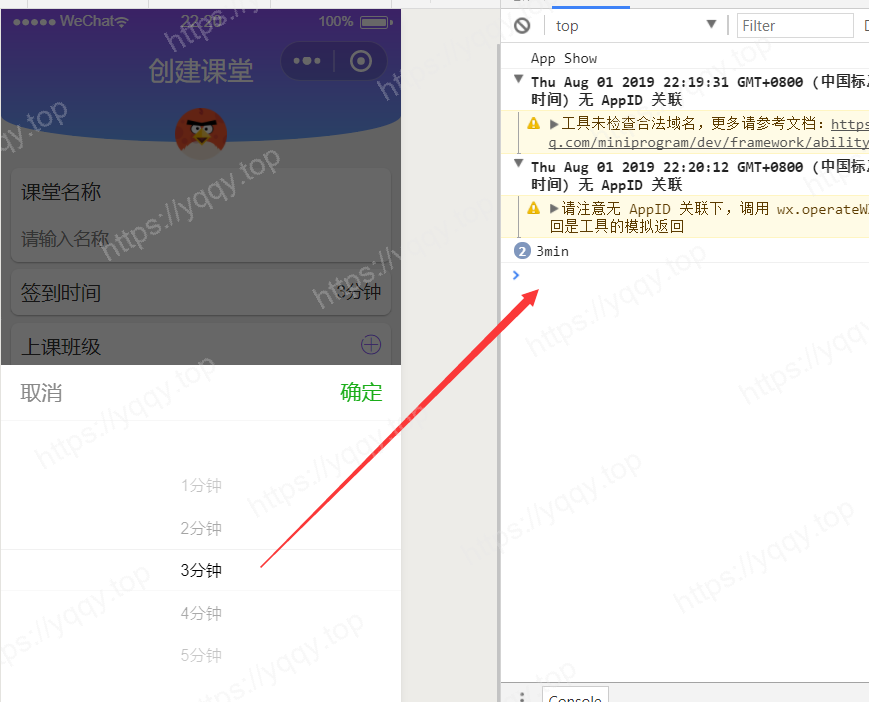

# uniapp的Form提交之蛋疼的picker

## 思路

哪有思路，菜鸡是没有思路的，本文参考小程序club的一篇文章写的关于uniapp的写法。

## 效果图


## 可能感觉很好写

其实这里有一个蛋疼的地方，借用原作者的一句话，picker通过form提交的时候，肯定提交的是自己的value，那么就相当于永远提交的是0、1、2、3、4、5…… 这样的话问题就来了，咱们要这些个0123有个毛用？所以你会发现官方文档给的，只能返回索引值。



## uniapp写法

**template部分**
```html
<picker mode="selector" name="selector" @change="bindSelectTime" :value="timeIndex" :range="picker_name">
	<view v-if="timeShow">
		<view class="uni-input">{{selectTime[timeIndex].name}}</view>
	</view>
	<view v-else="">
		<text class="lateTime-right">请选择时间</text>
		<text class="iconfont iconarrow-right-copy-copy"></text>
	</view>
</picker>
```

**script部分**
```javascript
<script>
    var that;
	export default {
		data() {
			return {
                selectTime: [  //时间数据
                        { "id" : "1min" , "name":"1分钟"},
                        { "id" : "2min" , "name":"2分钟"},  
                        { "id" : "3min" , "name":"3分钟"},  
                        { "id" : "4min" , "name":"4分钟"},  
                        { "id" : "5min" , "name":"5分钟"}
                    ],
                timeIndex: 0, //选择的picker索引
                picker_name:[],//picker中range属性值
                picker_id:[],//存储id数组
                result:'',//form提交最终结果
			}
		},
        onLoad() {
            that = this;
            // 将selectTime遍历赋值
            this.selectTime.forEach(function(e){
                that.picker_name.push(e.name); //注意一定要用that,因为this对象此时已经没有传不进来了
                that.picker_id.push(e.id);
            })
        },
		methods: {
			bindSelectTime: function(e) { // 绑定选择时间
                that.timeShow = true;
				that.timeIndex = e.detail.value;
			},
            // 表单提交代码
            formSubmit: function (e) { // 表单提交
                var result = this.picker_id[e.detail.value.selector];
                this.result = result;
                console.log(result);
            }
		}
	}
</script>
```

## 还有坑啊

就是在 `onLoad` 里面的  `this.selectTime.forEach` 里面必须用that，在之前将this对象赋值给that,因为此时this对象在这个函数里面已经丢失了，可以打印this,会发现是undefined。

或者可以用ES6的箭头函数就可以避免这个问题，如下：

```javascript
this.selectTime.forEach( e => {
	this.picker_name.push(e.name);
	this.picker_id.push(e.id);
})
```

## 参考文章

* [表单组件Form提交之蛋疼的___picker普通选择器模式](http://www.wxappclub.com/topic/687)