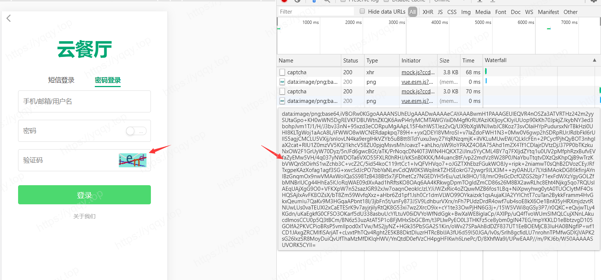

# Golang验证码–base64Captcha库1.3.0版本构建实例

::: tip 背景
这个库烦了我两天，我能接触到的例子都是旧版的，新版简直就是大改版哦，构建函数简直和旧版出入太大，函数参数及返回值皆不一样，记录一下最新版的字符验证码的完整实例，（数字验证码、计算验证码、汉字验证码以及语音验证码构建方法举一反三）
:::

### 官方例子地址

[在线构建验证码样式](https://captcha.mojotv.cn/)

<font color="#F56C6C">注意: </font>

旧版的`base64Captcha.ConfigCharacte` 以及 `base64Captcha.GenerateCaptcha`方法由于作者重构已经取消，具体实现看下面代码

### 代码如下

```go
package tool

import (
	"github.com/gin-gonic/gin"
	"github.com/mojocn/base64Captcha"
	"image/color"
)

type CaptchaResult struct {
	Id          string `json:"id"`
	Base64Blob  string `json:"base_64_blob"`
	VerifyValue string `json:"code"`
}

// 设置自带的store
var store = base64Captcha.DefaultMemStore

// 生成图形化验证码
func GenerateCaptcha(ctx *gin.Context) {
	var driver base64Captcha.Driver
	var driverString base64Captcha.DriverString

	// 配置验证码信息
	captchaConfig := base64Captcha.DriverString{
		Height:          30,
		Width:           60,
		NoiseCount:      0,
		ShowLineOptions: 2 | 4,
		Length:          4,
		Source:          "1234567890qwertyuioplkjhgfdsazxcvbnm",
		BgColor: &color.RGBA{
			R: 3,
			G: 102,
			B: 214,
			A: 125,
		},
		Fonts: []string{"wqy-microhei.ttc"},
	}

	// 自定义配置，如果不需要自定义配置，则上面的结构体和下面这行代码不用写
	driverString = captchaConfig
	driver = driverString.ConvertFonts()

	captcha := base64Captcha.NewCaptcha(driver, store)
	id, b64s, err := captcha.Generate()
	if err != nil {
		Failed(ctx, err.Error())
	}
	captchaResult := CaptchaResult{
		Id:         id,
		Base64Blob: b64s,
	}

	Success(ctx, gin.H{
		"captcha_result": captchaResult,
	})
}
```

这样子输出的就是一条json，放在项目里面就是这样的

