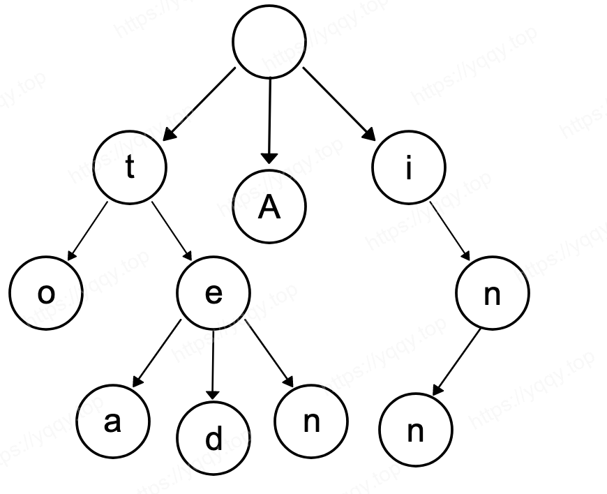

# Golang实现简单Trie树

Trie又称字典树，是N叉树的一种特殊形式。是一种存储大量字符串的树形数据结构，相当于`HashMap`，在存储单词中又比`HashMap`节省了很多的内存空间。`trie`树的根节点不存储内容，内容都在孩子节点上。



这是一个保存了8个单词的字典树的结构，8个单词分别是"A", "to", "tea", "ted", "ten", "i", "in", "inn"。每条从根节点到叶子节点的路径都构成了单词（有的不需要走到叶子节点也是单词，比如`i`, `in`），从根节点出发的路径都是给定单词列表的某个/某些单词的前缀，反之如果在某个字符串中没有出现在这棵树的路径上，就说明组不成单词。

> 通常Trie树也会用在搜索引擎上，就是输入某些词，就会扩展出一些模糊词汇
>
> Golang 实现的写法如下：

```go
type Trie struct {
	children [26]*Trie
	isWord bool
}

// Insert
func (t *Trie) Insert(word string)  {
	cur := t
	for k, v := range word {
		c := v - 'a'
		if cur.children[c] == nil {
			cur.children[c] = &Trie{}
		}
		cur = cur.children[c]
		// end
		if k == len(word) -1 {
			cur.isWord = true
		}
	}
}

// Search
func (t *Trie) Search(word string) bool  {
	cur := t
	for _, v := range word {
		c := v - 'a'
		if cur.children[c] == nil {
			return false
		}
		cur = cur.children[c]
	}
	return cur.isWord
}

// StartWith
func (t *Trie) StartWith(prefix string) bool {
	cur := t
	for _, v := range prefix {
		c := v - 'a'
		if cur.children[c] == nil {
			return false
		}
		cur = cur.children[c]
	}
	return true
}

func main() {
    trie := new(Trie)

	trie.Insert("inn")
	fmt.Println(trie.Search("inn"))   // true
	fmt.Println(trie.Search("in"))    // false
	fmt.Println(trie.StartWith("in")) // true
	fmt.Println(trie.StartWith("ia")) // false
}
```
