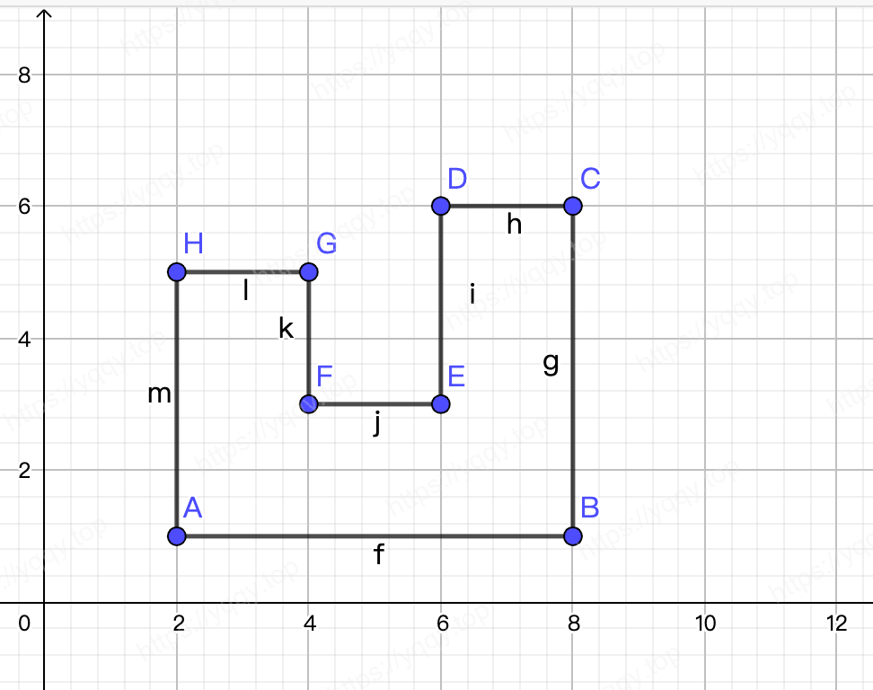

# Golang实现判断一个点是否在多边形中

> 今天分享一个数字几何题
>
> 如何判断一个点是否在一个多边形中？



## Go实现代码

> 直接贴出go的代码，注释都已标注好

```go
package main

import (
	"fmt"
	"math"
)

type Point struct {
	X float64
	Y float64
}

func IfPointsInPolygon(point Point, area []Point) bool {
	// 目标点的x, y坐标
	x := point.X
	y := point.Y

	// 多边形的点数
	count := len(area)

	// 点是否在多边形中
	var inInside bool

	// 浮点类型计算与0的容差
	precision := 2e-10

	// 依次计算每条边，根据每边两端点和目标点的状态栏判断
	for i, j := 0, count-1; i < count; j, i = i, i+1 {
		// 记录每条边上的两个点坐标
		x1 := area[i].X
		y1 := area[i].Y
		x2 := area[j].X
		y2 := area[j].Y

		// 判断点与多边形顶点是否重合
		if (x1 == x && y1 == y) || (x2 == x && y2 == y) {
			return true
		}

    // 判断点是否在水平直线上
		if (y == y1) && (y == y2) {
			return true
		}

		// 判断线段两端点是否在射线两侧
		if (y > y1 && y < y2) || (y < y1 && y > y2) {
			// 斜率
			k := (x2 - x1) / (y2 - y1)

			// 相交点的 x 坐标
			_x := x1 + k*(y-y1)

			// 点在多边形的边上
			if _x == x {
				return true
			}

			// 浮点类型计算容差
			if math.Abs(_x-x) < precision {
				return true
			}

			// 射线穿过多边形的边
			if _x > x {
				inInside = !inInside
			}
		}
	}

	return inInside
}

func main() {
	area := []Point{{2, 1}, {8, 1}, {8, 6}, {6, 6}, {6, 3}, {4, 3}, {4, 5}, {2, 5}}

	fmt.Println(IfPointsInPolygon(Point{5, 4}, area)) // false
	fmt.Println(IfPointsInPolygon(Point{6, 6}, area)) // true
	fmt.Println(IfPointsInPolygon(Point{6, 5}, area)) // true
	fmt.Println(IfPointsInPolygon(Point{7, 4}, area)) // true
	fmt.Println(IfPointsInPolygon(Point{8, 4}, area)) // true
	fmt.Println(IfPointsInPolygon(Point{3, 3}, area)) // true
	fmt.Println(IfPointsInPolygon(Point{4, 3}, area)) // true
	fmt.Println(IfPointsInPolygon(Point{2, 5}, area)) // true
	fmt.Println(IfPointsInPolygon(Point{4, 1}, area)) // true
	fmt.Println(IfPointsInPolygon(Point{6, 1}, area)) // true
	fmt.Println(IfPointsInPolygon(Point{4, 0}, area)) // false
	fmt.Println(IfPointsInPolygon(Point{8, 7}, area)) // false
	fmt.Println(IfPointsInPolygon(Point{5, 4}, area)) // false
	fmt.Println(IfPointsInPolygon(Point{8, 4}, area)) // true
}

```

## 参考文章

* [[射线法]判断一个点是否在多边形内部](https://blog.csdn.net/Form_/article/details/77841534)

