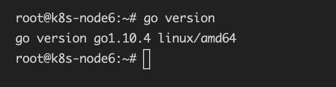
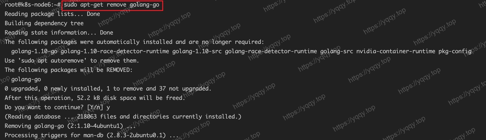
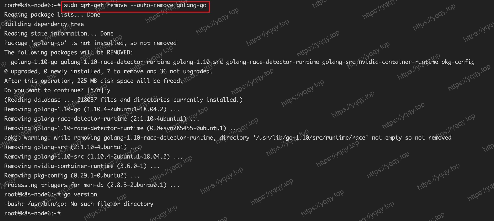

# 在Ubuntu上安装指定版本的Go语言

::: tip 背景
在ubuntu系统上，直接使用apt-get安装的话，安装之后的版本是go1.10.4，本文记载如何安装指定版本的go
:::

## 卸载

如果已经通过apt-get安装过了，首先去卸载，如果没有安装请直接跳到 **安装** 部分



命令如下：

> sudo apt-get remove golang-go



> sudo apt-get remove --auto-remove golang-go



## 安装

1. 下载、解压、软链接

```shell
# 下载，其他版本在 https://go.dev/dl/ 中找到源链接
wget https://go.dev/dl/go1.16.10.linux-amd64.tar.gz

# 解压
sudo tar -C /usr/local -xzf go1.16.10.linux-amd64.tar.gz

# 软链接
sudo ln -s /usr/local/go/bin/* /usr/bin/
```

2. 设置环境变量

```shell
sudo vim ~/.bashrc
```

在配置末尾添加内容：

```shell
export GOPATH="$HOME/go"
export PATH="$PATH:/usr/local/go/bin:$GOPATH/bin"
export GOPROXY=https://goproxy.cn,direct
```

应用配置

```shell
source ~/.bashrc
```

## 检查版本

```shell
root@k8s-node6:~# go version
go version go1.16.10 linux/amd64
```