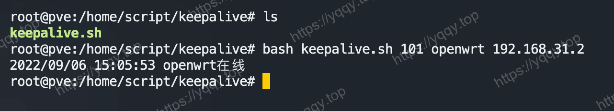
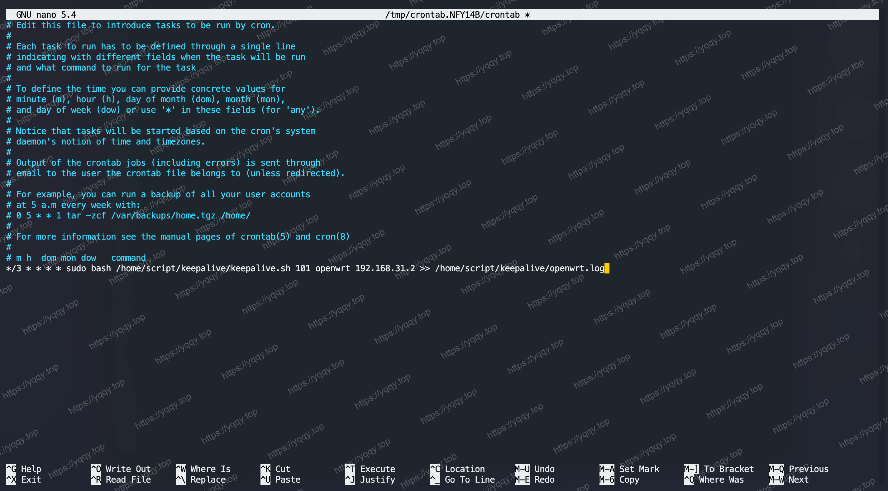

# Pve上使用Shell脚本保活虚拟机

先看脚本，脚本如下：

```shell
#!/bin/bash

function print() {
    echo "$(date +"%Y/%m/%d %H:%M:%S")" "$1"
}

function main() {
    if ping -c 1 "$3" >/dev/null; then
        print "$2在线"
    else
        print "发现$2又卡死了，重启"

        # 判断是虚拟机还是lxc容器
        if qm status "$1" >/dev/null 2>&1; then
            rm -f "/var/lock/qemu-server/lock-${1}.conf"
            qm stop "$1" >/dev/null 2>&1
            sleep 1s
            qm start "$1" >/dev/null 2>&1
        else
            rm -f "/var/lock/lxc/pve-config-${1}.lock"
            pct stop "$1" >/dev/null 2>&1
            pct start "$1" >/dev/null 2>&1
        fi

        print "重启$2成功"
    fi
}

main "$1" "$2" "$3"
```

## 第一步 - 创建脚本

1. 将脚本保存在 `PVE宿主机里任意一个目录`，要记住这个目录，比如这样


2. 执行一下，注意要替换一下命令的 `{}` 里的内容

```shell
bash keepalive.sh {pve虚拟机ID} {虚拟机名称 随便写只做记录用} {虚拟机使用的IP}
```



## 第二步 - 加入Crontab

1. 输入 `crontab -e` 回车
2. 输入 `*/3 * * * * sudo bash /home/script/keepalive/keepalive.sh 101 openwrt 192.168.31.2 >> /home/script/keepalive/openwrt.log` 要注意替换里面对应的内容，其中`/home/script/keepalive`是我存放脚本的绝对路径，要自行更改
3. 输入 `service cron restart` 重启crontab
4. 以上cron命令是每隔3分钟执行一次脚本，并将输入日志打印在 `/home/script/keepalive/openwrt.log` 这个文件里，查询时可以进入这个路径然后 `cat openwrt.log` 来查看日志

