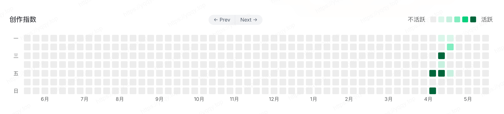

# VitePress博客-主题介绍

:::tip 😉
VitePress 1.0版本发布了，挺好看的，用来搭建一个博客看看，之前是Hugo，比较爱折腾。

> **设计：** 博客的设计从以下三位站长网站抄的，在此表达感谢！
> * [https://blog.charles7c.top](https://blog.charles7c.top)
> * [https://notes.fe-mm.com](https://notes.fe-mm.com)
> * [https://justin3go.com](https://justin3go.com)
:::

## frontmatter

VitePress 支持在所有 Markdown 文件中使用 YAML frontmatter，并使用 [gray-matter](https://github.com/jonschlinkert/gray-matter) 解析。frontmatter 必须位于 Markdown 文件的顶部 (在任何元素之前，包括 `<script>` 标签)，并且需要在三条虚线之间采用有效的 YAML 格式。

1. `VitePress`内置的`frontmatter`，看这里：[frontmatter-config](https://vitepress.dev/zh/reference/frontmatter-config)
2. `本博客`新增的`frontmatter`，有如下配置：

|         字段          |          格式          |     应用范围      | 含义                                      |
| :-----------------: | :------------------: | :-----------: | --------------------------------------- |
|        sort         |          1           | sidebar / doc | sidebar排序，来进行主目录或文章的排序，同一个目录下，sort越小越靠前 |
|      needRoute      |     true / false     |    sidebar    | sidebar是否需要路由，true的话可以点过去来介绍这个目录是干什么的   |
|        date         | YYYY-MM-DD hh:mm:ss  |      doc      | 文章发布日期                                  |
|        tags         | ["Golang", "Python"] |      doc      | 文章标签                                    |
| showArticleMetadata |     true / false     |      doc      | 是否展示文章主标题下面的信息，就是原创那行                   |
|     showComment     |     true / false     |      doc      | 是否展示评论                                  |
|  showChapterCount   |     true / false     |      doc      | 是否展示sidebar上的主目录的文章篇幅数                  |
|  showChapterCountName   |     默认"篇"     |      doc      | sidebar上的主目录的文章计数名称                  |
|     isOriginal      |     true / false     |      doc      | 文章是否原创                                  |
|       author        |                      |      doc      | 文章作者，仅非原创需要写                            |
|     articleLink     |                      |      doc      | 文章链接，仅非原创需要写，原文链接                       |

## sidebar

采用自动根据目录自动生成，规则看这里：

* [sidebar.ts#L16](https://github.com/yqchilde/yqchilde.github.io/blob/ad645dd5604eb41c6d8de3ef29c0f43de1a10ad5/.vitepress/config/sidebar.ts#L16)
* [sidebar.ts#L91](https://github.com/yqchilde/yqchilde.github.io/blob/ad645dd5604eb41c6d8de3ef29c0f43de1a10ad5/.vitepress/config/sidebar.ts#L91)

## heatmap

[点这里看详情](../2024/vitepress-blog-2)