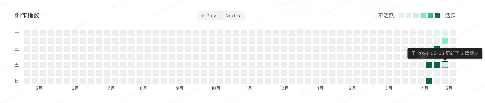

# VitePress博客-添加热力图

::: tip 概要
最近逛语雀，看到了语雀个人页面也有了文章热力图，然后这个风格很像Github Profile的热力图，所以我也在我的主页添加了热力图，样式基本复刻语雀的，**数据亮度以文章更新次数记录，同一篇文章可能更新多次，按每天更新次数算；有些博客喜欢用文章字数做数据，那也可以借鉴着我的代码修改**。下面我讲讲我是怎么实现的。

:::
## 1. 构建heatmap组件

文件路径： `.vitepress/theme/components/heatmap.vue` 

1. `template` 部分：
```vue
<template>
    <div class="cal-heatmap-container">
        <div class="cal-heatmap-header">
            <span class="cal-heatmap-header-title">学习指数</span>
            <div class="cal-heatmap-header-direct">
                <a-button-group shape="round" size="mini">
                    <a-button @click="(e) => { e.preventDefault(); cal.previous(); }">← Prev</a-button>
                    <a-button @click="(e) => { e.preventDefault(); cal.next(); }">Next →</a-button>
                </a-button-group>
            </div>
            <div class="cal-heatmap-legend-container">
                <span class="cal-heatmap-legend-text">懈怠</span>
                <div id="cal-heatmap-legend"></div>
                <span class="cal-heatmap-legend-text">努力</span>
            </div>
        </div>
        <div id="cal-heatmap"></div>
    </div>
</template>
```

2. `script` 部分：
```vue{64}
<script setup lang="ts">
import CalHeatmap from 'cal-heatmap'
import Tooltip from 'cal-heatmap/plugins/Tooltip'
import LegendLite from 'cal-heatmap/plugins/LegendLite'
import CalendarLabel from 'cal-heatmap/plugins/CalendarLabel'
import 'cal-heatmap/cal-heatmap.css'
import dayjs from 'dayjs'

import { useData } from "vitepress"
import { watch } from "vue"
const { isDark } = useData();

const yyDaysTemplate: CalHeatmap.Template = DateHelper => {
    const ALLOWED_DOMAIN_TYPE: CalHeatmap.DomainType[] = ['month'];
    return {
        name: 'yyDay',
        allowedDomainType: ALLOWED_DOMAIN_TYPE,
        rowsCount: () => 7,
        columnsCount: (ts) => {
            // 当前月要额外处理，减少多于空间
            if (DateHelper.date(ts).startOf('month').valueOf() !== DateHelper.date().startOf('month').valueOf()) {
                return DateHelper.getWeeksCountInMonth(ts)
            } else {
                let firstBlockDate = DateHelper.getFirstWeekOfMonth(ts);
                // 计算从今天到第一个块的时间间隔
                let interval = DateHelper.intervals('day', firstBlockDate, DateHelper.date()).length;
                // 计算需要规划几列
                let intervalCol = Math.ceil((interval + 1) / 7);
                return intervalCol;
            }
        },
        mapping: (startTimestamp, endTimestamp) => {
            const clampStart = DateHelper.getFirstWeekOfMonth(startTimestamp);
            const clampEnd = dayjs().startOf('day').add(8-dayjs().day(), 'day')
            
            let x = -1;
            const pivotDay = clampStart.weekday();

            return DateHelper.intervals('day', clampStart, clampEnd).map((ts) => {
                const weekday = DateHelper.date(ts).weekday();
                if (weekday === pivotDay) {
                    x += 1;
                }

                return {
                    t: ts,
                    x,
                    y: weekday,
                };
            });
        },
        extractUnit: (ts) => {
            return DateHelper.date(ts).startOf('day').valueOf();
        },
    };
};

function paint(cal: CalHeatmap, theme: 'light' | 'dark') {
    cal.addTemplates(yyDaysTemplate);
    cal.paint(
        {
            theme: theme,
            data: {
                source: '../../../heatmap.json',
                type: 'json',
                x: 'date',
                y: (datum) => +datum['file'],
                groupY: 'sum',
            },
            date: {
                start: dayjs().subtract(12, 'month').valueOf(),
                min: dayjs("2023-01-01").valueOf(),
                max: dayjs(),
                locale: 'zh',
                timezone: 'Asia/Shanghai',
            },
            range: 13,
            scale: {
                color: {
                    type: 'threshold',
                    range: ['#daf6ea', '#c7f0df', '#82edc0', '#0bd07d', '#00663b'],
                    domain: [2, 4, 6, 8],
                },
            },
            domain: {
                type: 'month',
                gutter: 5,
                label: { text: 'M月', textAlign: 'middle', position: 'bottom' },
            },
            subDomain: { type: 'yyDay', radius: 2, width: 16, height: 16, gutter: 5 },
            itemSelector: '#cal-heatmap',
        },
        [
            [
                Tooltip,
                {
                    text: function (timestamp: number, value: number, dayjsDate: dayjs.Dayjs) {
                        if (timestamp > Date.now()) {
                            return dayjsDate.format('别急，这一天还没来🫣')
                        }
                        if (!value) {
                            return dayjsDate.format('YYYY-MM-DD 未更新');
                        } else {
                            return dayjsDate.format('于 YYYY-MM-DD 更新了 ') + value + ' 篇博文';
                        }
                    },
                },
            ],
            [
                LegendLite,
                {
                    itemSelector: '#cal-heatmap-legend',
                    includeBlank: true,
                    radius: 2,
                    width: 14,
                    height: 14,
                    gutter: 5,
                },
            ],
            [
                CalendarLabel,
                {
                    width: 25,
                    textAlign: 'start',
                    text: function () {
                        return ['一', '', '三', '', '五', '', '日']
                    },
                },
            ],
        ]
    );
}

function destory(cal: CalHeatmap) {
    cal.destroy()
}

let cal: CalHeatmap;
watch(
    isDark,
    () => {
        if (isDark.value) {
            if (cal !== undefined) destory(cal);
            cal = new CalHeatmap();
            paint(cal, 'dark');
        } else {
            if (cal !== undefined) destory(cal);
            cal = new CalHeatmap();
            paint(cal, 'light');
        }
    },
    {
        immediate: true,
    }
);
</script>
```

3. `style` 部分：
```vue
<style scoped lang="scss">
:deep(.ch-domain-text) {
    font-size: 12px;
    color: var(--vp-home-heatmap-legend-text);
}

:deep(.ch-plugin-calendar-label-text) {
    font-size: 12px !important;
    color: var(--vp-home-heatmap-legend-text);
}

.cal-heatmap-container {
    display: flex;
    flex-direction: column;
    align-items: center;
    margin-top: 40px;
    max-width: 100%;
}

@media screen and (max-width: 768px) {
    .cal-heatmap-container {
        overflow: auto;
    }
}

.cal-heatmap-header {
    display: flex;
    flex-direction: row;
    justify-content: space-between;
    align-items: center;
    width: 100%;
    margin-bottom: 24px;
}

.cal-heatmap-header-title {
    flex: 1;
    font-size: 16px;
    line-height: 24px;
    font-weight: 500;
}

.cal-heatmap-header-direct {
    flex: 1;
}

.cal-heatmap-legend-container {
    display: flex;
    justify-content: space-between;
}

.cal-heatmap-legend-text {
    color: var(--vp-home-heatmap-legend-text);
    font-size: 14px;
}

#cal-heatmap-legend {
    display: flex;
    align-items: center;
    margin: 0 12px;
}
</style>
```

## 2. 数据来源

在上面写`script`代码时，注意有一行高亮，那里是数据来源`../../../heatmap.json`，所以要先生成这个文件，生成这个文件的代码在这里。 

要注意第6行，要自行修改成自己仓库的起始时间，然后只需要保证在运行前执行这个js即可，比如在`package.json`的`scripts`里变动一下`"docs:dev": node xxx.js && vitepress dev`

```js{6}
import { execSync } from 'child_process';
import fs from 'fs';
import dayjs from 'dayjs';

// 设置日期范围
const sinceDate = "2024-04-17T00:00:00Z"; 
const untilDate = dayjs().add(1, 'day').format('YYYY-MM-DDT23:59:59Z');

// 使用git log命令获取指定日期范围内的提交信息，包含文件名
const gitLogCmd = `git log --since="${sinceDate}" --until="${untilDate}" --name-only --pretty=format:"%cd" --date=format:"%Y-%m-%dT%H:%M:%SZ"`;
const output = execSync(gitLogCmd, { encoding: 'utf-8' });

// 上一个日期变量，用来判断是否是新的提交记录开始
let lastDate = null;
const lines = output.split('\n');
const results = [];

lines.forEach(line => {
    // 如果是日期行，保存该日期
    if (/^\d{4}-\d{2}-\d{2}T\d{2}:\d{2}:\d{2}Z$/.test(line.trim())) {
        lastDate = line.trim();
    } else if (/^posts\/.+README\.md$/.test(line.trim()) && lastDate) {
        results.push({ date: lastDate, file: line.trim() });
    }
});

// 过滤一下同一天内的重复文件
function filterData(data) {
    // 将数据按日期分组
    const groupedData = data.reduce((acc, obj) => {
        const date = obj.date.split('T')[0];
        acc[date] = acc[date] || [];
        acc[date].push(obj.file);
        return acc;
    }, {});

    // 去除每个日期组内的重复文件
    for (const date in groupedData) {
        groupedData[date] = [...new Set(groupedData[date])];
    }

    // 重新构建结果数组
    const filteredData = [];
    for (const date in groupedData) {
        filteredData.push({ date: `${date}`, file: groupedData[date].length });
    }

    return filteredData;
}

const filteredData = filterData(results);

// fs.writeFileSync('heatmap.json', JSON.stringify(results, null, 2))
fs.writeFileSync('heatmap.json', JSON.stringify(filteredData))
```

## 3. 适配主题切换

基本样式已经在`style`那部分写了，只不过那里引用了一个css变量，贴在下面了

因为`cal-heatmap`库的options里有`theme(dark | light)`配置，在`script`里引用了`watch`来监听主题变化，采用先`destory`再`paint`的思路

```css
:root {
    --vp-home-heatmap-legend-text: #585a5a;
}

.dark {
    --vp-home-heatmap-legend-text: #ffffff;
}
```

## 4. Q&A

有看不懂的地方评论区问吧
## 5. 参考
* [cal-heatmap文档](https://cal-heatmap.com)