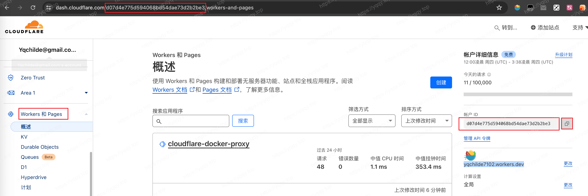
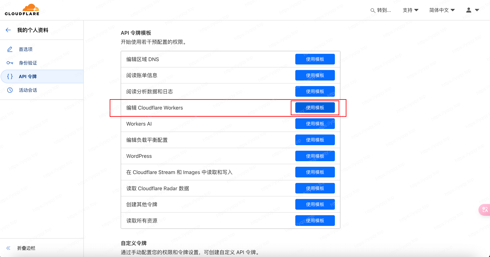
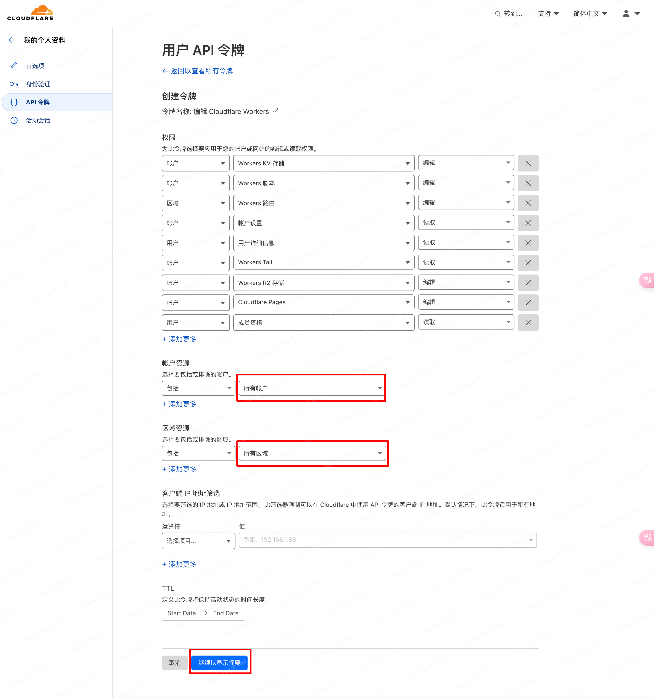
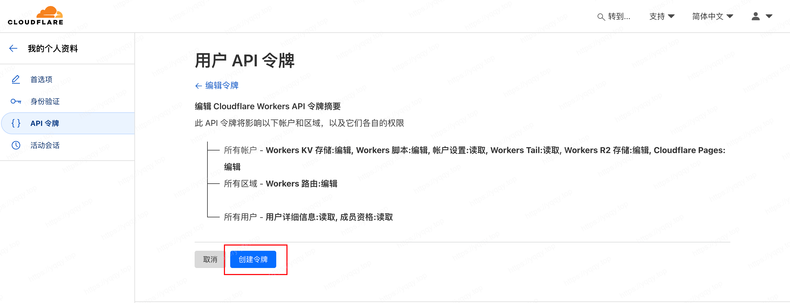
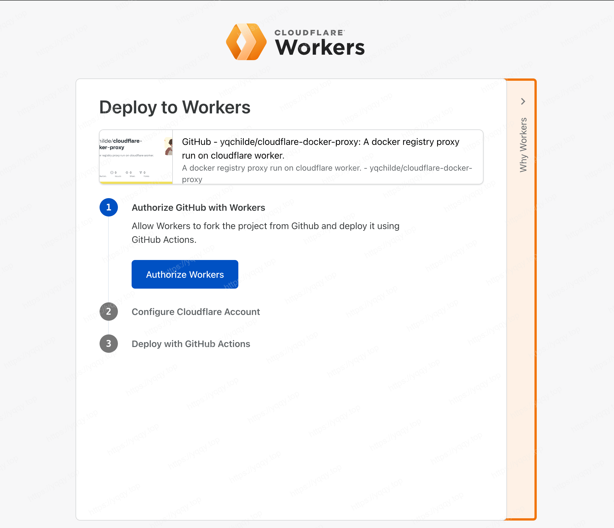
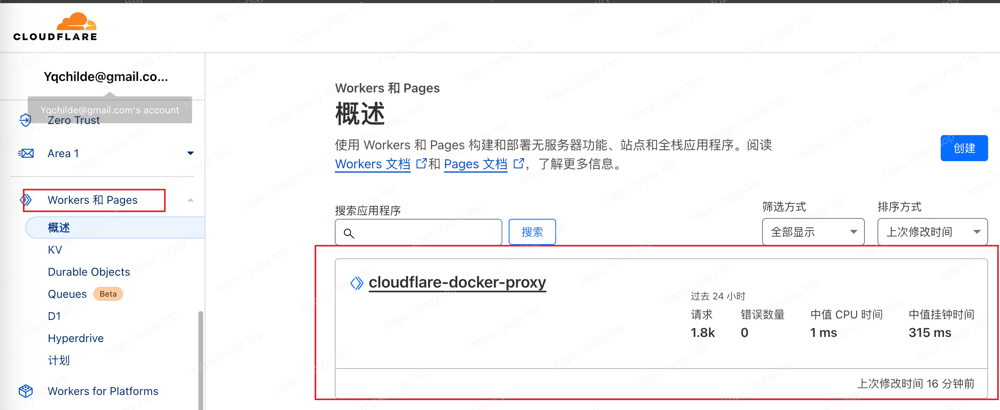
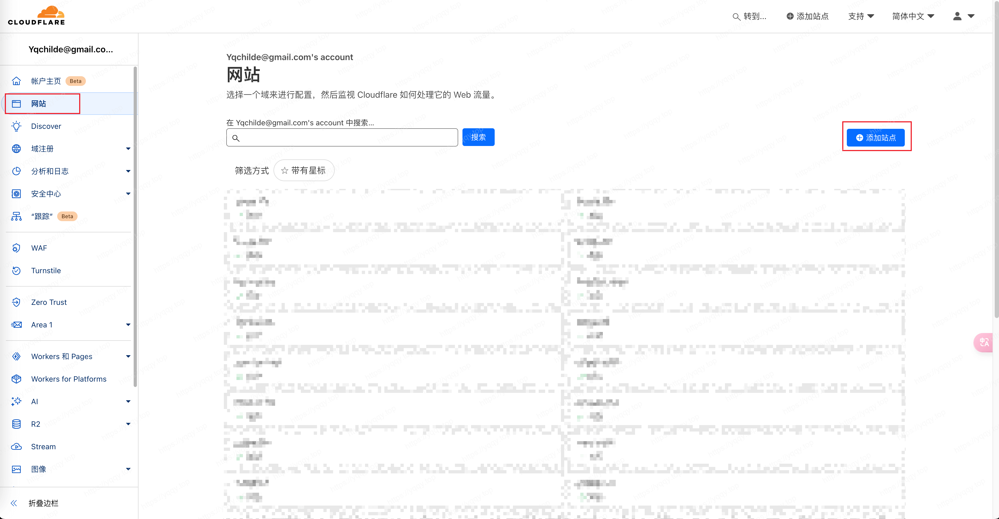
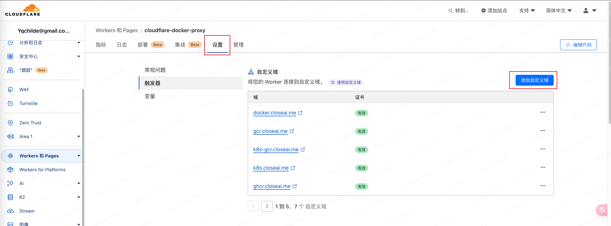
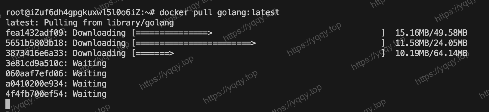

# 利用CloudFlare自建Docker镜像站

::: tip 引言
于2024年6月国内的Docker Hub镜像源大多已下线，我在网络上搜集到了利用CloudFlare自建Docker镜像站的办法，仅用于解决个人开发难题，请勿滥用CloudFlare，珍惜来之不易的机会！
::: tip 项目地址
原项目地址：https://github.com/ciiiii/cloudflare-docker-proxy

我修改地址：https://github.com/yqchilde/cloudflare-docker-proxy
:::

::: info 有朋友连docker都装不上了，这是安装办法，get-docker.sh这个建议本地获取之后，复制到服务器上
curl -fsSL https://get.docker.com -o get-docker.sh  
sudo DOWNLOAD_URL=https://mirrors.ustc.edu.cn/docker-ce sh get-docker.sh
:::

## 准备账号

既然是基于cloudflare的，那就先去 **[注册](https://www.cloudflare.com/zh-cn/)** 个账号，此处省略 ~

有了账号之后获取两个值，账号ID和TOKEN  
账号ID：可以从Url路径上获取，也可以点开Works和Pages页面右侧获取  
账号TOKEN：点击右上角->我的个人资料->API令牌->创建令牌->编辑Cloudflare Workers->使用模板









## 仓库代码

接下来打开我修改的仓库地址 [cloudflare-docker-proxy](https://github.com/yqchilde/cloudflare-docker-proxy) ，fork项目

fork到自己仓库后，需要修改以下文件

1. **`src/index.js`**，将下面的closeai.me替换为你自己的域名（先写上，待会从cf配置域名）
```js
const routes = {
  // production
  "docker.closeai.me": dockerHub,
  "quay.closeai.me": "https://quay.io",
  "gcr.closeai.me": "https://gcr.io",
  "k8s-gcr.closeai.me": "https://k8s.gcr.io",
  "k8s.closeai.me": "https://registry.k8s.io",
  "ghcr.closeai.me": "https://ghcr.io",
  "cloudsmith.closeai.me": "https://docker.cloudsmith.io",

  // staging
  "docker-staging.closeai.me": dockerHub,
};
```

2. **`wrangler.toml`**，将下面的closeai.me替换为你自己的域名（先写上，待会从cf配置域名）
```toml
routes = [
  { pattern = "docker.closeai.me", custom_domain = true },
  { pattern = "quay.closeai.me", custom_domain = true },
  { pattern = "gcr.closeai.me", custom_domain = true },
  { pattern = "k8s-gcr.closeai.me", custom_domain = true },
  { pattern = "k8s.closeai.me", custom_domain = true },
  { pattern = "ghcr.closeai.me", custom_domain = true },
  { pattern = "cloudsmith.closeai.me", custom_domain = true },
]
```

3. **`README.md`**，全局将`yqchilde`替换为你的`github用户名`，这一步是为了将`Deploy with Workers`按钮的超链接变更到你自己的仓库

## 部署配置

改好之后，点击`Deploy with Workers`按钮进行跳转，然后授权，并填入cloudflare的账号id和token后进行自动部署



进入到cloudflare的Workers界面就可以看到部署过来的workers了



workers默认会分配一个域名，但是这个域名可能已经被墙了，如果在国内机器ping不通，那就使用自定义域名吧

先添加一个域名，然后从域名商那边将dns解析到cloudflare，这样就会cloudflare管理了，打开workers设置添加自定义域就可以了，二级域名会自动解析过去





## 效果展示

在`/etc/docker/daemon.json`中配置`registry-mirrors`，如果你搭建了这一套流程，下面的域名换成你自己的即可，改完配置执行`sudo service docker restart`重启docker

```json
{
  "registry-mirrors": [
    "https://docker.closeai.me"
  ]
}
```



## Github Actions

项目中有github actions的配置，请注意和密钥的修改，更改之后可以当仓库代码变动时，自动部署到cloudflare