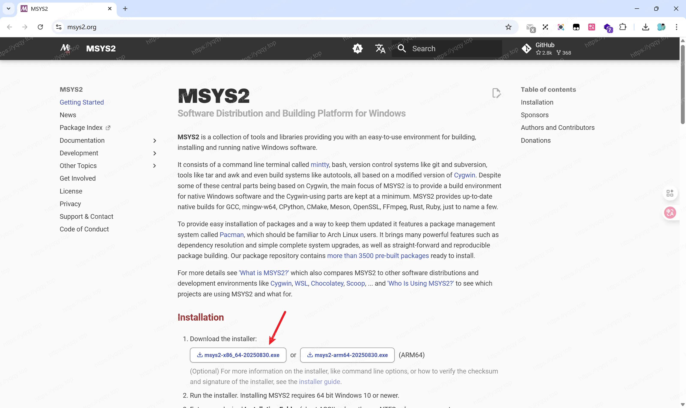
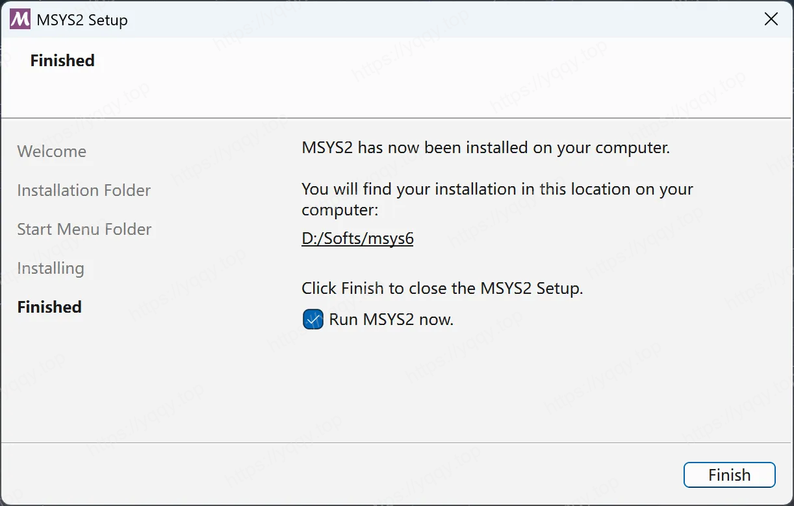
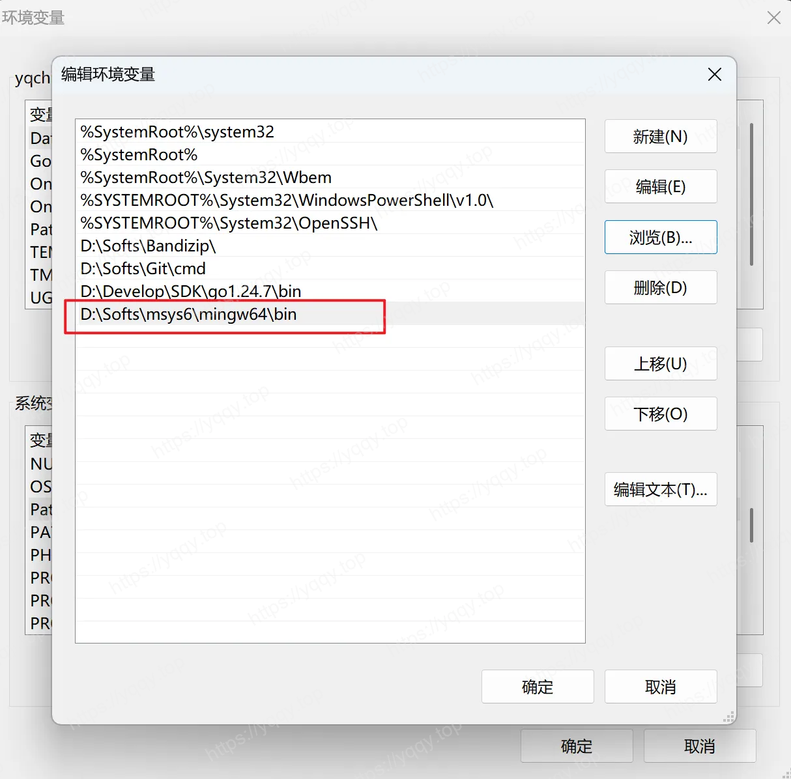

# 使用confluent-kafka-go包遇到的cgo问题

最近项目里用了`confluent-kafka-go`这个包，在编译时遇到一些问题，我的环境是Windows，报错如下：

```shell
kafka.go:11:21: undefined: kafka.Producer
kafka.go:15:18: undefined: kafka.NewProducer
kafka.go:15:37: undefined: kafka.ConfigMap
kafka.go:32:16: undefined: kafka.Message
kafka.go:37:15: undefined: kafka.Error
kafka.go:47:24: undefined: kafka.Message
kafka.go:48:26: undefined: kafka.TopicPartition
kafka.go:48:73: undefined: kafka.PartitionAny
kafka.go:62:36: undefined: kafka.Message
kafka.go:63:25: undefined: kafka.TopicPartition
kafka.go:63:25: too many errors
```

这是由于未开启CGO编译，只需要在设置`CGO_ENABLED=1`即可，然后又遇到如下问题：

```shell
# runtime/cgo
cgo: C compiler "gcc" not found: exec: "gcc": executable file not found in %PATH%
```

这是由于本机没有gcc环境，接下来写一下安装gcc环境，打开[msys2.org](https://msys2.org)进行下载








配置好gcc环境后，就可以成功编译了