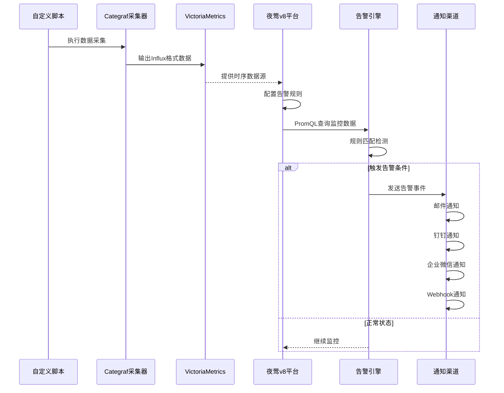

# 夜莺v8执行自定义脚本并告警通知

n9e为夜莺平台的名称缩写，本文中所有提及n9e的地方均指夜莺v8平台。

## 系统架构图



## 数据流说明

1. **数据采集层**: Categraf作为采集器执行自定义脚本，将数据转换为Influx格式
2. **存储层**: VictoriaMetrics作为时序数据库存储监控数据
3. **监控层**: 夜莺v8平台配置数据源和告警规则，使用PromQL进行数据查询
4. **告警层**: 告警引擎根据规则触发告警事件
5. **通知层**: 通过自定义通知配置将告警信息发送到各种渠道

## Categraf

Categraf的文档推荐阅读，[doc](https://flashcat.cloud/docs/content/flashcat-monitor/categraf/1-introduction/)

## 自定义脚本

自定义脚本可以是任何能够在Linux环境下执行的脚本，如bash、python、shell等。我这里采用golang编译好的二进制文件，只要能输出符合Influx格式的数据即可。这是我编写的一个简单的脚本，用于监控网站的http状态码：

::: details 代码展开
```go
/*
监控说明：
名称: 监控yqqy.top服务运行状态
通知: YY
频率: 0 10 * * * *

输出格式:
采用InfluxDB行协议格式，包含以下字段：
- measurement: server_yqqy_running_metrics
- tags: url, status_code
- fields: response_time_ms
- timestamp: 纳秒级时间戳
*/
package main

import (
	"fmt"
	"log"
	"net/http"
	"time"
)

const (
	monitorName = "server_yqqy_running_monitor"
	measurement = "server_yqqy_running_metrics"
)

type MonitorData struct {
	URL        string `json:"url"`
	StatusCode int    `json:"status_code"`
	Timestamp  int64  `json:"timestamp"`
}

type Monitor struct {
	client *http.Client
	url    string
}

func NewMonitor() *Monitor {
	return &Monitor{
		client: &http.Client{
			Timeout: 30 * time.Second,
		},
		url: "https://yqqy.top",
	}
}

func (m *Monitor) queryData() ([]MonitorData, error) {
	resp, err := m.client.Get(m.url)
	data := MonitorData{
		URL:       m.url,
		Timestamp: time.Now().UnixNano(),
	}

	if err != nil {
		// 网络错误或其他错误
		data.StatusCode = 0
		return []MonitorData{data}, fmt.Errorf("HTTP request failed: %w", err)
	}
	defer resp.Body.Close()

	data.StatusCode = resp.StatusCode
	return []MonitorData{data}, nil
}

func (m *Monitor) formatInfluxOutput(data []MonitorData) string {
	var lines []string
	for _, record := range data {
		// 构建tags和fields
		tags := fmt.Sprintf("url=%s", record.URL)
		fields := fmt.Sprintf("status_code=%di", record.StatusCode)
		line := fmt.Sprintf("%s,%s %s %d", measurement, tags, fields, record.Timestamp)
		lines = append(lines, line)
	}

	return lines[0]
}

func (m *Monitor) run() (string, error) {
	// 查询数据
	data, err := m.queryData()
	if err != nil {
		return "", fmt.Errorf("查询数据失败: %w", err)
	}

	// 格式化输出
	influxOutput := m.formatInfluxOutput(data)
	return influxOutput, nil
}

func main() {
	// 创建监控器
	monitor := NewMonitor()

	// 运行监控
	result, err := monitor.run()
	if err != nil {
		log.Printf("[%s] 运行失败: %v", monitorName, err)
	}

	// 输出结果
	fmt.Println(result)
}
```
:::

1. 编译之后，将二进制文件放入到 `/n9e/categraf/scripts/` 目录下，确认文件权限为可执行。
2. 修改exec插件的配置文件 `vim /n9e/categraf/conf/input.exec/exec.toml`，按需修改，改成适合自己脚本路径的配置。
    ```shell
    # collect interval
    interval = 15

    [[instances]]
    # commands, support glob
    commands = [
    "/n9e/categraf/scripts/server_yqqy_running_monitor"
    ]

    # # timeout for each command to complete
    # timeout = 5

    # # interval = global.interval * interval_times
    # interval_times = 1

    # choices: influx prometheus falcon
    # influx stdout example: mesurement,labelkey1=labelval1,labelkey2=labelval2 field1=1.2,field2=2.3
    data_format = "influx"
    ```
3. `/n9e/categraf/conf/config.toml`配置我保持默认，如果你需要修改，请参考官方文档
4. 配置文件修改之后，`systemctl restart categraf.service`重启categraf服务
5. 重启之后数据就会写入VictoriaMetrics数据库，你可以在`/n9e/categraf`中测试脚本是否能够正常输出数据。
    ```shell
    $ ./categraf --test --inputs exec
    ```

## 配置夜莺告警

待补充...