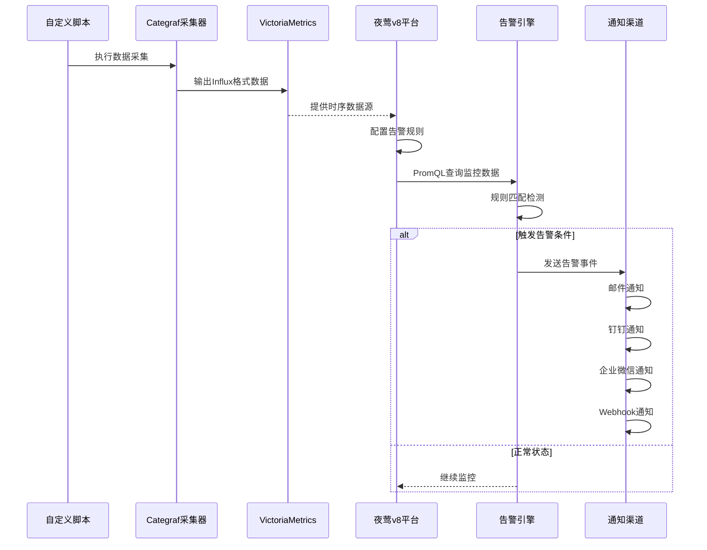
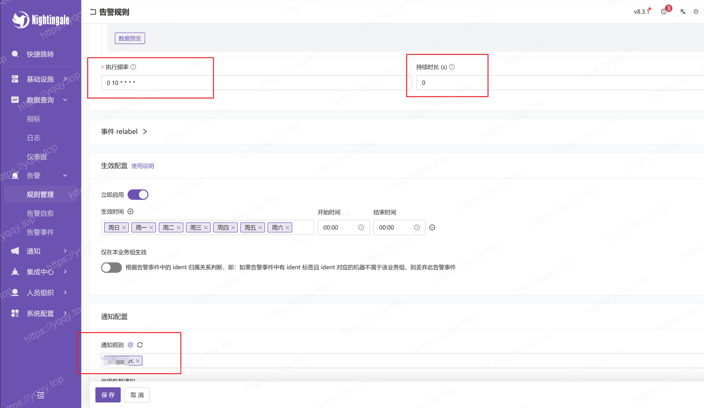
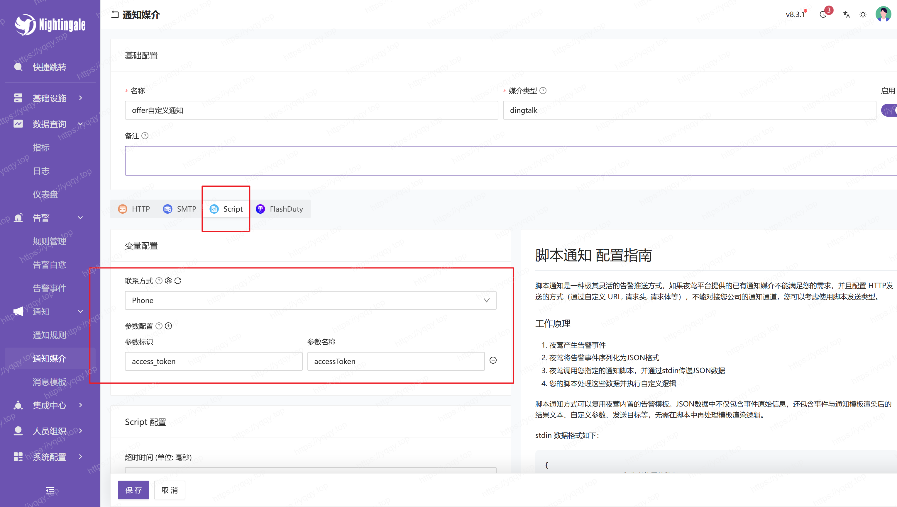
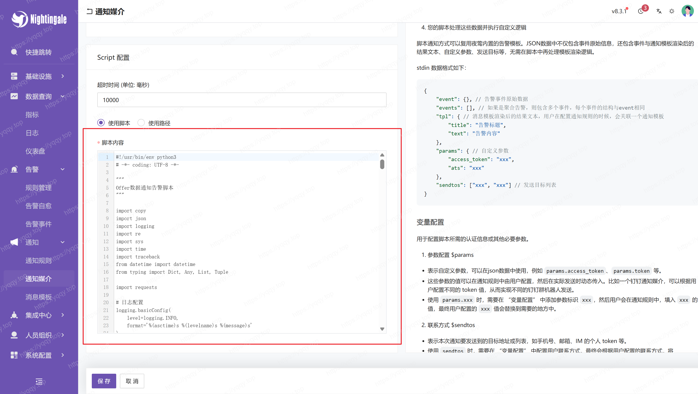

# 夜莺v8执行自定义脚本并告警通知

n9e为夜莺平台的名称缩写，本文中所有提及n9e的地方均指夜莺v8平台。

## 系统架构图



## 数据流说明

1. **数据采集层**: Categraf作为采集器执行自定义脚本，将数据转换为Influx格式
2. **存储层**: VictoriaMetrics作为时序数据库存储监控数据
3. **监控层**: 夜莺v8平台配置数据源和告警规则，使用PromQL进行数据查询
4. **告警层**: 告警引擎根据规则触发告警事件
5. **通知层**: 通过自定义通知配置将告警信息发送到各种渠道

## Categraf

Categraf的文档推荐阅读，[doc](https://flashcat.cloud/docs/content/flashcat-monitor/categraf/1-introduction/)

## 自定义脚本

自定义脚本可以是任何能够在Linux环境下执行的脚本，如bash、python、shell等。我这里采用golang编译好的二进制文件，只要能输出符合Influx格式的数据即可。这是我编写的一个简单的脚本，用于监控网站的http状态码：

::: details 代码展开
```go
/*
监控说明：
名称: 监控yqqy.top服务运行状态
通知: YY
频率: 0 10 * * * *

输出格式:
采用InfluxDB行协议格式，包含以下字段：
- measurement: server_yqqy_running_metrics
- tags: url, status_code
- fields: response_time_ms
- timestamp: 纳秒级时间戳
*/
package main

import (
	"fmt"
	"log"
	"net/http"
	"time"
)

const (
	monitorName = "server_yqqy_running_monitor"
	measurement = "server_yqqy_running_metrics"
)

type MonitorData struct {
	URL        string `json:"url"`
	StatusCode int    `json:"status_code"`
	Timestamp  int64  `json:"timestamp"`
}

type Monitor struct {
	client *http.Client
	url    string
}

func NewMonitor() *Monitor {
	return &Monitor{
		client: &http.Client{
			Timeout: 30 * time.Second,
		},
		url: "https://yqqy.top",
	}
}

func (m *Monitor) queryData() ([]MonitorData, error) {
	resp, err := m.client.Get(m.url)
	data := MonitorData{
		URL:       m.url,
		Timestamp: time.Now().UnixNano(),
	}

	if err != nil {
		// 网络错误或其他错误
		data.StatusCode = 0
		return []MonitorData{data}, fmt.Errorf("HTTP request failed: %w", err)
	}
	defer resp.Body.Close()

	data.StatusCode = resp.StatusCode
	return []MonitorData{data}, nil
}

func (m *Monitor) formatInfluxOutput(data []MonitorData) string {
	var lines []string
	for _, record := range data {
		// 构建tags和fields
		tags := fmt.Sprintf("url=%s", record.URL)
		fields := fmt.Sprintf("status_code=%di", record.StatusCode)
		line := fmt.Sprintf("%s,%s %s %d", measurement, tags, fields, record.Timestamp)
		lines = append(lines, line)
	}

	return lines[0]
}

func (m *Monitor) run() (string, error) {
	// 查询数据
	data, err := m.queryData()
	if err != nil {
		return "", fmt.Errorf("查询数据失败: %w", err)
	}

	// 格式化输出
	influxOutput := m.formatInfluxOutput(data)
	return influxOutput, nil
}

func main() {
	// 创建监控器
	monitor := NewMonitor()

	// 运行监控
	result, err := monitor.run()
	if err != nil {
		log.Printf("[%s] 运行失败: %v", monitorName, err)
	}

	// 输出结果
	fmt.Println(result)
}
```
:::

1. 编译之后，将二进制文件放入到 `/n9e/categraf/scripts/` 目录下，确认文件权限为可执行。
2. 修改exec插件的配置文件 `vim /n9e/categraf/conf/input.exec/exec.toml`，按需修改，改成适合自己脚本路径的配置。
    ```shell
    # collect interval
    interval = 15

    [[instances]]
    # commands, support glob
    commands = [
    "/n9e/categraf/scripts/server_yqqy_running_monitor"
    ]

    # # timeout for each command to complete
    # timeout = 5

    # # interval = global.interval * interval_times
    # interval_times = 1

    # choices: influx prometheus falcon
    # influx stdout example: mesurement,labelkey1=labelval1,labelkey2=labelval2 field1=1.2,field2=2.3
    data_format = "influx"
    ```
3. `/n9e/categraf/conf/config.toml`配置我保持默认，如果你需要修改，请参考官方文档
4. 配置文件修改之后，`systemctl restart categraf.service`重启categraf服务
5. 重启之后数据就会写入VictoriaMetrics数据库，你可以在`/n9e/categraf`中测试脚本是否能够正常输出数据。
    ```shell
    $ ./categraf --test --inputs exec
    ```

## 配置夜莺告警





然后在通知规则中配置通知人即可

### 自定义告警

在通知媒介-右上角点击新增





脚本内容参考：

::: details 代码展开
```py
#!/usr/bin/env python3
# -*- coding: UTF-8 -*-

"""
Offer数据通知告警脚本
"""

import copy
import json
import logging
import re
import sys
import time
import traceback
from datetime import datetime
from typing import Dict, Any, List, Tuple

import requests

# 日志配置
logging.basicConfig(
    level=logging.INFO,
    format='%(asctime)s %(levelname)s %(message)s'
)

# 日志前缀
LOG_PREFIX = "[OfferNotify]"


# ================================
# 自定义类定义
# ================================

class CustomLogger:
    """自定义日志记录器，添加统一前缀"""

    def __init__(self, logger, prefix: str):
        self.logger = logger
        self.prefix = prefix

    def info(self, msg: str, *args, **kwargs):
        self.logger.info(f"{self.prefix} {msg}", *args, **kwargs)

    def error(self, msg: str, *args, **kwargs):
        self.logger.error(f"{self.prefix} {msg}", *args, **kwargs)

    def warning(self, msg: str, *args, **kwargs):
        self.logger.warning(f"{self.prefix} {msg}", *args, **kwargs)

    def debug(self, msg: str, *args, **kwargs):
        self.logger.debug(f"{self.prefix} {msg}", *args, **kwargs)


# 创建带前缀的日志记录器
logger = CustomLogger(logging.getLogger(__name__), LOG_PREFIX)

# ================================
# 配置和常量定义
# ================================

# UserId到手机号的映射配置
UID_MOBILE_MAPPING = {
    '10001': '15555550001',  # 用户1
    '10002': '15555550002',  # 用户2
    '10003': '15555550003'   # 用户3
}

# UserId到用户名的映射配置
UID_NAME_MAPPING = {
    '10001': '用户1',  # 用户1
    '10002': '用户2',  # 用户2
    '10003': '用户3'   # 用户3
}

# 用户角色与用户ID的映射配置
USER_ROLE_UID_MAPPING = {
    'AM': ['10001'],  # 用户1
    'PM': ['10002', '10003']  # 用户2，用户3
}

# ================================
# 数据解析和处理函数
# ================================

def parse_offer_ids_by_pm(tags: str) -> Dict[str, dict]:
    """
    按PM ID分组解析offer_ids，支持新的数据格式和notify_roles字段

    Args:
        tags: 包含offer_ids和notify_roles的标签字符串或字典

    Returns:
        Dict[str, dict]: 按PM ID分组的数据字典，格式为
        {pm_id: {'offer_ids': [oid1, oid2, ...], 'mobile': 'phone_number', 'notify_roles': ['AM', 'PM']}}
    """
    pm_groups = {}

    if not tags:
        return pm_groups

    # 提取notify_roles信息
    notify_roles = _extract_notify_roles(tags)
    offer_ids_raw = _extract_offer_ids_raw(tags)

    if not offer_ids_raw:
        return pm_groups

    # 解析每个offer数据项
    for item in offer_ids_raw.split(';'):
        item = item.strip()
        if not item:
            continue

        pm_id, offer_id = _parse_offer_item(item)

        if pm_id not in pm_groups:
            pm_groups[pm_id] = {
                'offer_ids': [],
                'mobile': UID_MOBILE_MAPPING.get(pm_id, ''),
                'notify_roles': notify_roles.copy()
            }
        pm_groups[pm_id]['offer_ids'].append(offer_id)

    return pm_groups


def _extract_notify_roles(tags) -> List[str]:
    """提取notify_roles信息"""
    notify_roles = []

    if isinstance(tags, dict):
        notify_roles_raw = tags.get('notify_roles', '')
    else:
        notify_roles_match = re.search(r'notify_roles=([^,]+)', str(tags))
        notify_roles_raw = notify_roles_match.group(1) if notify_roles_match else ''

    if notify_roles_raw:
        notify_roles = [user.strip() for user in notify_roles_raw.split(';') if user.strip()]

    return notify_roles


def _extract_offer_ids_raw(tags) -> str:
    """提取原始offer_ids字符串"""
    if isinstance(tags, dict):
        return tags.get('offer_ids', '')
    else:
        offer_ids_match = re.search(r'offer_ids=([^,]+)', str(tags))
        return offer_ids_match.group(1) if offer_ids_match else ''


def _parse_offer_item(item: str) -> Tuple[str, str]:
    """
    解析单个offer项目，返回(pm_id, offer_id)

    格式：oid:16_amid:64012_pmid:64012
    """
    # 新格式：oid:16_amid:64012_pmid:64012
    if 'oid:' in item and 'pmid:' in item:
        oid_match = re.search(r'oid:(\d+)', item)
        pmid_match = re.search(r'pmid:(\d+)', item)

        if oid_match and pmid_match:
            return pmid_match.group(1), oid_match.group(1)

    # 默认归到default组
    return 'default', item


def extract_data_from_string(stdin_data: str) -> Dict[str, Any]:
    """
    从字符串中提取关键数据，返回构建的payload

    Args:
        stdin_data: 标准输入的字符串数据

    Returns:
        Dict: 构建的payload字典
    """
    payload = {"tpl": {}, "params": {}, "sendto": []}

    # 提取tplContent
    content_match = re.search(r'tplContent:map\[content:(.*?) title:(.*?)]', stdin_data)
    if content_match:
        payload["tpl"]["content"] = content_match.group(1)
        payload["tpl"]["title"] = content_match.group(2)

    # 提取customParams中的access_token
    params_match = re.search(r'customParams:map\[(.*?)\]', stdin_data)
    if params_match:
        params_str = params_match.group(1)
        access_token_match = re.search(r'access_token:(.*?)(?: |$)', params_str)
        if access_token_match:
            payload["params"]["access_token"] = access_token_match.group(1)

    # 检查是否有err字段
    err_match = re.search(r'err:(.*?)(?:,|\s|$)', stdin_data)
    if err_match:
        error_msg = err_match.group(1)
        logger.error(f"检测到脚本错误: {error_msg}")

    return payload


# ================================
# 消息格式化函数
# ================================

def format_alert_message_for_pm(event: Dict[str, Any], pm_id: str, pm_data: dict) -> Tuple[str, str]:
    """
    为特定PM格式化告警消息

    Args:
        event: 事件数据字典
        pm_id: PM ID
        pm_data: 该PM的数据，包含offer_ids列表、mobile和notify_roles

    Returns:
        Tuple[str, str]: (title, content) 格式化后的标题和内容
    """
    # 提取基本信息
    rule_name = event.get('rule_name', '告警通知')
    group_name = event.get('group_name', 'unknown')
    severity = event.get('severity', 1)
    trigger_time = event.get('trigger_time', 0)

    # 格式化标题
    title = f"💔{rule_name}"

    # 格式化触发时间
    trigger_time_str = _format_trigger_time(trigger_time)

    # 提取PM相关信息
    offer_ids = pm_data.get('offer_ids', [])
    notify_roles = pm_data.get('notify_roles', [])
    offer_ids_str = '; '.join(offer_ids)
    notify_roles_str = '; '.join(notify_roles) if notify_roles else '未指定'

    # 构建内容模板
    content = f"""#### <font color="#FF0000">{title}</font> 

---

{group_name}
* **告警级别**: {severity}级
* **触发时间**: {trigger_time_str}
* **PM**: {pm_id}-{UID_NAME_MAPPING.get(pm_id, '未知')}
* **通知角色**: {notify_roles_str}
* **Offer IDs({len(offer_ids)})**: {offer_ids_str}
"""

    return title, content


def _format_trigger_time(trigger_time: int) -> str:
    """格式化触发时间"""
    if trigger_time:
        return datetime.fromtimestamp(trigger_time).strftime('%Y-%m-%d %H:%M:%S')
    return '未知时间'


# ================================
# 通知发送函数
# ================================

def send_notify(payload: Dict[str, Any]) -> None:
    """
    发送通知的主入口函数

    Args:
        payload: 包含告警信息的字典
    """
    try:
        event = _extract_event_from_payload(payload)
        tags = event.get('tags_map', '')
        pm_groups = parse_offer_ids_by_pm(tags)

        if len(pm_groups) > 1:
            logger.info(f"检测到多个PM ({len(pm_groups)}个)，将分别发送通知")
            send_notify_by_pm(payload)
        else:
            pass

    except Exception as e:
        logger.error(f"发送通知失败: {str(e)}")


def send_notify_by_pm(payload: Dict[str, Any]) -> None:
    """
    按PM分组发送通知，根据PM ID和notify_roles确定具体的通知人

    Args:
        payload: 包含告警信息的字典
    """
    try:
        access_token = payload.get('params', {}).get('access_token')
        event = _extract_event_from_payload(payload)

        # 解析PM分组
        tags = event.get('tags_map', '')
        pm_groups = parse_offer_ids_by_pm(tags)

        if not pm_groups:
            logger.warning("未找到有效的PM分组数据")
            return

        logger.info(f"检测到 {len(pm_groups)} 个PM分组: {list(pm_groups.keys())}")

        # 为每个PM分别发送通知
        for pm_id, pm_data in pm_groups.items():
            try:
                _send_notification_for_pm(access_token, event, pm_id, pm_data, len(pm_groups) > 1)
            except Exception as e:
                logger.error(f"为PM {pm_id} 发送通知失败: {str(e)}")

    except Exception as e:
        logger.error(f"按PM分组发送钉钉通知失败: {str(e)}")


def _extract_event_from_payload(payload: Dict[str, Any]) -> Dict[str, Any]:
    """从payload中提取事件信息"""
    event = payload.get('event', {})
    if not event and payload.get('events') and len(payload.get('events', [])) > 0:
        event = payload.get('events')[0]
    return event


def _determine_notification_recipients(pm_data: dict, pm_id: str = None) -> List[str]:
    """根据PM数据确定通知接收者"""
    notify_roles = pm_data.get('notify_roles', [])
    sendtos = []

    if notify_roles:
        # 根据notify_roles字段确定接收者
        # for user_role in notify_roles:
        #     if user_role == "AM":
        #         # 添加AM的手机号
        #         am_user_ids = USER_ROLE_UID_MAPPING.get("AM", [])
        #         for am_uid in am_user_ids:
        #             am_mobile = UID_MOBILE_MAPPING.get(am_uid)
        #             if am_mobile and am_mobile not in sendtos:
        #                 sendtos.append(am_mobile)

        # 确保该PM本身也会收到通知（如果PM ID有效且有对应手机号）
        if pm_id and pm_id in UID_MOBILE_MAPPING:
            pm_mobile = UID_MOBILE_MAPPING[pm_id]
            if pm_mobile not in sendtos:
                sendtos.append(pm_mobile)

        # 如果sendtos为空，添加默认AM手机号
        # if not sendtos:
        #     am_user_ids = USER_ROLE_UID_MAPPING.get("AM", [])
        #     for am_uid in am_user_ids:
        #         am_mobile = UID_MOBILE_MAPPING.get(am_uid)
        #         if am_mobile and am_mobile not in sendtos:
        #             sendtos.append(am_mobile)

        # 去重
        sendtos = list(set(sendtos))
    else:
        # 如果没有notify_roles信息，使用PM对应的手机号（向后兼容）
        mobile = pm_data.get('mobile', '')
        if mobile:
            sendtos = [mobile]

    return sendtos


def _send_notification_for_pm(access_token: str, event: Dict[str, Any], pm_id: str, pm_data: dict, add_delay: bool = False):
    """为单个PM发送通知"""
    sendtos = _determine_notification_recipients(pm_data, pm_id)
    if not sendtos:
        logger.warning(f"PM {pm_id} 没有找到有效的通知接收者，跳过通知")
        return

    # 获取该PM的通知内容
    title, content = format_alert_message_for_pm(event, pm_id, pm_data)
    offer_ids = pm_data.get('offer_ids', [])
    notify_roles = pm_data.get('notify_roles', [])

    logger.info(f"为PM {pm_id} 发送通知，包含 {len(offer_ids)} 个offer，接收者: {sendtos}")
    if notify_roles:
        logger.info(f"根据notify_roles {notify_roles} 确定通知接收者: {sendtos}")
    else:
        mobile = pm_data.get('mobile', '')
        logger.info(f"使用PM {pm_id} 对应的手机号: {mobile}")

    _send_dingtalk_message(access_token, title, content, sendtos)

    # 为了避免钉钉API限流，在多个通知之间添加短暂延迟
    if add_delay:
        time.sleep(0.5)


def _send_dingtalk_message(access_token: str, title: str, content: str, sendtos: List[str]):
    """发送钉钉消息"""
    if not access_token:
        logger.error("未提供有效的钉钉机器人access_token")
        return

    # 生成@手机号格式的字符串
    ats_string = ' '.join([f"@{mobile}" for mobile in sendtos])

    message = {
        "msgtype": "markdown",
        "markdown": {
            "title": title,
            "text": f"{content}\n{ats_string}"
        },
        "at": {
            "atMobiles": sendtos
        }
    }

    url = f"https://oapi.dingtalk.com/robot/send?access_token={access_token}"
    headers = {"Content-Type": "application/json;charset=utf-8"}

    try:
        response = requests.post(url, headers=headers, json=message, timeout=5)
        logger.info(f"钉钉通知结果: status={response.status_code} response={response.text}")
    except Exception as e:
        logger.error(f"发送钉钉消息失败: {str(e)}")


# ================================
# 输入处理和文件操作函数
# ================================

def read_and_parse_input() -> Dict[str, Any]:
    """读取并解析标准输入"""
    try:
        stdin_data = sys.stdin.read()
        _save_raw_input(stdin_data)

        # 优先尝试解析JSON
        try:
            payload = json.loads(stdin_data)
        except json.JSONDecodeError:
            # JSON解析失败，尝试字符串提取
            if "tplContent" in stdin_data:
                payload = extract_data_from_string(stdin_data)
                logger.info("从原始文本提取数据成功")
            else:
                logger.error("无法识别的数据格式")
                payload = {
                    "tpl": {"content": "无法解析输入数据", "title": "告警通知"},
                    "params": {},
                    "sendto": []
                }

        _save_payload(payload)
        return payload

    except Exception as e:
        logger.error(f"读取输入失败: {e}")
        return {
            "tpl": {"content": "读取输入失败", "title": "告警通知"},
            "params": {},
            "sendto": []
        }


def _save_raw_input(stdin_data: str):
    """保存原始输入数据（隐藏敏感信息）"""
    try:
        sanitized_data = stdin_data.replace(
            r'dingtalk_access_token:[^ ]*',
            'dingtalk_access_token:[REDACTED]'
        )
        with open(".raw_input", 'w') as f:
            f.write(sanitized_data)
    except Exception as e:
        logger.debug(f"保存原始输入失败: {e}")


def _save_payload(payload: Dict[str, Any]):
    """保存处理后的payload（隐藏敏感信息）"""
    try:
        safe_payload = copy.deepcopy(payload)
        if 'params' in safe_payload and 'access_token' in safe_payload['params']:
            safe_payload['params']['access_token'] = '[REDACTED]'

        with open(".payload", 'w') as f:
            f.write(json.dumps(safe_payload, indent=4))
    except Exception as e:
        logger.debug(f"保存payload失败: {e}")


# ================================
# 主函数
# ================================

def main():
    """主函数入口"""
    try:
        logger.info("开始执行Offer数据通知告警脚本")

        # 读取并解析输入
        payload = read_and_parse_input()

        # 处理发送
        send_notify(payload)

    except Exception as e:
        logger.error(f"处理异常: {e}")
        logger.error(f"错误详情: {traceback.format_exc()}")
        sys.exit(1)  # 确保错误状态正确传递


if __name__ == "__main__":
    main()

```
:::