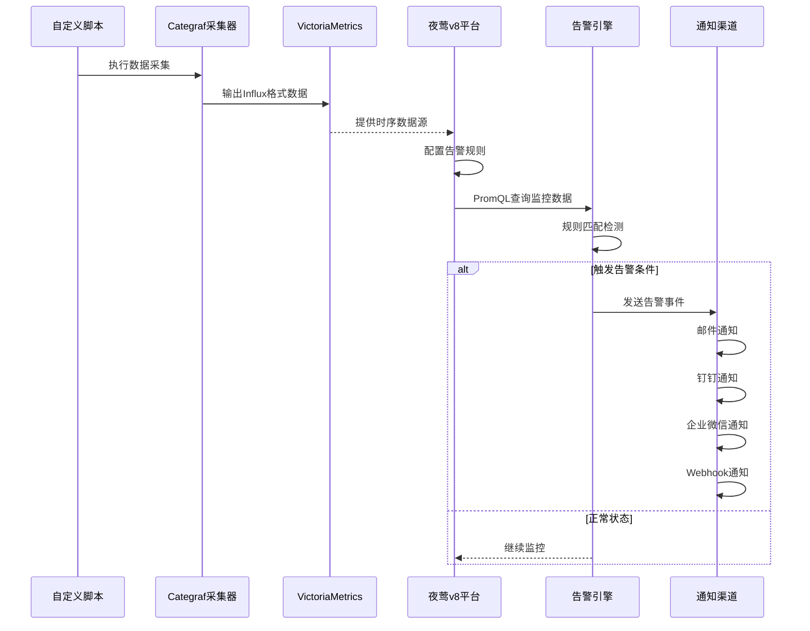

# 夜莺v8执行自定义脚本并告警通知

## 系统架构图

## 数据流说明

1. **数据采集层**: Categraf作为采集器执行自定义脚本，将数据转换为Influx格式
2. **存储层**: VictoriaMetrics作为时序数据库存储监控数据
3. **监控层**: 夜莺v8平台配置数据源和告警规则，使用PromQL进行数据查询
4. **告警层**: 告警引擎根据规则触发告警事件
5. **通知层**: 通过自定义通知配置将告警信息发送到各种渠道

## Categraf

Categraf的文档推荐阅读，[doc](https://flashcat.cloud/docs/content/flashcat-monitor/categraf/1-introduction/)