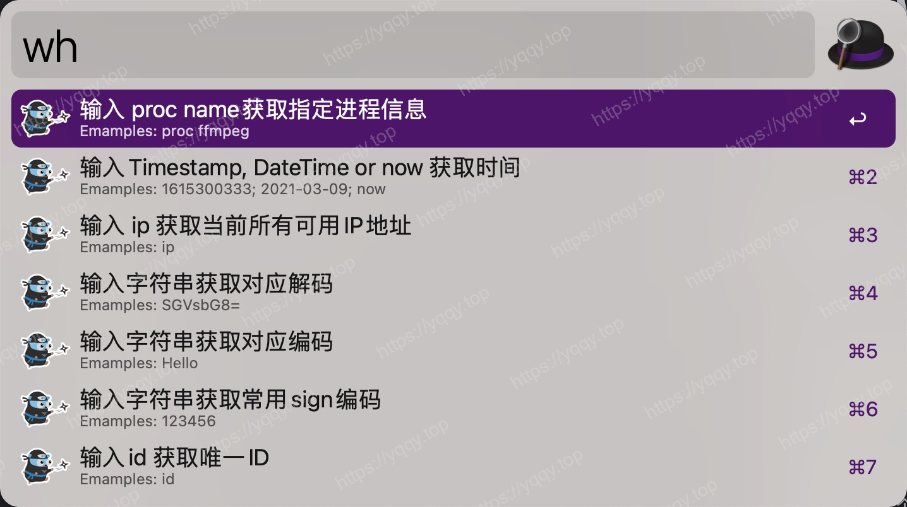

# 其他必要的软件安装参考

:::tip 说明
推荐不分先后，想起什么写什么
:::

## 1. Mos

:::info 推荐级别：🌟🌟🌟🌟🌟
推荐理由：Mac上的鼠标滚动方向总是反人类，使用这款软件丝滑解决该问题  
下载地址：https://mos.caldis.me
:::

## 2. Alfred

:::info 推荐级别：🌟🌟🌟🌟🌟
推荐理由：Alfred 是一款屡获殊荣的 macOS 应用程序，它通过热键、关键字、文本扩展等功能提高您的效率。搜索您的 Mac 和网络，并通过自定义操作来控制您的 Mac，从而提高工作效率。而且它支持自己编写 workflow，如图是变量命名的workflow。  
下载地址：Macked网站上自己找找哈
:::

## 3. 超级右键

:::info 推荐级别：🌟🌟🌟🌟🌟
推荐理由：从win系统过来的用户，会发现在桌面上右键创建文件功能缺少，可以使用该软件解决  
下载地址：AppStore搜索
:::

## 4. FastZip

:::info 推荐级别：🌟🌟🌟🌟
推荐理由：文件压缩和解压的软件，推荐他的理由是支持的格式足够多  
下载地址：AppStore搜索
:::

## 5. Snipaste

:::info 推荐级别：🌟🌟🌟🌟
推荐理由：一款很好用的截图软件，从win过来的不陌生  
下载地址：https://zh.snipaste.com
:::

## 6. Tencent Lemon

:::info 推荐级别：🌟🌟🌟🌟
推荐理由：清理文件垃圾，卸载软件的软件，很轻量，算是腾讯在Mac上的良心作品  
下载地址：https://lemon.qq.com
:::

## 7. OrbStack

:::info 推荐级别：🌟🌟🌟🌟🌟
推荐理由：本地docker desktop类工具，强烈安利给搞开发的朋友，比docker官方的好用，还轻量  
下载地址：https://orbstack.dev
:::

## 8. IINA

:::info 推荐级别：🌟🌟🌟🌟
推荐理由：一款播放器，十分强大且好用
下载地址：https://www.iina.io
:::

## 9. Karabiner

:::info 推荐级别：🌟🌟🌟🌟
推荐理由：适用于macOS的强大且稳定的键盘定制器，我个人是使用它定制了一套键位快捷键方案，使得我在mac/win直接无缝切换  
下载地址：https://karabiner-elements.pqrs.org
:::

## 10. Sourcetree

:::info 推荐级别：🌟🌟🌟🌟
推荐理由：一款免费的Git GUI工具，懂得都懂  
下载地址：https://www.sourcetreeapp.com
:::

## 11. Tabby

:::info 推荐级别：🌟🌟🌟🌟🌟
推荐理由：一款三方终端软件，强烈安利给搞开发的朋友，十分强大，可以配置跳板堡垒机等操作  
下载地址：https://github.com/Eugeny/tabby
:::

## 12. iStat Memus

:::info 推荐级别：🌟🌟🌟🌟🌟
推荐理由：Mac上一款优秀的监控软件  
下载地址：Macked网站上自己找找哈
:::

## 13. BetterDisplay

:::info 推荐级别：🌟🌟🌟🌟
推荐理由：自定义分辨率、XDR/HDR 额外亮度、虚拟屏幕、画中画、软断开、配置和 EDID 覆盖、DDC 控制、色彩模式选择、同步、布局保护等等。如果你是2k屏不受苹果支持那你一定要试试这款软件调整分辨率  
下载地址：Macked网站上自己找找哈
:::

