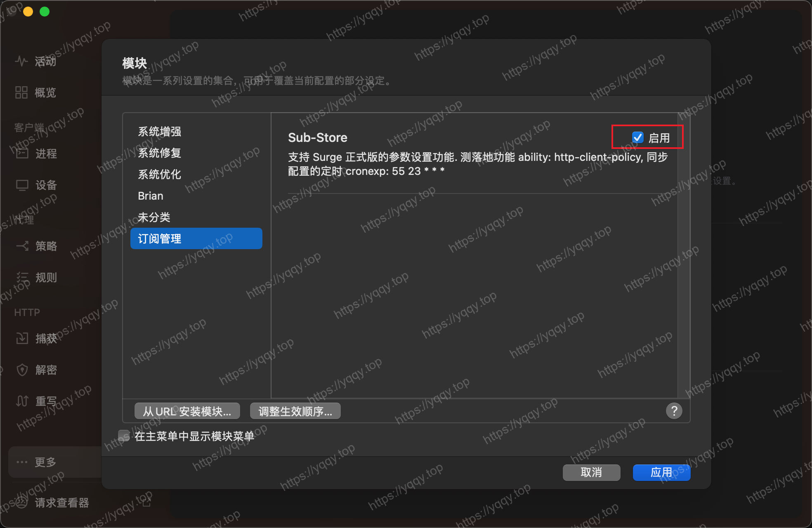
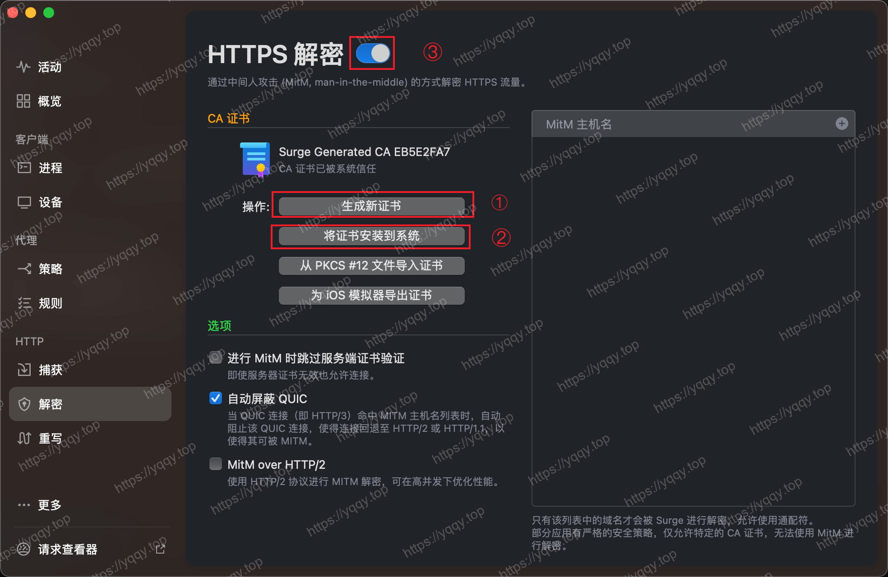
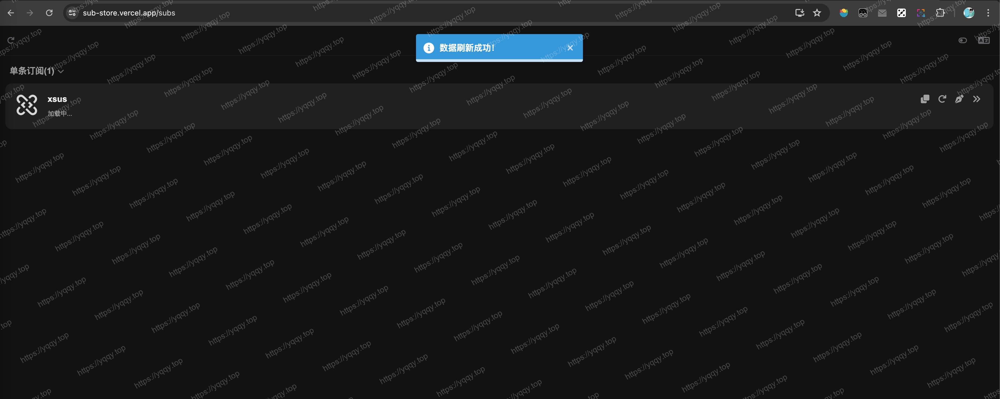
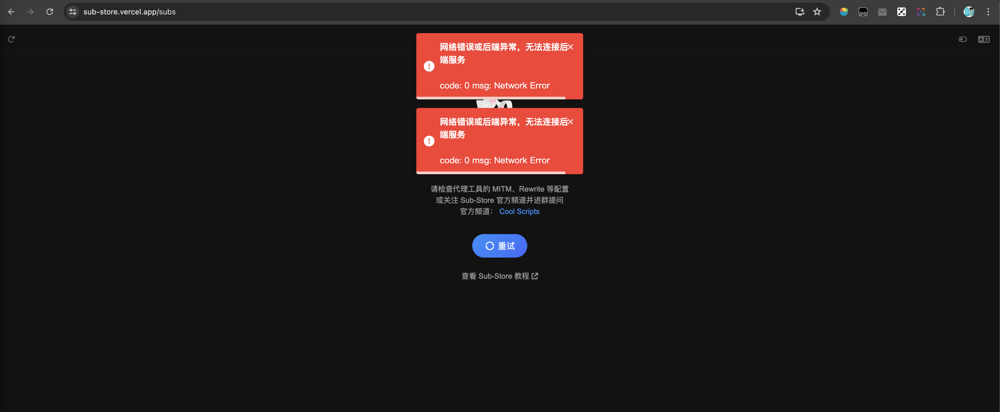
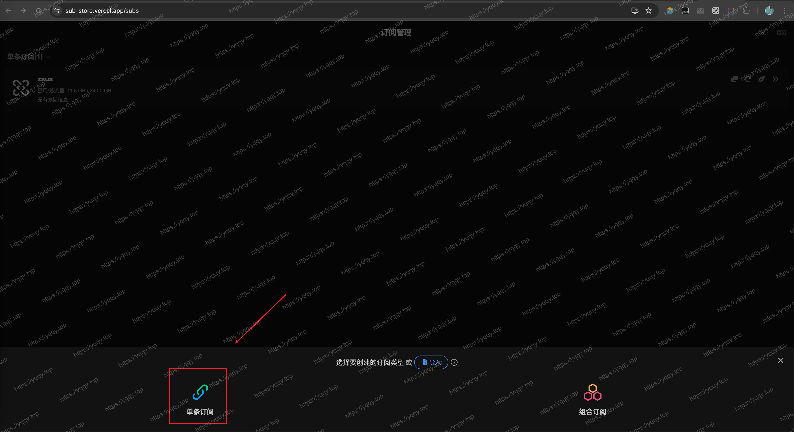
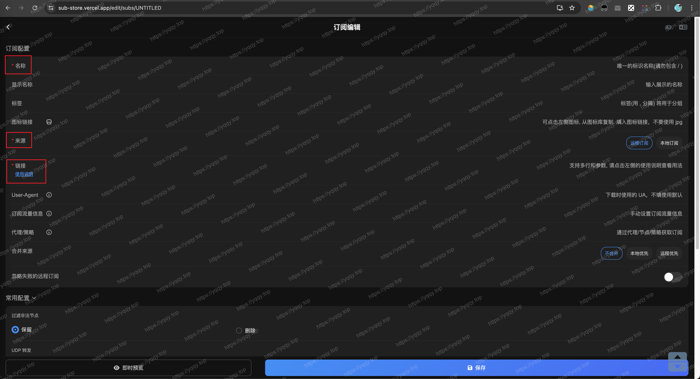
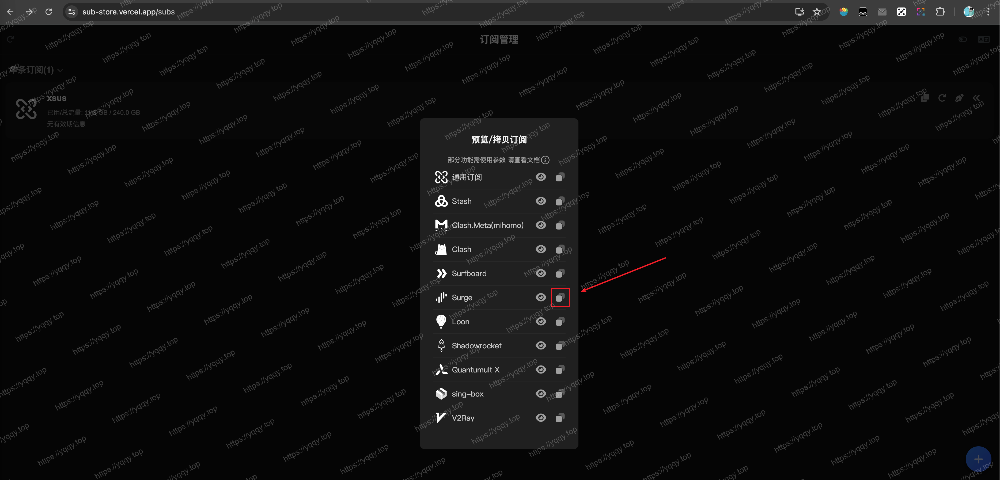
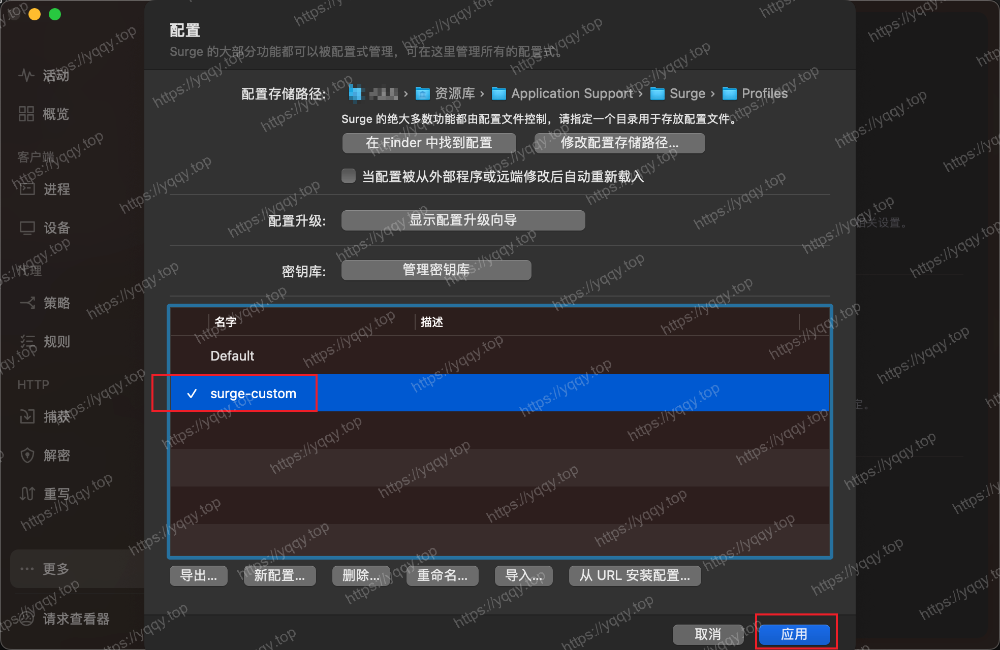

# Surge配置

:::tip 前提
你需要确保你的Surge是激活状态
:::

## 订阅节点

使用开源项目：[Sub-Store](https://github.com/sub-store-org/Sub-Store)  
介绍：适用于 Loon 、 Surge 和 Quantumult X 的高级订阅管理工具。完全本地解析，无订阅泄露的风险。

**安装：**

1. 打开Surge，找到 更多-模块
2. 从URL安装模块，输入`https://raw.githubusercontent.com/sub-store-org/Sub-Store/master/config/Surge.sgmodule`
3. 订阅成功后，从模块中选择启用

4. 找到 解密-升成新证书-将证书安装到系统

5. 然后**重启Surge** 并在启动后 **启用系统代理**
6. 打开 [https://sub.store](https://sub.store)，如果网页正常打开并弹出以下提示，则说明Sub-Store已经配置成功，直接看**第8步骤**

7. 如果**第6步骤**发生如下报错或者打不开界面，请打开[https://sub-store.vercel.app/subs](https://sub-store.vercel.app/subs)，这说明**系统代理未启用**，启用之后就正常了

8. 接下来设置Sub-Store插件，进入配置界面点右下角➕号，选择单条订阅

9. 配置所有带*号的项目，简单说一个名称，一个你的订阅链接

10. 点击保存并返回，点击一下添加的订阅，然后复制Surge链接


## Surge配置

vscode新建文件，命名surge-custom.conf，将以下配置粘贴进去，然后全局替换`填上你Sub-Store的节点信息`为上面复制的链接，一般是`https://sub.store/download/xxx?target=Surge`，然后点开 **更多-配置**，导入配置文件，双击配置文件，在配置前打勾之后点击应用，这样就完成了



::: details 配置详情，点击展开
```txt
[General]
# > 日志级别
loglevel = notify
show-error-page-for-reject = true
# > Wi-Fi 访问
allow-wifi-access = false
# > All Hybrid 网络并发
all-hybrid = false
# > IPv6 支持（默认关闭）
ipv6 = false
# > 测试超时（秒）
test-timeout = 2
# > Internet 测试 URL
internet-test-url = http://www.baidu.com
# > 代理测速 URL
proxy-test-url = http://www.google.com/generate_204
# > GeoIP数据库
geoip-maxmind-url = https://github.com/Hackl0us/GeoIP2-CN/raw/release/Country.mmdb
# > 排除简单主机名
exclude-simple-hostnames = true
# > DNS 服务器
dns-server = 223.5.5.5, 119.29.29.29
hijack-dns = 8.8.8.8:53, 8.8.4.4:53
# > 从 /etc/hosts 读取 DNS 记录
read-etc-hosts = true
# > 远程控制器
http-api-web-dashboard = false
use-default-policy-if-wifi-not-primary = false
# > 跳过代理
skip-proxy = 127.0.0.1, 192.168.0.0/16, 10.0.0.0/8, 172.16.0.0/12, 100.64.0.0/10, 17.0.0.0/8, localhost, *.local, *.crashlytics.com, seed-sequoia.siri.apple.com, sequoia.apple.com
# > Always Real IP Hosts
always-real-ip = *.srv.nintendo.net, *.stun.playstation.net, xbox.*.microsoft.com, *.xboxlive.com*.srv.nintendo.net, *.stun.playstation.net, xbox.*.microsoft.com, *.xboxlive.com, *.battlenet.com.cn, *.battlenet.com, *.blzstatic.cn, *.battle.net
http-listen = 0.0.0.0
socks5-listen = 0.0.0.0
 
[Replica]
# > 隐藏 Apple 请求
hide-apple-request = false
# > 隐藏崩溃追踪器请求
hide-crash-reporter-request = true
# > 隐藏 UDP 会话
hide-udp = false
# > 关键词过滤器
keyword-filter-type = false
 
[Proxy Group]
🚀 节点选择 = select, ♻️ 自动选择, 🇭🇰 香港节点, 🇨🇳 台湾节点, 🇸🇬 狮城节点, 🇯🇵 日本节点, 🇺🇲 美国节点, 🇰🇷 韩国节点, 🚀 手动切换, DIRECT
🚀 手动切换 = select, policy-path=填上你Sub-Store的节点信息
♻️ 自动选择 = url-test, policy-path=填上你Sub-Store的节点信息, url=http://www.gstatic.com/generate_204, interval=300, tolerance=50
📲 电报消息 = select, 🚀 节点选择, ♻️ 自动选择, 🇸🇬 狮城节点, 🇭🇰 香港节点, 🇨🇳 台湾节点, 🇯🇵 日本节点, 🇺🇲 美国节点, 🇰🇷 韩国节点, 🚀 手动切换, DIRECT
💬 OpenAi = select, 🚀 节点选择, ♻️ 自动选择, 🇸🇬 狮城节点, 🇭🇰 香港节点, 🇨🇳 台湾节点, 🇯🇵 日本节点, 🇺🇲 美国节点, 🇰🇷 韩国节点, 🚀 手动切换, DIRECT
📹 油管视频 = select, 🚀 节点选择, ♻️ 自动选择, 🇸🇬 狮城节点, 🇭🇰 香港节点, 🇨🇳 台湾节点, 🇯🇵 日本节点, 🇺🇲 美国节点, 🇰🇷 韩国节点, 🚀 手动切换, DIRECT
🎥 奈飞视频 = select, 🎥 奈飞节点, 🚀 节点选择
📺 巴哈姆特 = select, 🇨🇳 台湾节点, 🚀 节点选择, 🚀 手动切换, DIRECT
📺 哔哩哔哩 = select, 🎯 全球直连, 🇨🇳 台湾节点, 🇭🇰 香港节点
🌍 国外媒体 = select, 🚀 节点选择, ♻️ 自动选择, 🇭🇰 香港节点, 🇨🇳 台湾节点, 🇸🇬 狮城节点, 🇯🇵 日本节点, 🇺🇲 美国节点, 🇰🇷 韩国节点, 🚀 手动切换, DIRECT
🌏 国内媒体 = select, DIRECT, 🇭🇰 香港节点, 🇨🇳 台湾节点, 🇸🇬 狮城节点, 🇯🇵 日本节点, 🚀 手动切换
📢 谷歌FCM = select, DIRECT, 🚀 节点选择, 🇺🇲 美国节点, 🇭🇰 香港节点, 🇨🇳 台湾节点, 🇸🇬 狮城节点, 🇯🇵 日本节点, 🇰🇷 韩国节点, 🚀 手动切换
Ⓜ️ 微软云盘 = select, DIRECT, 🚀 节点选择, 🇺🇲 美国节点, 🇭🇰 香港节点, 🇨🇳 台湾节点, 🇸🇬 狮城节点, 🇯🇵 日本节点, 🇰🇷 韩国节点, 🚀 手动切换
Ⓜ️ 微软服务 = select, DIRECT, 🚀 节点选择, 🇺🇲 美国节点, 🇭🇰 香港节点, 🇨🇳 台湾节点, 🇸🇬 狮城节点, 🇯🇵 日本节点, 🇰🇷 韩国节点, 🚀 手动切换
🍎 苹果服务 = select, DIRECT, 🚀 节点选择, 🇺🇲 美国节点, 🇭🇰 香港节点, 🇨🇳 台湾节点, 🇸🇬 狮城节点, 🇯🇵 日本节点, 🇰🇷 韩国节点, 🚀 手动切换
🎮 游戏平台 = select, DIRECT, 🚀 节点选择, 🇺🇲 美国节点, 🇭🇰 香港节点, 🇨🇳 台湾节点, 🇸🇬 狮城节点, 🇯🇵 日本节点, 🇰🇷 韩国节点, 🚀 手动切换
🎶 网易音乐 = select, DIRECT, 🚀 节点选择, ♻️ 自动选择
🎯 全球直连 = select, DIRECT, 🚀 节点选择, ♻️ 自动选择
🛑 广告拦截 = select, REJECT, DIRECT
🍃 应用净化 = select, REJECT, DIRECT
🐟 漏网之鱼 = select, 🚀 节点选择, ♻️ 自动选择, DIRECT, 🇭🇰 香港节点, 🇨🇳 台湾节点, 🇸🇬 狮城节点, 🇯🇵 日本节点, 🇺🇲 美国节点, 🇰🇷 韩国节点, 🚀 手动切换
# > 外部节点自动匹配
# > 匹配到关键字，自动收纳为节点组
🇭🇰 香港节点 = url-test, policy-path=填上你Sub-Store的节点信息, policy-regex-filter=(🇭🇰)|(港)|(Hong)|(HK), url=http://www.gstatic.com/generate_204, interval=300, tolerance=150
🇨🇳 台湾节点 = url-test, policy-path=填上你Sub-Store的节点信息, policy-regex-filter=(🇨🇳)|(台)|(Tai)|(TW), url=http://www.gstatic.com/generate_204, interval=300, tolerance=150
🇺🇲 美国节点 = url-test, policy-path=填上你Sub-Store的节点信息, policy-regex-filter=(🇺🇸)|(美)|(States)|(US), url=http://www.gstatic.com/generate_204, interval=300, tolerance=150
🇯🇵 日本节点 = url-test, policy-path=填上你Sub-Store的节点信息, policy-regex-filter=(🇯🇵)|(日)|(Japan)|(JP), url=http://www.gstatic.com/generate_204, interval=300, tolerance=150
🇸🇬 狮城节点 = url-test, policy-path=填上你Sub-Store的节点信息, policy-regex-filter=(🇸🇬)|(新)|(Singapore)|(SG), url=http://www.gstatic.com/generate_204, interval=300, tolerance=150
🇰🇷 韩国节点 = url-test, policy-path=填上你Sub-Store的节点信息, policy-regex-filter=(🇰🇷)|(韩)|(Korea)|(KR), url=http://www.gstatic.com/generate_204, interval=300, tolerance=150
🎥 奈飞节点 = select, policy-path=填上你Sub-Store的节点信息, policy-regex-filter=(NF)|(奈飞)|(Netflix)|(video)|(Video)|(nf), url=http://www.gstatic.com/generate_204, interval=300, tolerance=150
 
[Rule]
RULE-SET,https://raw.githubusercontent.com/ACL4SSR/ACL4SSR/master/Clash/LocalAreaNetwork.list,🎯 全球直连,update-interval=86400
RULE-SET,https://raw.githubusercontent.com/ACL4SSR/ACL4SSR/master/Clash/UnBan.list,🎯 全球直连,update-interval=86400
RULE-SET,https://raw.githubusercontent.com/ACL4SSR/ACL4SSR/master/Clash/BanAD.list,🛑 广告拦截,update-interval=86400
RULE-SET,https://raw.githubusercontent.com/ACL4SSR/ACL4SSR/master/Clash/BanProgramAD.list,🍃 应用净化,update-interval=86400
RULE-SET,https://raw.githubusercontent.com/ACL4SSR/ACL4SSR/master/Clash/Ruleset/GoogleFCM.list,📢 谷歌FCM,update-interval=86400
RULE-SET,https://raw.githubusercontent.com/ACL4SSR/ACL4SSR/master/Clash/GoogleCN.list,🎯 全球直连,update-interval=86400
RULE-SET,https://raw.githubusercontent.com/ACL4SSR/ACL4SSR/master/Clash/Ruleset/SteamCN.list,🎯 全球直连,update-interval=86400
RULE-SET,https://raw.githubusercontent.com/ACL4SSR/ACL4SSR/master/Clash/OneDrive.list,Ⓜ️ 微软云盘,update-interval=86400
RULE-SET,https://raw.githubusercontent.com/ACL4SSR/ACL4SSR/master/Clash/Microsoft.list,Ⓜ️ 微软服务,update-interval=86400
RULE-SET,https://raw.githubusercontent.com/ACL4SSR/ACL4SSR/master/Clash/Apple.list,🍎 苹果服务,update-interval=86400
RULE-SET,https://raw.githubusercontent.com/ACL4SSR/ACL4SSR/master/Clash/Telegram.list,📲 电报消息,update-interval=86400
RULE-SET,https://raw.githubusercontent.com/ACL4SSR/ACL4SSR/master/Clash/Ruleset/OpenAi.list,💬 OpenAi,update-interval=86400
RULE-SET,https://raw.githubusercontent.com/ACL4SSR/ACL4SSR/master/Clash/Ruleset/NetEaseMusic.list,🎶 网易音乐,update-interval=86400
RULE-SET,https://raw.githubusercontent.com/ACL4SSR/ACL4SSR/master/Clash/Ruleset/Epic.list,🎮 游戏平台,update-interval=86400
RULE-SET,https://raw.githubusercontent.com/ACL4SSR/ACL4SSR/master/Clash/Ruleset/Origin.list,🎮 游戏平台,update-interval=86400
RULE-SET,https://raw.githubusercontent.com/ACL4SSR/ACL4SSR/master/Clash/Ruleset/Sony.list,🎮 游戏平台,update-interval=86400
RULE-SET,https://raw.githubusercontent.com/ACL4SSR/ACL4SSR/master/Clash/Ruleset/Steam.list,🎮 游戏平台,update-interval=86400
RULE-SET,https://raw.githubusercontent.com/ACL4SSR/ACL4SSR/master/Clash/Ruleset/Nintendo.list,🎮 游戏平台,update-interval=86400
RULE-SET,https://raw.githubusercontent.com/ACL4SSR/ACL4SSR/master/Clash/Ruleset/YouTube.list,📹 油管视频,update-interval=86400
RULE-SET,https://raw.githubusercontent.com/ACL4SSR/ACL4SSR/master/Clash/Ruleset/Netflix.list,🎥 奈飞视频,update-interval=86400
RULE-SET,https://raw.githubusercontent.com/ACL4SSR/ACL4SSR/master/Clash/Ruleset/Bahamut.list,📺 巴哈姆特,update-interval=86400
RULE-SET,https://raw.githubusercontent.com/ACL4SSR/ACL4SSR/master/Clash/Ruleset/BilibiliHMT.list,📺 哔哩哔哩,update-interval=86400
RULE-SET,https://raw.githubusercontent.com/ACL4SSR/ACL4SSR/master/Clash/Ruleset/Bilibili.list,📺 哔哩哔哩,update-interval=86400
RULE-SET,https://raw.githubusercontent.com/ACL4SSR/ACL4SSR/master/Clash/ChinaMedia.list,🌏 国内媒体,update-interval=86400
RULE-SET,https://raw.githubusercontent.com/ACL4SSR/ACL4SSR/master/Clash/ProxyMedia.list,🌍 国外媒体,update-interval=86400
RULE-SET,https://raw.githubusercontent.com/ACL4SSR/ACL4SSR/master/Clash/ProxyGFWlist.list,🚀 节点选择,update-interval=86400
RULE-SET,https://raw.githubusercontent.com/ACL4SSR/ACL4SSR/master/Clash/ChinaDomain.list,🎯 全球直连,update-interval=86400
RULE-SET,https://raw.githubusercontent.com/ACL4SSR/ACL4SSR/master/Clash/ChinaCompanyIp.list,🎯 全球直连,update-interval=86400
RULE-SET,https://raw.githubusercontent.com/ACL4SSR/ACL4SSR/master/Clash/Download.list,🎯 全球直连,update-interval=86400
GEOIP,CN,🎯 全球直连
FINAL,🐟 漏网之鱼
```
:::

## Panels模块

Panels模块是在Surge(2814版本新增的)，找到几个网友分享的，具体干啥用的点开看说明吧

```txt
https://raw.githubusercontent.com/xream/scripts/main/surge/modules/network-info/net-lsp-x.sgmodule
https://whatshub.top/sgmodule/gpt.sgmodule
https://whatshub.top/sgmodule/ip-api.sgmodule
https://raw.githubusercontent.com/getsomecat/GetSomeCats/Surge/modules/Panel/Net_Speed/Net_Speed.sgmodule
https://whatshub.top/sgmodule/media.sgmodule
https://raw.githubusercontent.com/TributePaulWalker/Profiles/main/Surge/Module/Surge_ConnectivityTest.sgmodule
```

## 排错指南

1. https://sub-store.vercel.app 是搭建在 vercel 上的, 请自己保证能正常访问(分流和节点自己处理)
2. 确保模块和脚本都下载成功（由于网络问题可以先借助clash让脚本下载成功）
3. 浏览器中访问 https://sub.store/api/utils/env (注意 这是 https) 应该可以看到版本号
4. 如果报错, 尝试访问 http://sub.store/api/utils/env (注意 这是 http) 如果成功 那就是 MitM/证书信任的问题
5. 如果还是不行 一般是因为请求没有进重写, 请检查是否开启了重写和脚本功能(不同的 app 可能会有差异, 总之得开启功能)
6. 以上都不行的话，建议使用工具彻底卸载surge，重新安装试试