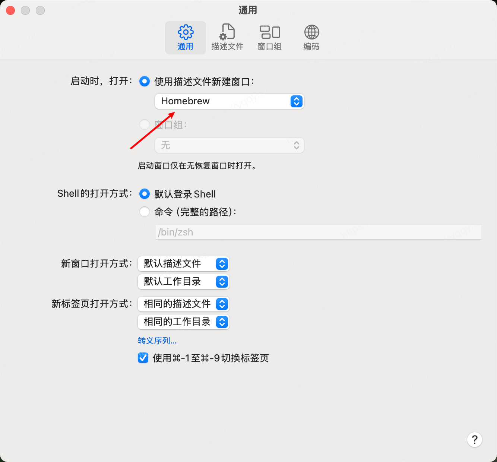
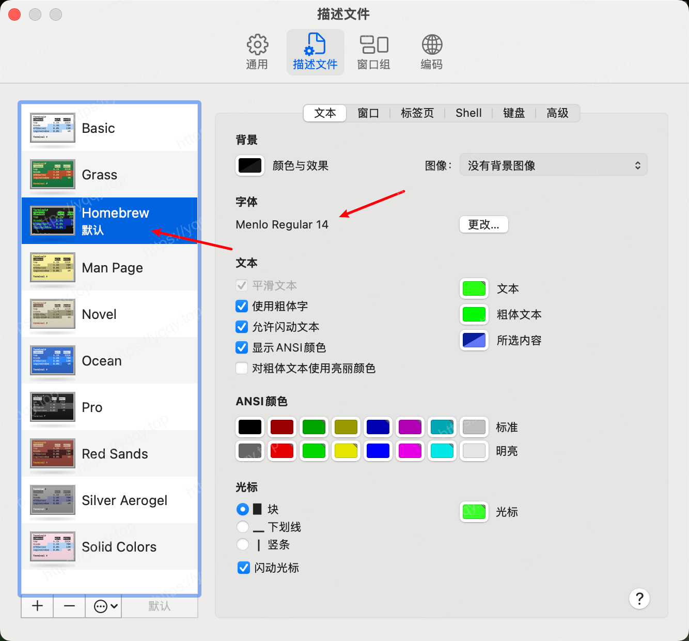
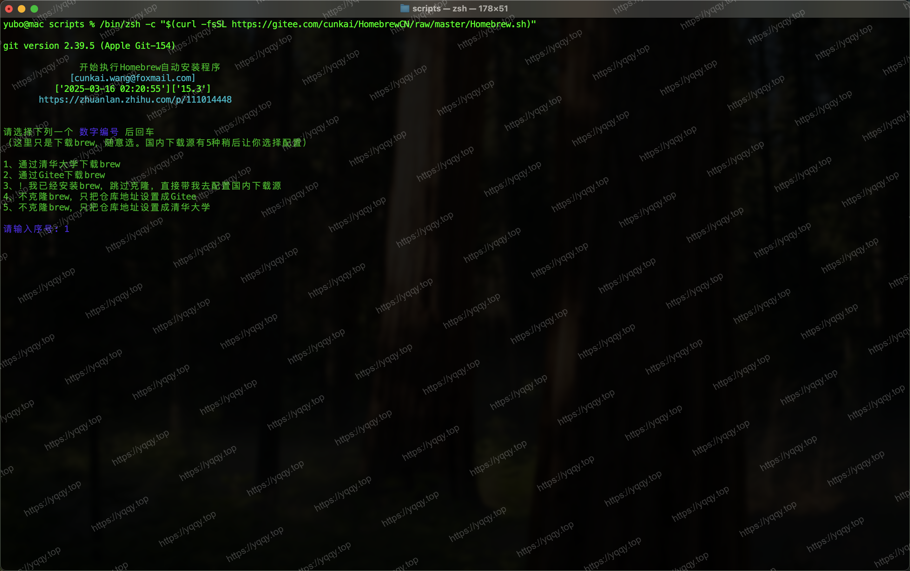
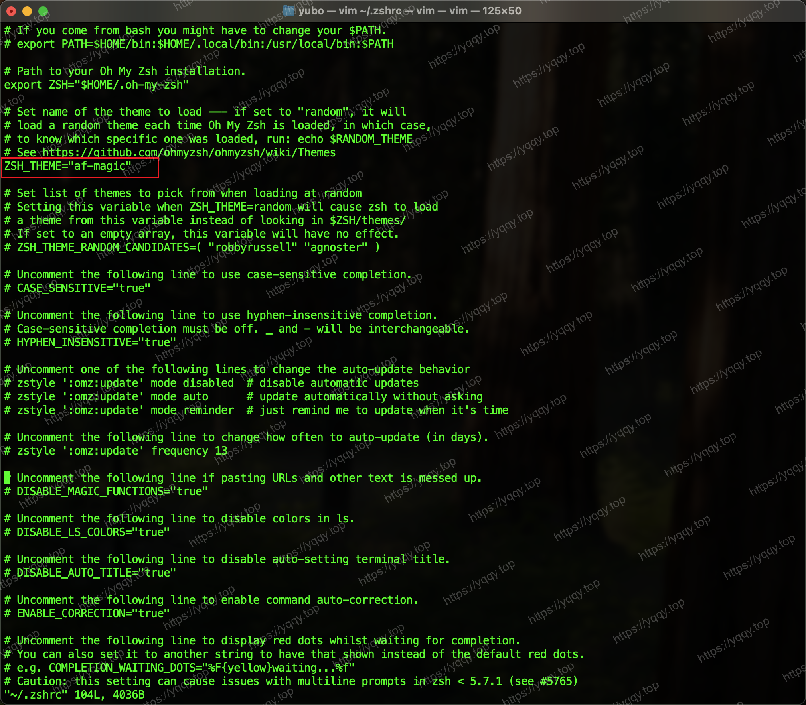
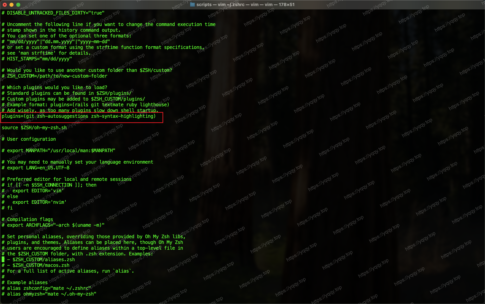
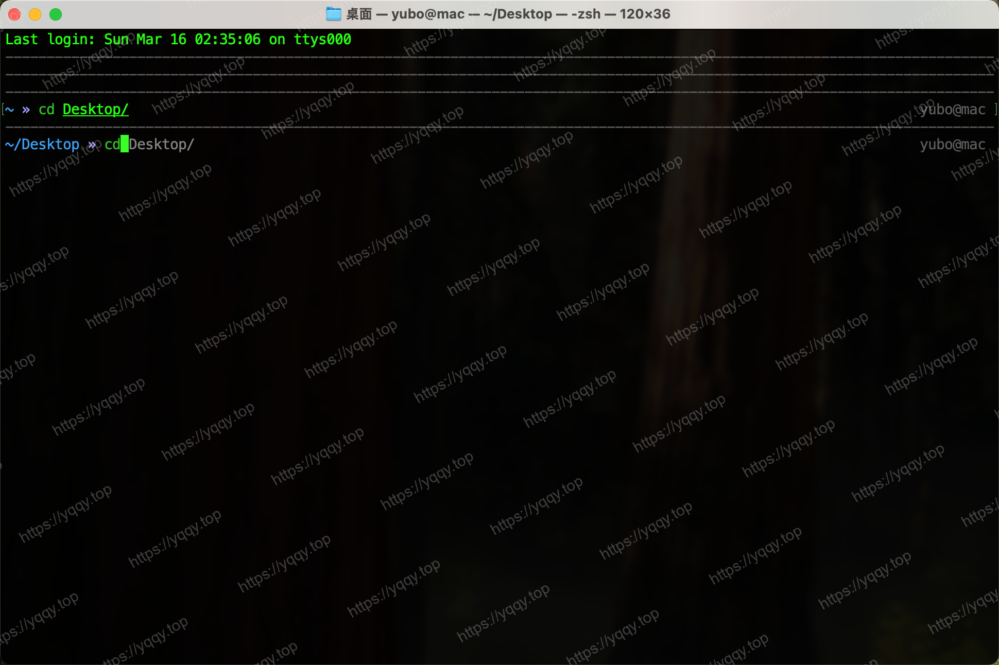

# Terminal配置

## 基础配置

打开`终端` -> `设置`，按照图片所示配置






## 安装Homebrew

执行命令安装，按照脚本提示执行
```sh
/bin/zsh -c "$(curl -fsSL https://gitee.com/cunkai/HomebrewCN/raw/master/Homebrew.sh)"
```



## 安装Oh-My-Zsh

执行命令安装，按照脚本提示执行
```sh
sh -c "$(curl -fsSL https://raw.githubusercontent.com/ohmyzsh/ohmyzsh/master/tools/install.sh)"
```

### 配置插件与主题

**下载自动补全插件** `zsh-autosuggestions`，安装命令：

```bash
git clone https://github.com/zsh-users/zsh-autosuggestions ${ZSH_CUSTOM:-~/.oh-my-zsh/custom}/plugins/zsh-autosuggestions
```

**下载语法高亮插件** `zsh-syntax-highlighting`，安装命令：

```bash
git clone https://github.com/zsh-users/zsh-syntax-highlighting.git ${ZSH_CUSTOM:-~/.oh-my-zsh/custom}/plugins/zsh-syntax-highlighting
```

使用 `vim ~/.zshrc` 编辑zsh配置，配置后执行 `source ~/.zshrc` 生效，如图：







## 参考资料

* [Homebrew国内源项目](https://gitee.com/cunkai/HomebrewCN)
* [Oh-My-Zsh官网](https://ohmyz.sh/#install)