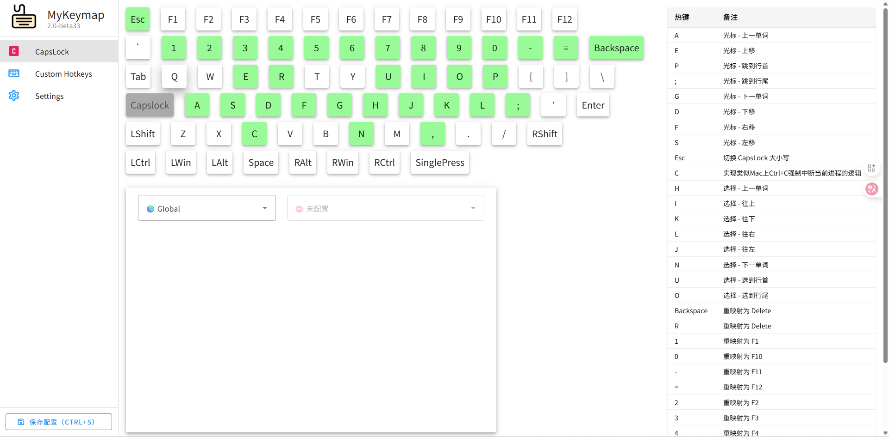
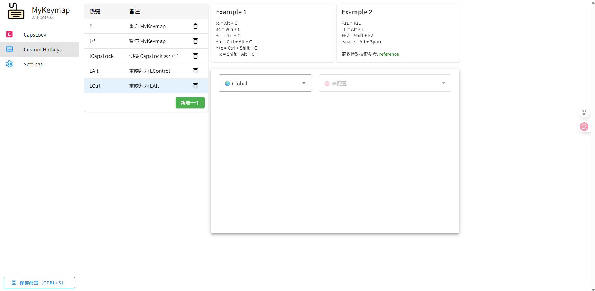

# MKeymap - 键盘映射神器

::: tip 絮叨
关于键位映射，从工作以来一直使用，从`capslock+`免费版开始用到收费。随后由自己使用`karabiner`配置了一套MacOS端的配置 [capslox-karabiner](https://github.com/yqchilde/capslox-karabiner)，于年前购入一台Win电脑，为了近乎无适应成本又研究了Win端的键位映射，于是发现了`MKeyMap`这款神器
:::

产品描述我不多数了，根据产品文档了解一下，文档地址：[MyKeymap-Doc](https://xianyukang.com/MyKeymap.html)

## 我的配置

**2025-09-24更新：** 已将配置整理到仓库中

[点击查看capslox-mykeymap项目](https://github.com/yqchilde/capslox-mykeymap)

---

