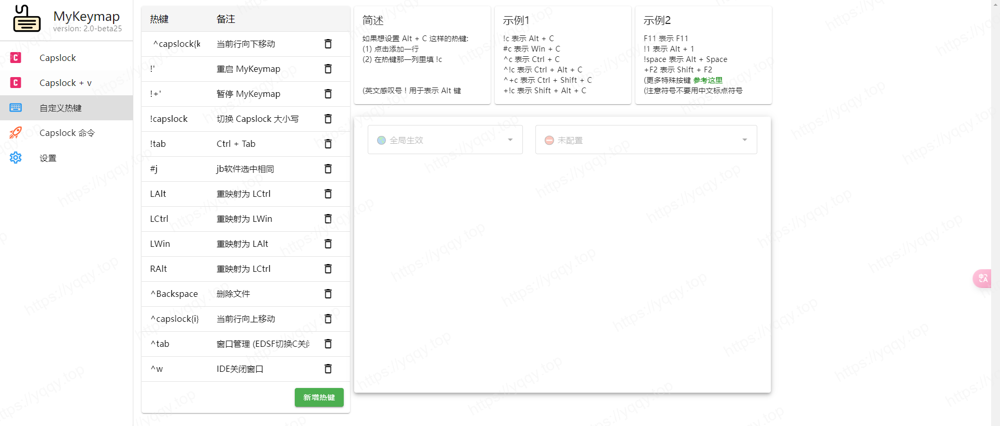
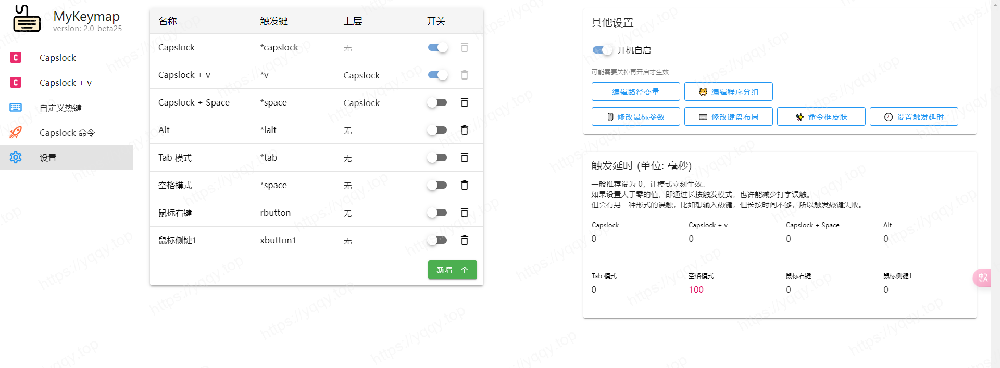

# MKeymap - 键盘映射神器

::: tip 絮叨
关于键位映射，从工作以来一直使用，从`capslock+`免费版开始用到收费。随后由自己使用`karabiner`配置了一套MacOS端的配置 [capslox-karabiner](https://github.com/yqchilde/capslox-karabiner)，于年前购入一台Win电脑，为了近乎无适应成本又研究了Win端的键位映射，于是发现了`MKeyMap`这款神器
:::

产品描述我不多数了，根据产品文档了解一下，文档地址：[MyKeymap-Doc](https://xianyukang.com/MyKeymap.html)

## 我的配置





::: details 详细配置 config.json
```json
{
  "keymaps": [
    {
      "id": 5,
      "name": "Capslock",
      "enable": true,
      "hotkey": "*capslock",
      "parentID": 0,
      "delay": 0,
      "hotkeys": {
        "*,": [
          {
            "windowGroupID": 0,
            "actionTypeID": 6,
            "comment": "选中当前单词",
            "keysToSend": "{Ctrl down}{Left}{Ctrl up}\n{Ctrl down}{Shift down}{Right}{Shift up}{Ctrl up}"
          }
        ],
        "*-": [
          {
            "windowGroupID": 0,
            "actionTypeID": 5,
            "comment": "重映射为 f11",
            "remapToKey": "f11"
          }
        ],
        "*.": [
          {
            "windowGroupID": 0,
            "actionTypeID": 3,
            "comment": "让窗口随鼠标拖动",
            "actionValueID": 13
          }
        ],
        "*/": [
          {
            "windowGroupID": 0,
            "actionTypeID": 4,
            "comment": "移动鼠标到窗口中心",
            "actionValueID": 13
          }
        ],
        "*0": [
          {
            "windowGroupID": 0,
            "actionTypeID": 5,
            "comment": "重映射为 f10",
            "remapToKey": "f10"
          }
        ],
        "*1": [
          {
            "windowGroupID": 0,
            "actionTypeID": 5,
            "comment": "重映射为 f1",
            "remapToKey": "f1"
          }
        ],
        "*2": [
          {
            "windowGroupID": 0,
            "actionTypeID": 5,
            "comment": "重映射为 f2",
            "remapToKey": "f2"
          }
        ],
        "*3": [
          {
            "windowGroupID": 0,
            "actionTypeID": 5,
            "comment": "重映射为 f3",
            "remapToKey": "f3"
          }
        ],
        "*4": [
          {
            "windowGroupID": 0,
            "actionTypeID": 5,
            "comment": "重映射为 f4",
            "remapToKey": "f4"
          }
        ],
        "*5": [
          {
            "windowGroupID": 0,
            "actionTypeID": 5,
            "comment": "重映射为 f5",
            "remapToKey": "f5"
          }
        ],
        "*6": [
          {
            "windowGroupID": 0,
            "actionTypeID": 5,
            "comment": "重映射为 f6",
            "remapToKey": "f6"
          }
        ],
        "*7": [
          {
            "windowGroupID": 0,
            "actionTypeID": 5,
            "comment": "重映射为 f7",
            "remapToKey": "f7"
          }
        ],
        "*8": [
          {
            "windowGroupID": 0,
            "actionTypeID": 5,
            "comment": "重映射为 f8",
            "remapToKey": "f8"
          }
        ],
        "*9": [
          {
            "windowGroupID": 0,
            "actionTypeID": 5,
            "comment": "重映射为 f9",
            "remapToKey": "f9"
          }
        ],
        "*;": [
          {
            "windowGroupID": 0,
            "actionTypeID": 7,
            "comment": "光标 - 跳到行尾",
            "actionValueID": 6
          }
        ],
        "*=": [
          {
            "windowGroupID": 0,
            "actionTypeID": 5,
            "comment": "重映射为 f12",
            "remapToKey": "f12"
          }
        ],
        "*a": [
          {
            "windowGroupID": 0,
            "actionTypeID": 7,
            "comment": "光标 - 上一单词",
            "actionValueID": 7
          }
        ],
        "*b": [
          {
            "windowGroupID": 0,
            "actionTypeID": 3,
            "comment": "窗口最小化",
            "actionValueID": 8
          }
        ],
        "*backspace": [
          {
            "windowGroupID": 0,
            "actionTypeID": 6,
            "comment": "删除当前行",
            "keysToSend": "{End}\n{Shift down}{Home}{Shift up}{Del}"
          }
        ],
        "*c": [
          {
            "windowGroupID": 0,
            "actionTypeID": 2,
            "comment": "音量调节",
            "actionValueID": 5
          }
        ],
        "*d": [
          {
            "windowGroupID": 0,
            "actionTypeID": 7,
            "comment": "光标 - 下移",
            "actionValueID": 2
          }
        ],
        "*e": [
          {
            "windowGroupID": 0,
            "actionTypeID": 7,
            "comment": "光标 - 上移",
            "actionValueID": 1
          }
        ],
        "*f": [
          {
            "windowGroupID": 0,
            "actionTypeID": 7,
            "comment": "光标 - 右移",
            "actionValueID": 4
          }
        ],
        "*g": [
          {
            "windowGroupID": 0,
            "actionTypeID": 7,
            "comment": "光标 - 下一单词",
            "actionValueID": 8
          }
        ],
        "*h": [
          {
            "windowGroupID": 0,
            "actionTypeID": 7,
            "comment": "选择 - 上一单词",
            "actionValueID": 15
          }
        ],
        "*i": [
          {
            "windowGroupID": 0,
            "actionTypeID": 7,
            "comment": "选择 - 往上",
            "actionValueID": 9
          }
        ],
        "*j": [
          {
            "windowGroupID": 0,
            "actionTypeID": 7,
            "comment": "选择 - 往左",
            "actionValueID": 11
          }
        ],
        "*k": [
          {
            "windowGroupID": 0,
            "actionTypeID": 7,
            "comment": "选择 - 往下",
            "actionValueID": 10
          }
        ],
        "*l": [
          {
            "windowGroupID": 0,
            "actionTypeID": 7,
            "comment": "选择 - 往右",
            "actionValueID": 12
          }
        ],
        "*n": [
          {
            "windowGroupID": 0,
            "actionTypeID": 7,
            "comment": "选择 - 下一单词",
            "actionValueID": 16
          }
        ],
        "*o": [
          {
            "windowGroupID": 0,
            "actionTypeID": 7,
            "comment": "选择 - 选到行尾",
            "actionValueID": 14
          }
        ],
        "*p": [
          {
            "windowGroupID": 0,
            "actionTypeID": 7,
            "comment": "光标 - 跳到行首",
            "actionValueID": 5
          }
        ],
        "*r": [
          {
            "windowGroupID": 0,
            "actionTypeID": 7,
            "comment": "Delete",
            "actionValueID": 23
          }
        ],
        "*s": [
          {
            "windowGroupID": 0,
            "actionTypeID": 7,
            "comment": "光标 - 左移",
            "actionValueID": 3
          }
        ],
        "*space": [
          {
            "windowGroupID": 0,
            "actionTypeID": 6,
            "keysToSend": "{LWin down}{Shift}{LWin up}"
          }
        ],
        "*u": [
          {
            "windowGroupID": 0,
            "actionTypeID": 7,
            "comment": "选择 - 选到行首",
            "actionValueID": 13
          }
        ],
        "*w": [
          {
            "windowGroupID": 0,
            "actionTypeID": 7,
            "comment": "Backspace",
            "actionValueID": 21
          }
        ],
        "*z": [
          {
            "windowGroupID": 0,
            "actionTypeID": 2,
            "comment": "复制文件路径或纯文本",
            "actionValueID": 8
          }
        ],
        "singlePress": [
          {
            "windowGroupID": 0,
            "actionTypeID": 9,
            "comment": "触发 Capslock 命令",
            "actionValueID": 6
          }
        ]
      }
    },
    {
      "id": 6,
      "name": "Capslock + v",
      "enable": true,
      "hotkey": "*v",
      "parentID": 5,
      "delay": 0,
      "hotkeys": {
        "*a": [
          {
            "windowGroupID": 0,
            "actionTypeID": 1,
            "comment": "Windows Terminal",
            "winTitle": "ahk_exe WindowsTerminal.exe",
            "target": "shortcuts\\终端预览.lnk"
          }
        ],
        "*d": [
          {
            "windowGroupID": 0,
            "actionTypeID": 1,
            "comment": "Edge",
            "winTitle": "ahk_exe msedge.exe",
            "target": "shortcuts\\Microsoft Edge.lnk"
          }
        ],
        "*e": [
          {
            "windowGroupID": 0,
            "actionTypeID": 1,
            "comment": "File Explorer",
            "winTitle": "ahk_class CabinetWClass ahk_exe Explorer.EXE",
            "target": "D:\\"
          }
        ],
        "*h": [
          {
            "windowGroupID": 0,
            "actionTypeID": 1,
            "comment": "Visual Studio",
            "winTitle": "- Microsoft Visual Studio",
            "target": "shortcuts\\Visual Studio 2019.lnk"
          }
        ],
        "*i": [
          {
            "windowGroupID": 0,
            "actionTypeID": 1,
            "comment": "Typora",
            "winTitle": "ahk_exe Typora.exe",
            "target": "shortcuts\\Typora.lnk"
          }
        ],
        "*j": [
          {
            "windowGroupID": 0,
            "actionTypeID": 1,
            "comment": "IntelliJ IDEA",
            "winTitle": "ahk_exe idea64.exe",
            "target": "shortcuts\\IntelliJ IDEA Ultimate.lnk"
          }
        ],
        "*k": [
          {
            "windowGroupID": 0,
            "actionTypeID": 1,
            "comment": "PotPlayer",
            "winTitle": "ahk_class PotPlayer64",
            "target": "shortcuts\\PotPlayer 64 bit.lnk"
          }
        ],
        "*l": [
          {
            "windowGroupID": 0,
            "actionTypeID": 1,
            "comment": "Excel",
            "winTitle": "ahk_exe EXCEL.EXE",
            "target": "shortcuts\\Excel.lnk"
          }
        ],
        "*m": [
          {
            "windowGroupID": 0,
            "actionTypeID": 8,
            "comment": "如果 TIM.exe 进程存在则输入 Ctrl+Alt+Z 热键激活 TIM，否则启动 TIM",
            "ahkCode": "ProcessExistSendKeyOrRun(\"TIM.exe\", \"^!z\", \"shortcuts\\TIM.lnk\")"
          }
        ],
        "*n": [
          {
            "windowGroupID": 0,
            "actionTypeID": 1,
            "comment": "GoLand",
            "winTitle": "ahk_exe goland64.exe",
            "target": "shortcuts\\GoLand.lnk"
          }
        ],
        "*o": [
          {
            "windowGroupID": 0,
            "actionTypeID": 1,
            "comment": "OneNote 桌面版",
            "winTitle": "ahk_exe ONENOTE.EXE",
            "target": "shortcuts\\OneNote.lnk"
          }
        ],
        "*p": [
          {
            "windowGroupID": 0,
            "actionTypeID": 1,
            "comment": "PowerPoint",
            "winTitle": "ahk_exe POWERPNT.EXE",
            "target": "shortcuts\\PowerPoint.lnk"
          }
        ],
        "*q": [
          {
            "windowGroupID": 0,
            "actionTypeID": 1,
            "comment": "Everything",
            "winTitle": "ahk_class EVERYTHING",
            "target": "shortcuts\\Everything.lnk"
          }
        ],
        "*r": [
          {
            "windowGroupID": 0,
            "actionTypeID": 1,
            "comment": "FoxitReader",
            "winTitle": "ahk_exe FoxitReader.exe",
            "target": "D:\\install\\Foxit Reader\\FoxitReader.exe"
          }
        ],
        "*s": [
          {
            "windowGroupID": 0,
            "actionTypeID": 1,
            "comment": "Visual Studio Code",
            "winTitle": "ahk_exe Code.exe",
            "target": "shortcuts\\Visual Studio Code.lnk"
          }
        ],
        "*w": [
          {
            "windowGroupID": 0,
            "actionTypeID": 1,
            "comment": "Chrome",
            "winTitle": "ahk_exe chrome.exe",
            "target": "shortcuts\\Google Chrome.lnk"
          }
        ],
        "singlePress": [
          {
            "windowGroupID": 0,
            "actionTypeID": 6,
            "comment": "输入 f 键",
            "keysToSend": "{blind}{f}"
          }
        ]
      }
    },
    {
      "id": 7,
      "name": "Capslock + Space",
      "enable": false,
      "hotkey": "*space",
      "parentID": 5,
      "delay": 0,
      "hotkeys": {
        "*d": [
          {
            "windowGroupID": 0,
            "actionTypeID": 1,
            "comment": "DataGrip",
            "winTitle": "ahk_exe datagrip64.exe",
            "target": "shortcuts\\DataGrip.lnk"
          }
        ],
        "*w": [
          {
            "windowGroupID": 0,
            "actionTypeID": 8,
            "comment": "如果 WeChat.exe 进程存在则输入 Ctrl+Alt+W 热键激活微信，否则启动微信",
            "ahkCode": "ProcessExistSendKeyOrRun(\"WeChat.exe\", \"^!w\", \"shortcuts\\微信.lnk\")"
          }
        ],
        "singlePress": [
          {
            "windowGroupID": 0,
            "actionTypeID": 6,
            "comment": "输入 space 键",
            "keysToSend": "{blind}{space}"
          }
        ]
      }
    },
    {
      "id": 10,
      "name": "Alt",
      "enable": false,
      "hotkey": "*lalt",
      "parentID": 0,
      "delay": 0,
      "hotkeys": {
        "*LWin": [
          {
            "windowGroupID": 0,
            "actionTypeID": 5,
            "comment": "重映射为 LAlt",
            "remapToKey": "LAlt"
          }
        ],
        "*j": [
          {
            "windowGroupID": 0,
            "actionTypeID": 6,
            "keysToSend": "sda"
          }
        ],
        "singlePress": [
          {
            "windowGroupID": 0,
            "actionTypeID": 6,
            "keysToSend": "{blind}{LAlt}"
          }
        ]
      }
    },
    {
      "id": 11,
      "name": "Tab 模式",
      "enable": false,
      "hotkey": "*tab",
      "parentID": 0,
      "delay": 0,
      "hotkeys": {
        "singlePress": [
          {
            "windowGroupID": 0,
            "actionTypeID": 6,
            "comment": "输入 tab 键",
            "keysToSend": "{blind}{tab}"
          }
        ]
      }
    },
    {
      "id": 12,
      "name": "空格模式",
      "enable": false,
      "hotkey": "*space",
      "parentID": 0,
      "delay": 100,
      "hotkeys": {
        "*,": [
          {
            "windowGroupID": 0,
            "actionTypeID": 7,
            "comment": "Delete",
            "actionValueID": 23
          }
        ],
        "*.": [
          {
            "windowGroupID": 0,
            "actionTypeID": 7,
            "comment": "Insert",
            "actionValueID": 24
          }
        ],
        "*2": [
          {
            "windowGroupID": 0,
            "actionTypeID": 7,
            "comment": "Ctrl+Shift+Tab",
            "actionValueID": 28
          }
        ],
        "*3": [
          {
            "windowGroupID": 0,
            "actionTypeID": 7,
            "comment": "Ctrl + Tab",
            "actionValueID": 26
          }
        ],
        "*a": [
          {
            "windowGroupID": 0,
            "actionTypeID": 7,
            "comment": "光标 - 跳到行首",
            "actionValueID": 5
          }
        ],
        "*b": [
          {
            "windowGroupID": 0,
            "actionTypeID": 7,
            "comment": "删除一个单词",
            "actionValueID": 18
          }
        ],
        "*c": [
          {
            "windowGroupID": 0,
            "actionTypeID": 7,
            "comment": "Backspace",
            "actionValueID": 21
          }
        ],
        "*d": [
          {
            "windowGroupID": 0,
            "actionTypeID": 7,
            "comment": "光标 - 下移",
            "actionValueID": 2
          }
        ],
        "*e": [
          {
            "windowGroupID": 0,
            "actionTypeID": 7,
            "comment": "光标 - 上移",
            "actionValueID": 1
          }
        ],
        "*f": [
          {
            "windowGroupID": 0,
            "actionTypeID": 7,
            "comment": "光标 - 右移",
            "actionValueID": 4
          }
        ],
        "*g": [
          {
            "windowGroupID": 0,
            "actionTypeID": 7,
            "comment": "光标 - 跳到行尾",
            "actionValueID": 6
          }
        ],
        "*k": [
          {
            "windowGroupID": 0,
            "actionTypeID": 7,
            "comment": "Shift 键",
            "actionValueID": 19
          }
        ],
        "*q": [
          {
            "windowGroupID": 0,
            "actionTypeID": 7,
            "comment": "右键菜单",
            "actionValueID": 17
          }
        ],
        "*r": [
          {
            "windowGroupID": 0,
            "actionTypeID": 7,
            "comment": "Tab",
            "actionValueID": 25
          }
        ],
        "*s": [
          {
            "windowGroupID": 0,
            "actionTypeID": 7,
            "comment": "光标 - 左移",
            "actionValueID": 3
          }
        ],
        "*v": [
          {
            "windowGroupID": 0,
            "actionTypeID": 7,
            "comment": "光标 - 下一单词",
            "actionValueID": 8
          }
        ],
        "*w": [
          {
            "windowGroupID": 0,
            "actionTypeID": 7,
            "comment": "Shift + Tab",
            "actionValueID": 27
          }
        ],
        "*x": [
          {
            "windowGroupID": 0,
            "actionTypeID": 7,
            "comment": "Esc",
            "actionValueID": 20
          }
        ],
        "*z": [
          {
            "windowGroupID": 0,
            "actionTypeID": 7,
            "comment": "光标 - 上一单词",
            "actionValueID": 7
          }
        ],
        "singlePress": [
          {
            "windowGroupID": 0,
            "actionTypeID": 6,
            "comment": "输入 space 键",
            "keysToSend": "{blind}{space}"
          }
        ]
      }
    },
    {
      "id": 16,
      "name": "鼠标右键",
      "enable": false,
      "hotkey": "rbutton",
      "parentID": 0,
      "delay": 0,
      "hotkeys": {
        "*LButton": [
          {
            "windowGroupID": 0,
            "actionTypeID": 6,
            "comment": "打开 Alt+Tab 窗口切换器 ( 可用鼠标中键关闭窗口 )",
            "keysToSend": "^!{tab}"
          }
        ],
        "*WheelDown": [
          {
            "windowGroupID": 0,
            "actionTypeID": 7,
            "comment": "Ctrl + Tab",
            "actionValueID": 26
          }
        ],
        "*WheelUp": [
          {
            "windowGroupID": 0,
            "actionTypeID": 7,
            "comment": "Ctrl+Shift+Tab",
            "actionValueID": 28
          }
        ],
        "*c": [
          {
            "windowGroupID": 0,
            "actionTypeID": 7,
            "comment": "Backspace",
            "actionValueID": 21
          }
        ],
        "*f": [
          {
            "windowGroupID": 0,
            "actionTypeID": 1,
            "target": "D:\\project\\ahk\\zz.ahk",
            "runInBackground": true
          }
        ],
        "*space": [
          {
            "windowGroupID": 0,
            "actionTypeID": 7,
            "comment": "Enter",
            "actionValueID": 22
          }
        ],
        "*x": [
          {
            "windowGroupID": 0,
            "actionTypeID": 7,
            "comment": "Esc",
            "actionValueID": 20
          }
        ],
        "singlePress": [
          {
            "windowGroupID": 0,
            "actionTypeID": 4,
            "comment": "鼠标右键",
            "actionValueID": 10
          }
        ]
      }
    },
    {
      "id": 17,
      "name": "鼠标侧键1",
      "enable": false,
      "hotkey": "xbutton1",
      "parentID": 0,
      "delay": 0,
      "hotkeys": {
        "*c": [
          {
            "windowGroupID": 0,
            "actionTypeID": 6,
            "comment": "Ctrl + C 复制",
            "keysToSend": "^c"
          }
        ],
        "*v": [
          {
            "windowGroupID": 0,
            "actionTypeID": 6,
            "comment": "Ctrl + V 粘贴",
            "keysToSend": "^v"
          }
        ],
        "singlePress": [
          {
            "windowGroupID": 0,
            "actionTypeID": 6,
            "comment": "输入 xbutton1 键",
            "keysToSend": "{blind}{xbutton1}"
          }
        ]
      }
    },
    {
      "id": 1,
      "name": "自定义热键",
      "enable": true,
      "hotkey": "customHotkeys",
      "parentID": 0,
      "delay": 0,
      "hotkeys": {
        " ^capslock{k}": [
          {
            "windowGroupID": 0,
            "actionTypeID": 6,
            "comment": "当前行向下移动",
            "keysToSend": "^+{Down}"
          }
        ],
        "!'": [
          {
            "windowGroupID": 0,
            "actionTypeID": 9,
            "comment": "重启 MyKeymap",
            "actionValueID": 2
          }
        ],
        "!+'": [
          {
            "windowGroupID": 0,
            "actionTypeID": 9,
            "comment": "暂停 MyKeymap",
            "actionValueID": 1
          }
        ],
        "!capslock": [
          {
            "windowGroupID": 0,
            "actionTypeID": 9,
            "comment": "切换 Capslock 大小写",
            "actionValueID": 7
          }
        ],
        "!tab": [
          {
            "windowGroupID": 0,
            "actionTypeID": 7,
            "comment": "Ctrl + Tab",
            "actionValueID": 26
          }
        ],
        "#j": [
          {
            "windowGroupID": 0,
            "actionTypeID": 6,
            "comment": "jb软件选中相同",
            "keysToSend": "!j"
          }
        ],
        "LAlt": [
          {
            "windowGroupID": 0,
            "actionTypeID": 5,
            "comment": "重映射为 LCtrl",
            "remapToKey": "LCtrl"
          }
        ],
        "LCtrl": [
          {
            "windowGroupID": 0,
            "actionTypeID": 5,
            "comment": "重映射为 LWin",
            "remapToKey": "LWin"
          }
        ],
        "LWin": [
          {
            "windowGroupID": 0,
            "actionTypeID": 5,
            "comment": "重映射为 LAlt",
            "remapToKey": "LAlt"
          }
        ],
        "RAlt": [
          {
            "windowGroupID": 0,
            "actionTypeID": 5,
            "comment": "重映射为 LCtrl",
            "remapToKey": "LCtrl"
          }
        ],
        "^Backspace": [
          {
            "windowGroupID": 3,
            "actionTypeID": 6,
            "comment": "删除文件",
            "keysToSend": "^d"
          }
        ],
        "^capslock{i}": [
          {
            "windowGroupID": 0,
            "actionTypeID": 6,
            "comment": "当前行向上移动",
            "keysToSend": "^+{Up}"
          }
        ],
        "^tab": [
          {
            "windowGroupID": 0,
            "actionTypeID": 3,
            "comment": "窗口管理 (EDSF切换C关闭,空格选择)",
            "actionValueID": 4
          }
        ],
        "^w": [
          {
            "windowGroupID": 4,
            "actionTypeID": 6,
            "comment": "IDE关闭窗口",
            "keysToSend": "{Ctrl down}{F4}{Ctrl up}"
          }
        ]
      }
    },
    {
      "id": 2,
      "name": "Capslock 命令",
      "enable": true,
      "hotkey": "capslockAbbr",
      "parentID": 0,
      "delay": 0,
      "hotkeys": {
        "bb": [
          {
            "windowGroupID": 0,
            "actionTypeID": 1,
            "comment": "查询选中的单词 (低配版划词翻译)",
            "winTitle": "Bing 词典",
            "target": "msedge.exe",
            "args": "--app=https://www.bing.com/dict/search?q={selected}"
          }
        ],
        "cc": [
          {
            "windowGroupID": 0,
            "actionTypeID": 1,
            "comment": "用 VS Code 打开选中的文件，在新窗口中打开",
            "target": "shortcuts\\Visual Studio Code.lnk",
            "args": "-n \"{selected}\""
          }
        ],
        "cmd": [
          {
            "windowGroupID": 0,
            "actionTypeID": 1,
            "comment": "位于 PATH 环境变量中的命令 (比如 cmd.exe) 可以直接启动，无需使用完整路径",
            "winTitle": "ahk_exe WindowsTerminal.exe",
            "target": "shortcuts\\终端.lnk",
            "runAsAdmin": true
          }
        ],
        "dd": [
          {
            "windowGroupID": 0,
            "actionTypeID": 1,
            "comment": "打开「 下载 」文件夹",
            "target": "shell:downloads"
          }
        ],
        "dm": [
          {
            "windowGroupID": 0,
            "actionTypeID": 1,
            "comment": "打开「 MyKeymap 」文件夹",
            "target": "ahk-expression: A_WorkingDir"
          }
        ],
        "ex": [
          {
            "windowGroupID": 0,
            "actionTypeID": 9,
            "comment": "退出 MyKeymap",
            "actionValueID": 3
          }
        ],
        "gj": [
          {
            "windowGroupID": 0,
            "actionTypeID": 2,
            "comment": "关机",
            "actionValueID": 3
          }
        ],
        "kp": [
          {
            "windowGroupID": 0,
            "actionTypeID": 3,
            "comment": "关闭窗口 (杀进程)",
            "actionValueID": 15
          }
        ],
        "ld": [
          {
            "windowGroupID": 0,
            "actionTypeID": 2,
            "comment": "显示器亮度调节",
            "actionValueID": 6
          }
        ],
        "lj": [
          {
            "windowGroupID": 0,
            "actionTypeID": 1,
            "comment": "打开「 回收站 」文件夹",
            "target": "shell:RecycleBinFolder"
          }
        ],
        "ly": [
          {
            "windowGroupID": 0,
            "actionTypeID": 1,
            "comment": "打开蓝牙设置",
            "target": "ms-settings:bluetooth"
          }
        ],
        "mm": [
          {
            "windowGroupID": 0,
            "actionTypeID": 1,
            "comment": "个人常用项目 - MyKeymap",
            "winTitle": "MyKeymap2 - Visual Studio Code",
            "target": "shortcuts\\Visual Studio Code.lnk",
            "args": "D:\\MyFiles\\MyKeymap2"
          }
        ],
        "ms": [
          {
            "windowGroupID": 0,
            "actionTypeID": 1,
            "comment": "个人常用项目 - My Site",
            "winTitle": "my_site - Visual Studio Code",
            "target": "shortcuts\\Visual Studio Code.lnk",
            "args": "D:\\project\\my_site"
          }
        ],
        "no": [
          {
            "windowGroupID": 0,
            "actionTypeID": 1,
            "comment": "记事本",
            "winTitle": "记事本",
            "target": "notepad.exe"
          }
        ],
        "rb": [
          {
            "windowGroupID": 0,
            "actionTypeID": 2,
            "comment": "重启",
            "actionValueID": 4
          }
        ],
        "rex": [
          {
            "windowGroupID": 0,
            "actionTypeID": 2,
            "comment": "重启文件资源管理器",
            "actionValueID": 7
          }
        ],
        "se": [
          {
            "windowGroupID": 0,
            "actionTypeID": 9,
            "comment": "打开 MyKeymap 设置",
            "actionValueID": 4
          }
        ],
        "sl": [
          {
            "windowGroupID": 0,
            "actionTypeID": 2,
            "comment": "睡眠",
            "actionValueID": 2
          }
        ],
        "sp": [
          {
            "windowGroupID": 0,
            "actionTypeID": 1,
            "comment": "Spotify 网页",
            "winTitle": "Spotify",
            "target": "https://open.spotify.com/"
          }
        ],
        "ss": [
          {
            "windowGroupID": 0,
            "actionTypeID": 1,
            "comment": "Spotify 应用",
            "winTitle": "ahk_exe Spotify.exe",
            "target": "shortcuts\\Spotify.lnk"
          }
        ],
        "tm": [
          {
            "windowGroupID": 0,
            "actionTypeID": 6,
            "comment": "Ctrl + Shift + Esc 打开任务管理器",
            "keysToSend": "^+{esc}"
          }
        ],
        "vm": [
          {
            "windowGroupID": 0,
            "actionTypeID": 1,
            "comment": "Volume Mixer 音量合成器",
            "target": "ms-settings:apps-volume"
          }
        ],
        "we": [
          {
            "windowGroupID": 0,
            "actionTypeID": 1,
            "comment": "网易云音乐 UWP 版",
            "winTitle": "网易云音乐",
            "target": "shortcuts\\网易云音乐.lnk"
          }
        ],
        "wf": [
          {
            "windowGroupID": 0,
            "actionTypeID": 1,
            "comment": "查看周围 WiFi",
            "target": "ms-availablenetworks:"
          }
        ],
        "wt": [
          {
            "windowGroupID": 0,
            "actionTypeID": 1,
            "comment": "用 Windows Terminal 打开选中的文件夹",
            "target": "wt.exe",
            "args": "-d \"{selected}\""
          }
        ]
      }
    },
    {
      "id": 3,
      "name": "缩写功能",
      "enable": false,
      "hotkey": "semicolonAbbr",
      "parentID": 0,
      "delay": 0,
      "hotkeys": {
        ",": [
          {
            "windowGroupID": 0,
            "actionTypeID": 6,
            "comment": "因为在输入法中设置了「 中文状态下使用英文标点 」, 所以用这个输入中文逗号",
            "keysToSend": "，"
          }
        ],
        ".": [
          {
            "windowGroupID": 0,
            "actionTypeID": 6,
            "comment": "因为在输入法中设置了「 中文状态下使用英文标点 」, 所以用这个输入中文句号",
            "keysToSend": "。"
          }
        ],
        "/": [
          {
            "windowGroupID": 0,
            "actionTypeID": 6,
            "comment": "因为在输入法中设置了「 中文状态下使用英文标点 」, 所以用这个输入中文顿号",
            "keysToSend": "、"
          }
        ],
        "dk": [
          {
            "windowGroupID": 0,
            "actionTypeID": 6,
            "comment": "输入一对 {} 并把光标移动中间",
            "keysToSend": "{text}{}\n{left}"
          }
        ],
        "gg": [
          {
            "windowGroupID": 0,
            "actionTypeID": 6,
            "comment": "一键 Git 提交",
            "keysToSend": "{text}git add -A; git commit -a -m \"\"; git push origin (git branch --show-current);\n{left 47}"
          }
        ],
        "gt": [
          {
            "windowGroupID": 0,
            "actionTypeID": 6,
            "comment": "狗头 🐶",
            "keysToSend": "🐶"
          }
        ],
        "i love nia": [
          {
            "windowGroupID": 0,
            "actionTypeID": 6,
            "comment": "没错，缩写中可以包含空格，用del i love nia删掉这个示例",
            "keysToSend": "{text}我爱尼娅! \n{text}( 还 有 大 家 )"
          }
        ],
        "jt": [
          {
            "windowGroupID": 0,
            "actionTypeID": 6,
            "comment": "输入箭头符号",
            "keysToSend": "{text}➤ "
          }
        ],
        "sj": [
          {
            "windowGroupID": 0,
            "actionTypeID": 6,
            "comment": "输入当前时间",
            "keysToSend": "ahk-expression: Format(\"{}年{}月{}日 {}:{}\", A_YYYY, A_MM, A_DD, A_Hour, A_Min)"
          }
        ],
        "sk": [
          {
            "windowGroupID": 0,
            "actionTypeID": 6,
            "comment": "输入一对「」并把光标移动中间",
            "keysToSend": "「  」\n{left 2}"
          }
        ],
        "xk": [
          {
            "windowGroupID": 0,
            "actionTypeID": 6,
            "comment": "输入一对 () 并把光标移到中间",
            "keysToSend": "(){left}"
          }
        ],
        "zh": [
          {
            "windowGroupID": 0,
            "actionTypeID": 6,
            "comment": "搜索时加上 site: 选项，能让搜索引擎只搜某网站的内容，另外用 inurl: 过滤掉专栏和视频内容",
            "keysToSend": "{text} site:zhihu.com inurl:question"
          }
        ],
        "zk": [
          {
            "windowGroupID": 0,
            "actionTypeID": 6,
            "comment": "输入一对 [] 并把光标移到中间",
            "keysToSend": "[]{left}"
          }
        ]
      }
    },
    {
      "id": 4,
      "name": "设置",
      "enable": true,
      "hotkey": "settings",
      "parentID": 0,
      "delay": 0,
      "hotkeys": {}
    }
  ],
  "options": {
    "mykeymapVersion": "2.0-beta19",
    "windowGroups": [
      {
        "id": 0,
        "name": "🌎 全局生效"
      },
      {
        "id": 1,
        "name": "🌐 浏览器",
        "value": "ahk_exe chrome.exe\nahk_exe msedge.exe\nahk_exe firefox.exe",
        "conditionType": 1
      },
      {
        "id": 3,
        "name": "📁 文件资源管理器",
        "value": "ahk_exe explorer.exe",
        "conditionType": 1
      },
      {
        "id": 4,
        "name": "💻IDE",
        "value": "ahk_exe pycharm64.exe\nahk_exe goland64.exe\nahk_exe Code.exe",
        "conditionType": 1
      }
    ],
    "mouse": {
      "keepMouseMode": false,
      "showTip": false,
      "tipSymbol": "🐶",
      "delay1": "0.13",
      "delay2": "0.01",
      "fastSingle": "110",
      "fastRepeat": "70",
      "slowSingle": "10",
      "slowRepeat": "13"
    },
    "scroll": {
      "delay1": "0.2",
      "delay2": "0.03",
      "onceLineCount": "1"
    },
    "commandInputSkin": {
      "backgroundColor": "#FFFFFF",
      "backgroundOpacity": "0.9",
      "borderWidth": "3",
      "borderColor": "#FFFFFF",
      "borderOpacity": "1.0",
      "borderRadius": "10",
      "cornerColor": "#000000",
      "cornerOpacity": "0.0",
      "gridlineColor": "#2843AD",
      "gridlineOpacity": "0.04",
      "keyColor": "#000000",
      "keyOpacity": "1.0",
      "hideAnimationDuration": "0.34",
      "windowYPos": "0.25",
      "windowWidth": "700",
      "windowShadowColor": "#000000",
      "windowShadowOpacity": "0.5",
      "windowShadowSize": "3.0"
    },
    "pathVariables": [
      {
        "name": "programs",
        "value": "C:\\ProgramData\\Microsoft\\Windows\\Start Menu\\Programs\\"
      }
    ],
    "startup": true,
    "keyMapping": "",
    "keyboardLayout": "esc f1 f2 f3 f4 f5 f6 f7 f8 f9 f10 f11 f12\n` 1 2 3 4 5 6 7 8 9 0 - = backspace\ntab q w e r t y u i o p [ ] \\\ncapslock a s d f g h j k l ; ' enter\nLShift z x c v b n m , . / RShift\nLCtrl LWin LAlt space RAlt RWin RCtrl singlePress"
  }
}
```
:::