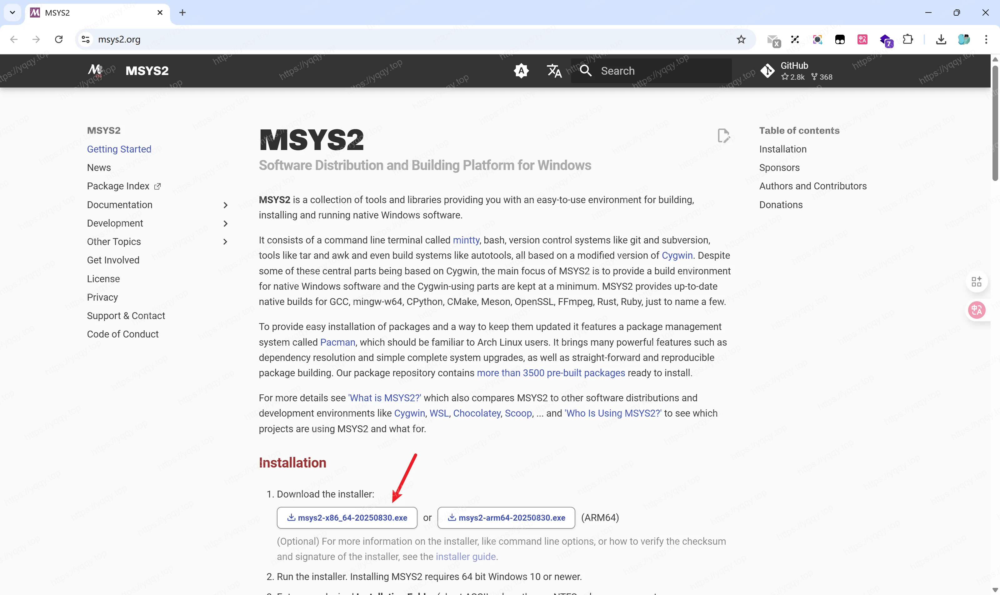

# 美化Windows Terminal并增加自动提示

## oh-my-zsh

由于常使用Mac && Linux环境，对zsh比较熟悉，其中很多命令`PowerShell`并没有，比如`grep`, `ll`等等，所以这里使用`oh-my-zsh`，在Mac上我也使用`oh-my-zsh`

### 安装MSYS2

打开[msys2.org](https://msys2.org)进行下载



### 安装Zsh

打开`mingw64.exe`之后执行`pacman -S git`先安装git， 然后执行`pacman -S zsh`下载zsh

然后重新进入`mingw64.exe`，输入`zsh`，检查是否安装ok，如下图就是安装ok，按q退出，我们开始配置

如图：


### 安装Oh-My-Zsh

执行如下命令：

```shell
sh -c "$(curl -fsSL https://raw.github.com/ohmyzsh/ohmyzsh/master/tools/install.sh)"
# 或者 
# sh -c "$(curl -fsSL https://raw.githubusercontent.com/ohmyzsh/ohmyzsh/master/tools/install.sh)"
```

如图：


### 配置插件与主题

**自动补全插件** `zsh-autosuggestions`，安装命令：

```shell
git clone https://github.com/zsh-users/zsh-autosuggestions ${ZSH_CUSTOM:-~/.oh-my-zsh/custom}/plugins/zsh-autosuggestions
```

**语法高亮插件** `zsh-syntax-highlighting`，安装命令：

```shell
git clone https://github.com/zsh-users/zsh-syntax-highlighting.git ${ZSH_CUSTOM:-~/.oh-my-zsh/custom}/plugins/zsh-syntax-highlighting
```

如图：


### 配置Zsh为MSYS6的默认shell

重新打开`mingw64.exe`，执行`vim ~/.bashrc`，填入下面代码，然后重启就默认是 zsh 了

```shell
# Launch Zsh
if [ -t 1 ]; then
exec zsh
fi
```

### 配置Windows Terminal使用MSYS6

打开设置-打开JSON文件，在 `profiles.list` 下添加如下配置：

```json
{
    "guid": "{1b478085-41fb-49da-a9c9-8adbc5b7c071}",
    "commandline": "D:\\Softs\\msys6\\msys2_shell.cmd -defterm -here -no-start -mingw64",
    "icon": "D:\\Softs\\msys6\\mingw64.ico",
    "name" : "MSYS6",
    "startingDirectory" : "%USERPROFILE%",
    "closeOnExit" : true,
    "historySize" : 9001,
    "snapOnInput" : true,
    "useAcrylic" : true
}
```

如图：


### 将Windows Terminal加入到右键菜单

执行命令 `mkdir "$USERPROFILE/AppData/Local/terminal"` 创建目录

向其中放入文件 `wt.reg` 和 `terminal.ico` 

```txt
Windows Registry Editor Version 5.00

[HKEY_CLASSES_ROOT\Directory\Background\shell\wt]
@="Windows terminal here"
"Icon"="%LOCALAPPDATA%\\terminal\\terminal.ico"

[HKEY_CLASSES_ROOT\Directory\Background\shell\wt\command]
@="C:\\Users\\<your username>\\AppData\\Local\\Microsoft\\WindowsApps\\wt.exe"
```

最后一行 wt.exe 的路径，必须使用绝对路径，否则会报错，然后双击执行`wr.reg`，将配置添加到注册表。

效果如图：


### 配置VsCode默认打开终端

修改settings.json
```json
{
    "terminal.integrated.defaultProfile.windows": "MSYS6",
    "terminal.integrated.profiles.windows": {
        "MSYS6": {
            "path": "D:\\Softs\\msys6\\msys2_shell.cmd",
            "args": [
                "-defterm",
                "-here",
                "-no-start",
                "-mingw64"
            ]
        }
    }
}
```

终端 -> 选择默认配置文件 -> MSYS6

### 配置Goland默认打开终端

Settings -> Tools -> Terminal -> Shell Path

设置为合适的路径，可以从Windows Termianl中拷贝，比如我的 `D:\Softs\msys6\msys2_shell.cmd -defterm -here -no-start -mingw64`