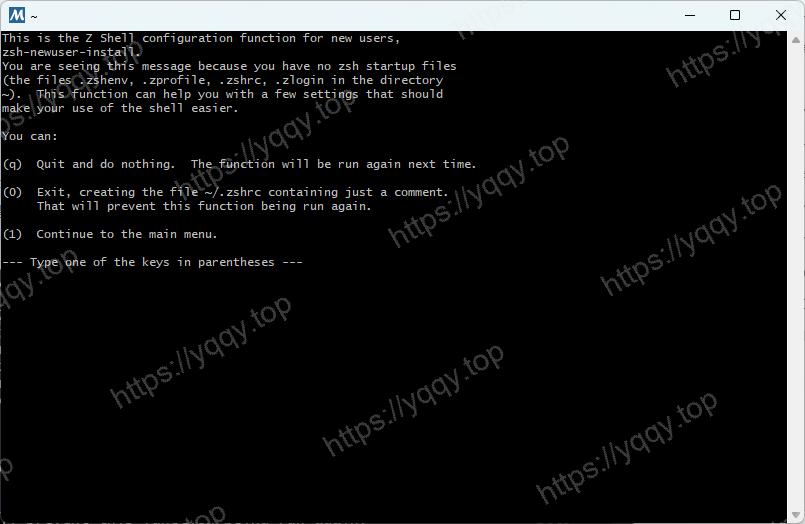
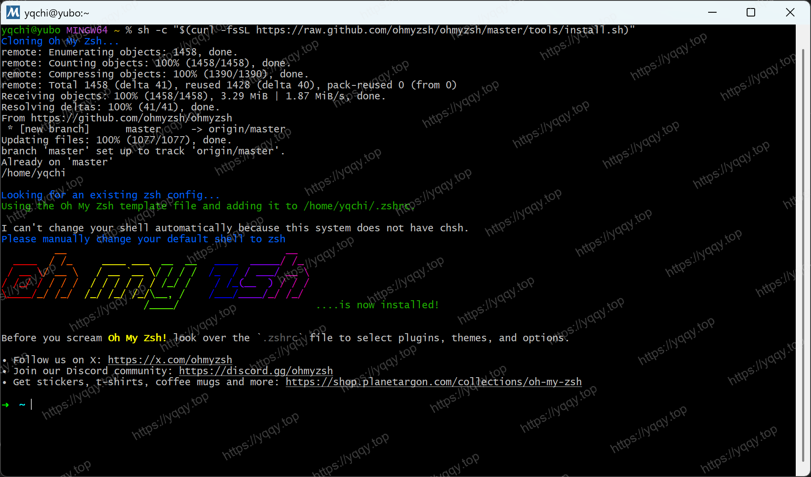
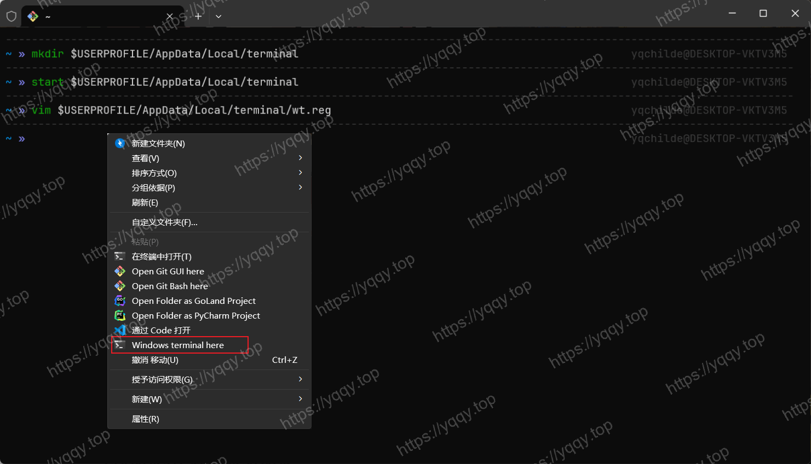

# 美化Windows Terminal并增加自动提示

如果是 Win11 自带了 Windows Terminal，如果是 Win10 先去 Mincrosoft Store 里下载，下载好了进行下列步骤，以下方式二选一，博主倾向于使用`oh-my-zsh`。

## 1. oh-my-posh

### 安装Oh-My-Posh

下载地址：[oh-my-posh/releases](https://github.com/JanDeDobbeleer/oh-my-posh/releases)

如图：


安装，安装完成后，打开 Windows Terminal 输入命令`oh-my-posh`，检查是否安装ok

如图：


### 配置Oh-My-Posh

1. 终端执行命令`notepad $profile`，如果报错没有该文件，先执行命令创建 `New-Item -Path $PROFILE -Type File -Force`，如果PowerShell继续阻止运行本地脚本，执行命令设置权限 `Set-ExecutionPolicy -ExecutionPolicy RemoteSigned -Scope LocalMachine`

2. 安装模块

```shell
# 自动补全
Install-Module PSReadLine -Force

# 让 Git 命令在 PowerShell 中具有更好的用户体验
Install-Module posh-git

# ls时能给文件添加颜色
Install-Module Terminal-Icons
```

3. 在打开的`$profile`文件里添加如下配置，`iterm2.omp.json`是文件名，简单说就是指定主题路径

```txt
oh-my-posh init pwsh --config "$Env:POSH_THEMES_PATH\iterm2.omp.json" | Invoke-Expression

Import-Module posh-git
Import-Module Terminal-Icons
Set-PSReadLineOption -PredictionSource History
Set-PSReadLineKeyHandler -Key Tab -Function MenuComplete
cls
```

### 配置终端字体

保存`$profile`文件后重启终端，发现字体乱码

如图：


这里需要使用`Nerd字体`，下载地址 [nerdfonts-downloads](https://www.nerdfonts.com/font-downloads)

找到`JetBrainsMono`字体，下载之后解压安装，打开终端的设置里配置字体，然后重启终端

如图：


## 2. oh-my-zsh

由于常使用Mac && Linux环境，对zsh比较熟悉，其中很多命令`PowerShell`并没有，比如`grep`, `ll`等等，所以这里使用`oh-my-zsh`，在Mac上我也使用`oh-my-zsh`

使用的前提是要安装过`git bash`，这里就不阐述了

### 安装Zsh

下载地址：[zsh-download](https://packages.msys2.org/package/zsh?repo=msys&variant=x86_64)

如图：


解压之后，将全部文件移入到git bash的目录下，然后重新进入 git bash，输入命令`zsh`，检查是否安装ok，如下图就是安装ok，按q退出，我们开始配置

如图：


### 安装Oh-My-Zsh

执行如下命令：

```bash
sh -c "$(curl -fsSL https://raw.github.com/ohmyzsh/ohmyzsh/master/tools/install.sh)"
# 或者 
# sh -c "$(curl -fsSL https://raw.githubusercontent.com/ohmyzsh/ohmyzsh/master/tools/install.sh)"
```

如图：


### 配置插件与主题

**自动补全插件** `zsh-autosuggestions`，安装命令：

```bash
git clone https://github.com/zsh-users/zsh-autosuggestions ${ZSH_CUSTOM:-~/.oh-my-zsh/custom}/plugins/zsh-autosuggestions
```

**语法高亮插件** `zsh-syntax-highlighting`，安装命令：

```bash
git clone https://github.com/zsh-users/zsh-syntax-highlighting.git ${ZSH_CUSTOM:-~/.oh-my-zsh/custom}/plugins/zsh-syntax-highlighting
```

如图：


### 配置Zsh为bash的默认shell

打开git bash的根目录，编辑文件`etc/bash.bashrc`，填入下面代码，然后重启就默认是 zsh 了

```bash
# Launch Zsh
if [ -t 1 ]; then
exec zsh
fi
```

### 配置Windows Terminal使用git bash

打开设置-打开JSON文件，在 `profiles.list` 下添加如下配置：

```json
{
    "guid": "{1b478085-41fb-49da-a9c9-8adbc5b7c071}",
    "commandline": "%PROGRAMFILES%/git/usr/bin/bash.exe -i -l",
    "icon": "%PROGRAMFILES%/Git/mingw64/share/git/git-for-windows.ico",
    "name" : "Bash",
    "startingDirectory" : "%USERPROFILE%",
    "closeOnExit" : true,
    "historySize" : 9001,
    "snapOnInput" : true,
    "useAcrylic" : true
}
```

如图：


### 将Windows Terminal加入到右键菜单

执行命令 `mkdir "$USERPROFILE/AppData/Local/terminal"` 创建目录

向其中放入文件 `wt.reg` 和 `terminal.ico` 

```txt
Windows Registry Editor Version 5.00

[HKEY_CLASSES_ROOT\Directory\Background\shell\wt]
@="Windows terminal here"
"Icon"="%LOCALAPPDATA%\\terminal\\terminal.ico"

[HKEY_CLASSES_ROOT\Directory\Background\shell\wt\command]
@="C:\\Users\\<your username>\\AppData\\Local\\Microsoft\\WindowsApps\\wt.exe"
```

最后一行 wt.exe 的路径，必须使用绝对路径，否则会报错，然后双击执行`wr.reg`，将配置添加到注册表。

效果如图：



### 配置VsCode默认打开终端

终端 -> 选择默认配置文件 -> Git Bash

### 配置Goland默认打开终端

Settings -> Tools -> Terminal -> Shell Path

设置为合适的路径，可以从Windows Termianl中拷贝，比如我的 `D:\Softs\Git\usr\bin\bash.exe -i -l`