# 某东M端登录滑块分析学习

未完待续...

## 某接口

### risk_jd[fp]参数

整体搜索一下`risk_jd[fp]`，搜到几个结果，挨个打开一下，最后定位到了图中所示位置，此时`risk_jd[fp]: r.fp`，所以要继续看`r.fp`的值

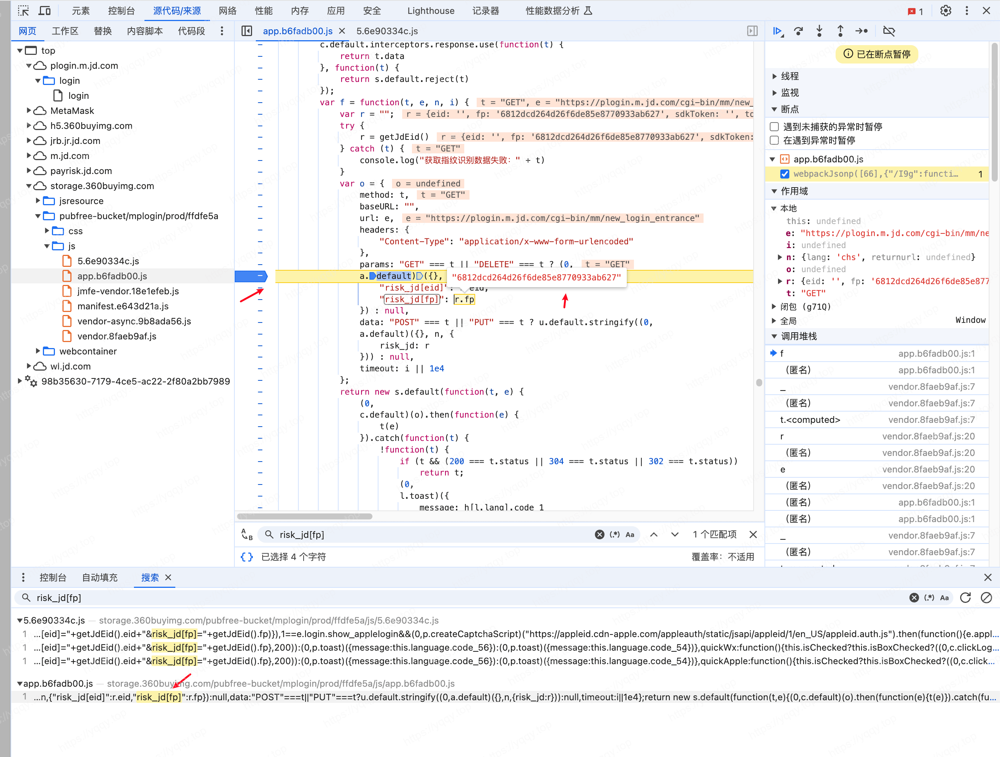

在上方看到`r`的值，`fp`属性在其中，通过`r = getJdEid()`知道`r`是怎么来的，断点跟入

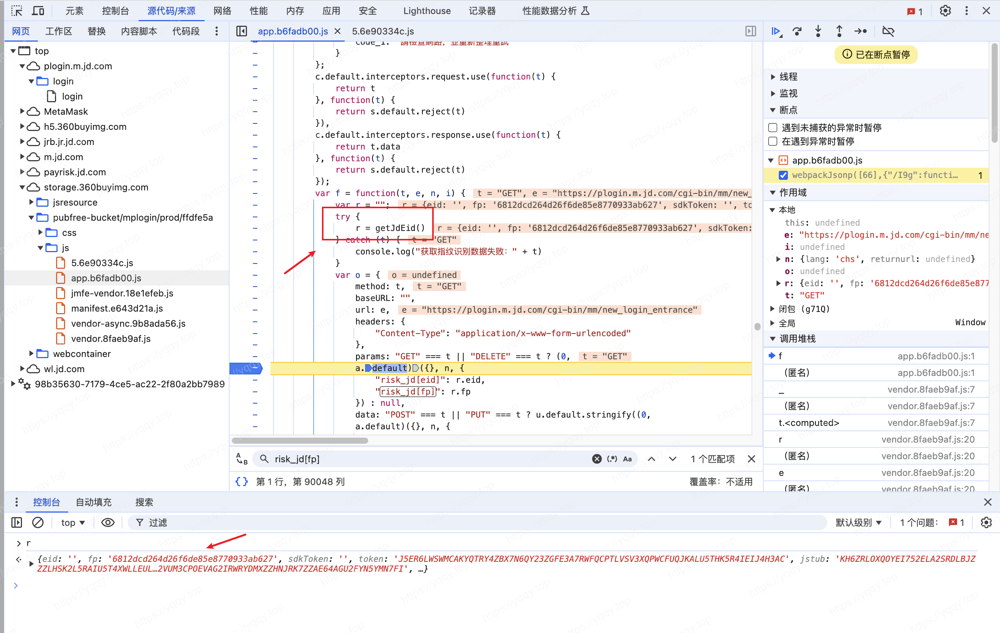

跟进来之后看到`fp: risk_jd_local_fingerprint`，这就知道怎么来的了

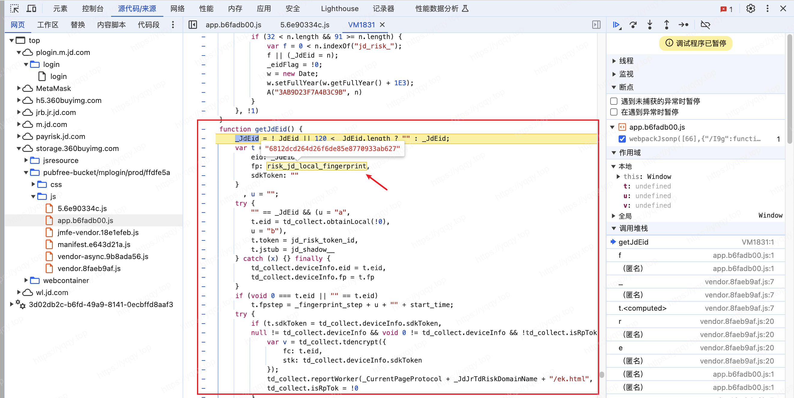

搜一下关键词又发现`risk_jd_local_fingerprint = t`，且`t`是函数传进来的，那么就跟一下栈

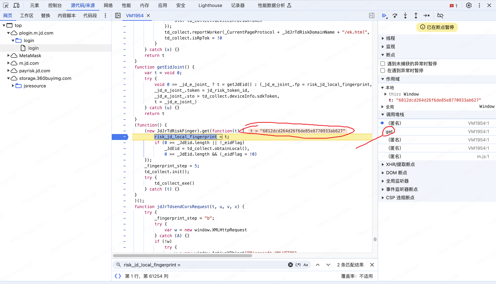

跟进来后看出这个函数参数`b`就是`t`，`b = this.x64hash128(c.join("~~~", 31);`，其中`c`是各种指纹信息

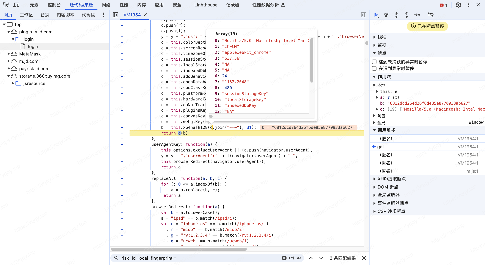

这个`x64hash128`函数是开源项目 [fingerprintjs](https://github.com/fingerprintjs/fingerprintjs) 的方法，本地模拟一下，成功算出

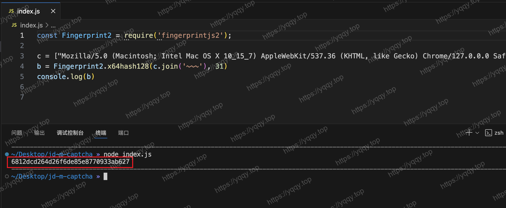

### risk_jd[jstub]参数

和`risk_jd[fp]`一样，找到js中的位置，看出来`jstub`的值是`jd_shadow__`

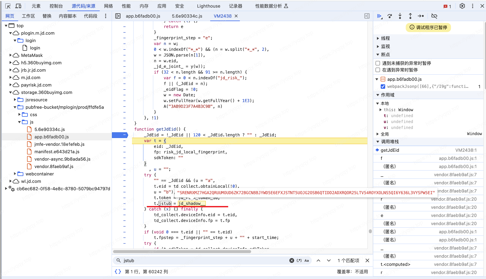

在文件中搜一下来源，看出来是一个AES加密算法，扣一下算法

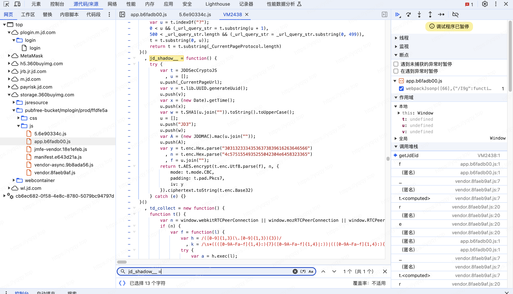

缺啥函数补啥函数，搞定

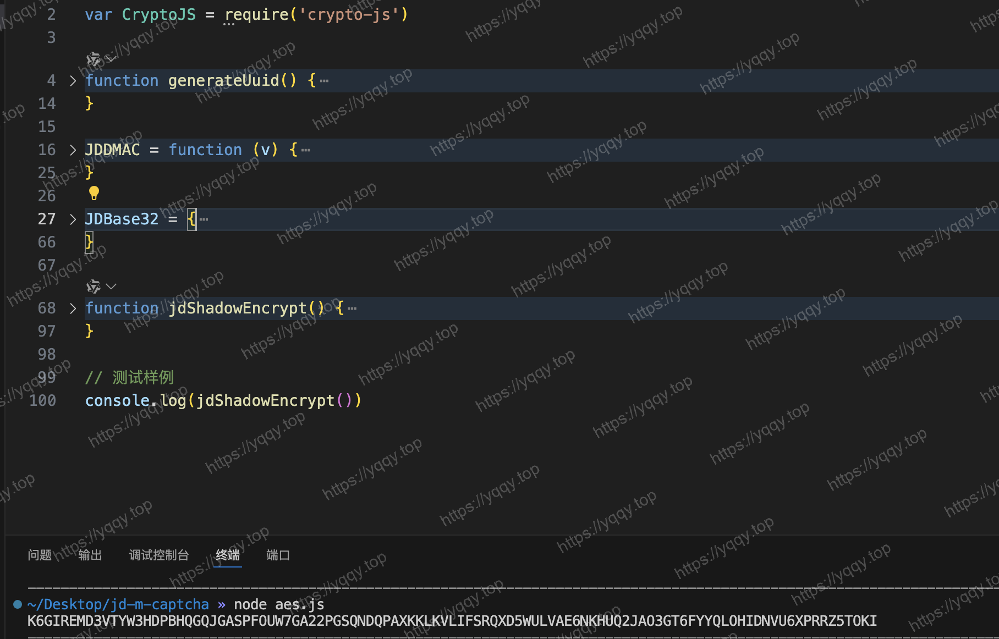

### ct参数

滑块中显示的图片是`ct`参数

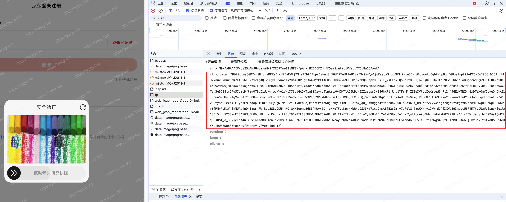

跟一下调用栈

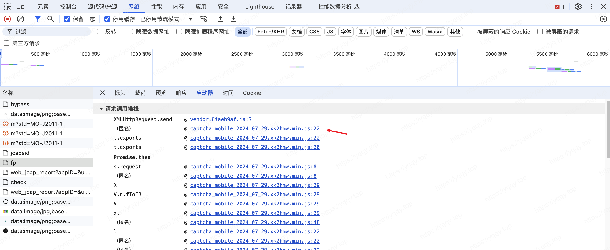

进入js中，搜一下`ct =`，定位到如图位置  
所以`ct`就是用`pt(o.RfeFa(vt, m) + o.FSiZM(gt, y.si[e("0x4c") + "gth"], 4) + y.si + d + c, l, v)`计算的

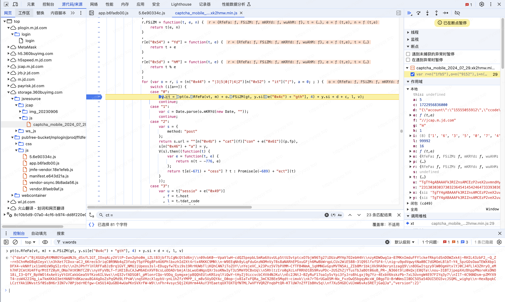

从后往前分别找一下参数，先看参数`v`，搜一下`v`的值，发现`l`和`v`都在`requireCaptcha.js`这个文件中

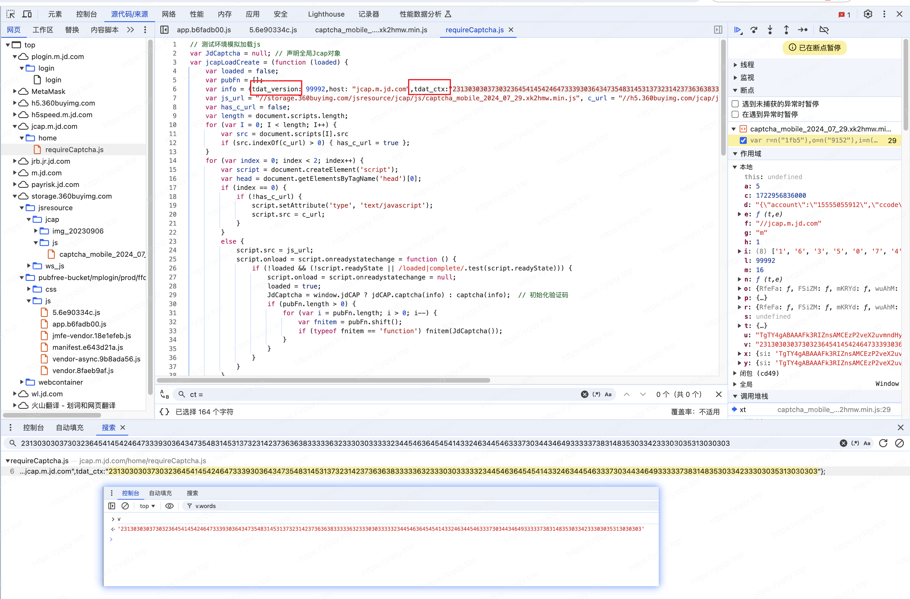

`c`的值是时间戳，Date.parse(new Date)  
`d`的值看起来是一些手机号，wgl等环境参数  
`y.si`是前文`jcapsid`接口中的`jcap_sid`

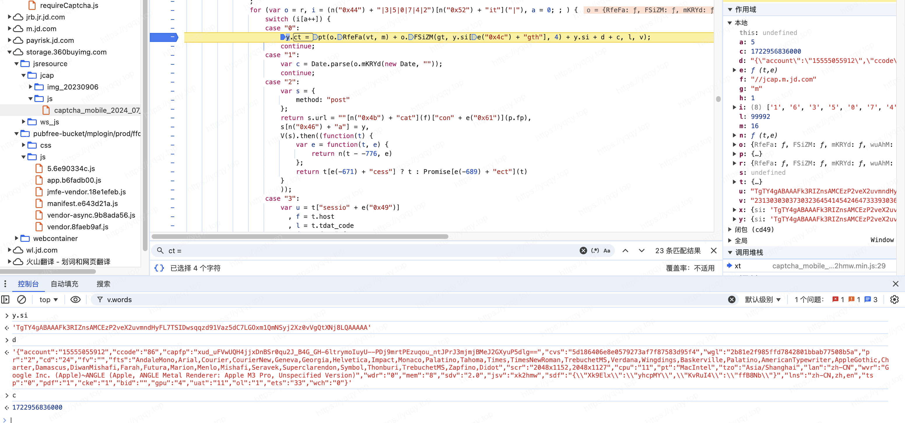

接着看`o.FSiZM(gt, y.si[e("0x4c") + "gth"], 4)`  
1. 其中`FSiZM`函数接收3个参数，其内部实现是`t(e, n)`，也就是可以变成`o.FSiZM(gt(y.si[e("0x4c") + "gth"], 4))`  
2. `e("0x4c") + "gth"`，执行得出`length`，所以又可以变成`o.FSiZM(gt(y.si["length"], 4))`  
3. 那么`gt`函数是啥？

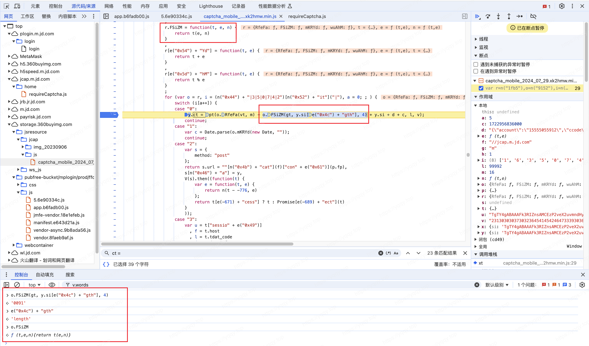

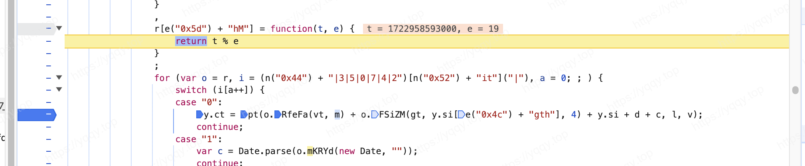

