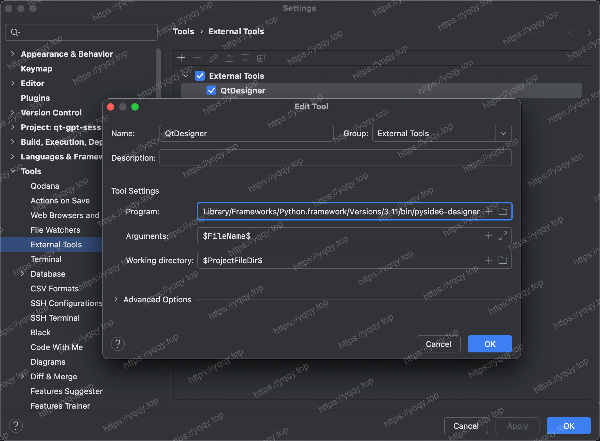
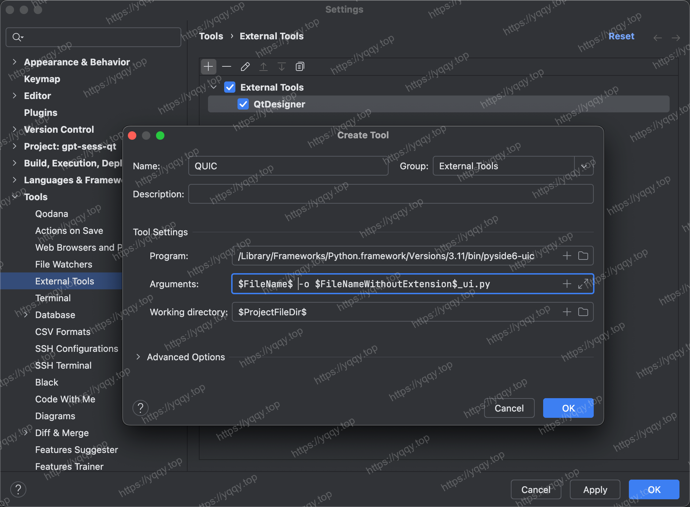
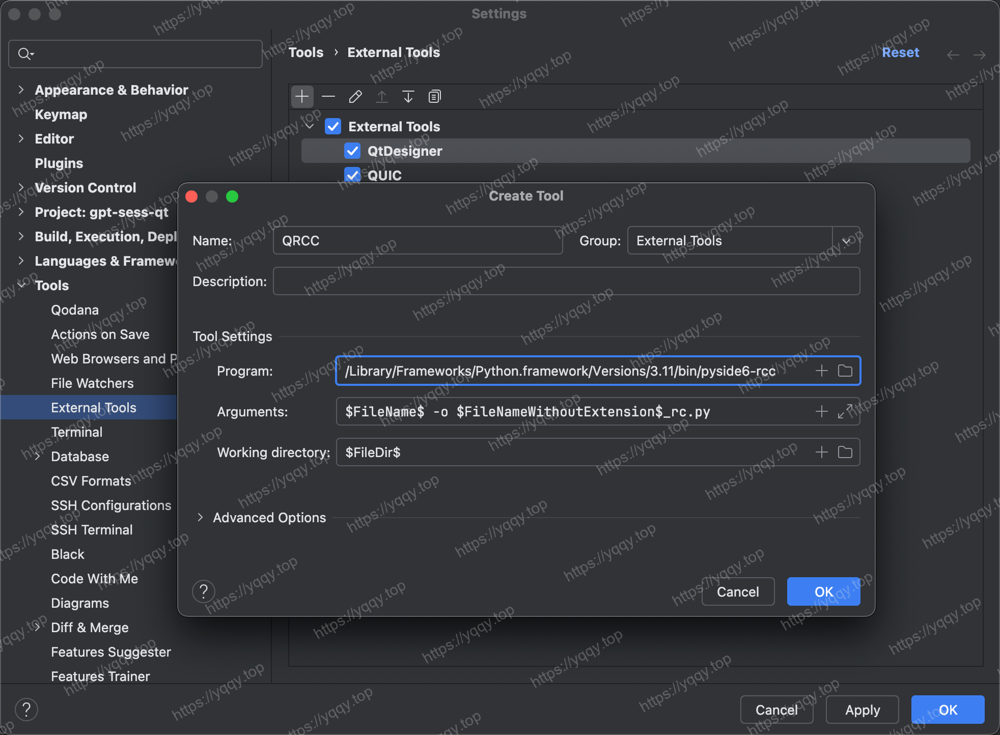
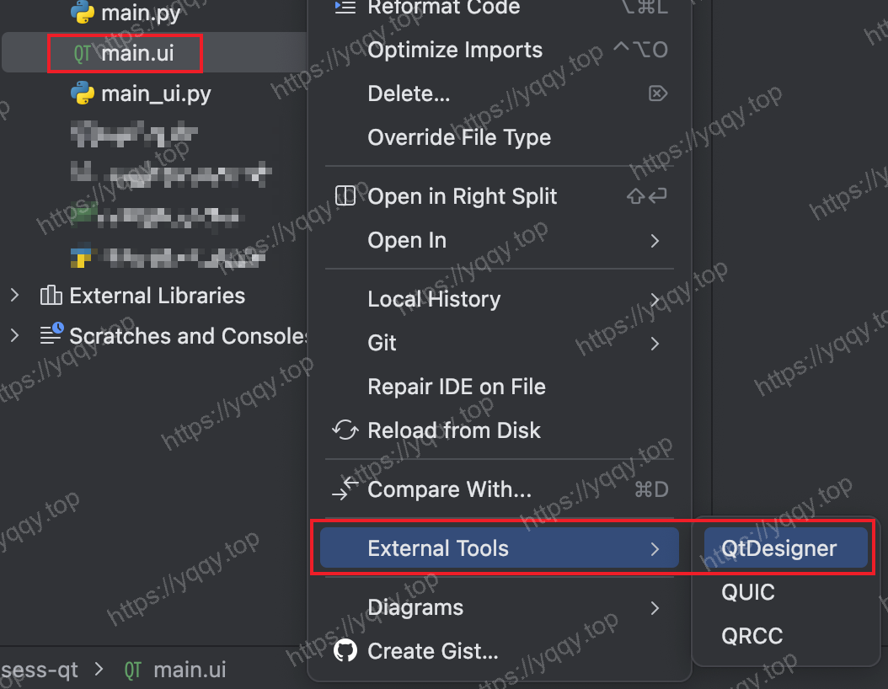
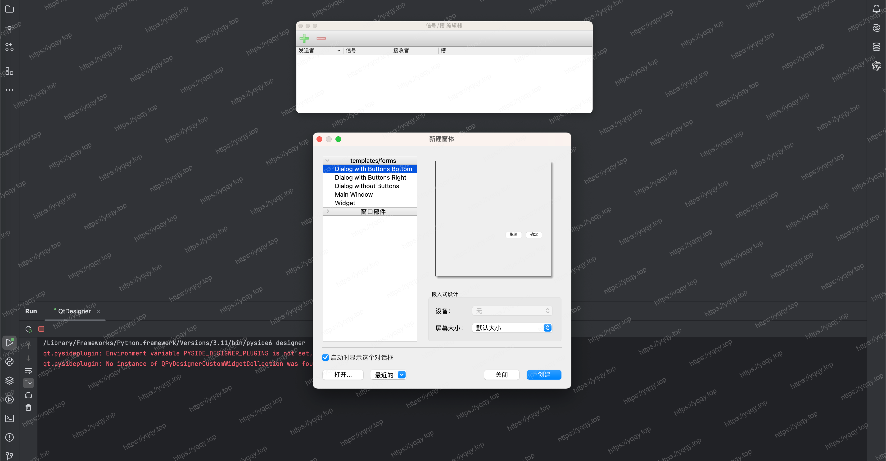
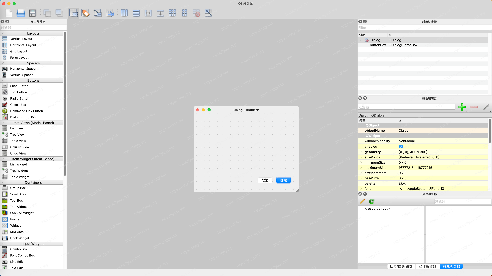

# PySide6开发技巧

:::tip 本节说明
这里暂时记录一些PySide6开发的一些小技巧，具体PySide6开发学习还请到B站学习。
:::

## 1. PyCharm环境配置QTDesigner

1. 推荐在外部再安装一份`pyside6`，避免直接使用`venv中的pyside6`，主要是方便在多个项目中使用，比如我用`whereis`找到python3.11安装在`/Library/Frameworks/Python.framework/Versions/3.11/bin`，然后开始配置
2. 打开 **Pycharm - Settings - Tools - External Tools**，点击加号
3. 配置`QtDesigner`, `Program`参数填 `/Library/Frameworks/Python.framework/Versions/3.11/bin/pyside6-designer`，其他看图

4. 配置`QUIC`，如图

4. 配置`QRCC`，如图

5. 找到自己的`.ui`文件，右键，找到**External Tools - QtDesigner**，点击

6. 在Mac上会看到窗口都分散了，很丑而且很不好操作，在Windows上不会有这个问题

7. Mac上的解决办法：先点确定进入QtDesigner，然后打开首选项选择停靠窗口就ok了

## 2. 主题待定