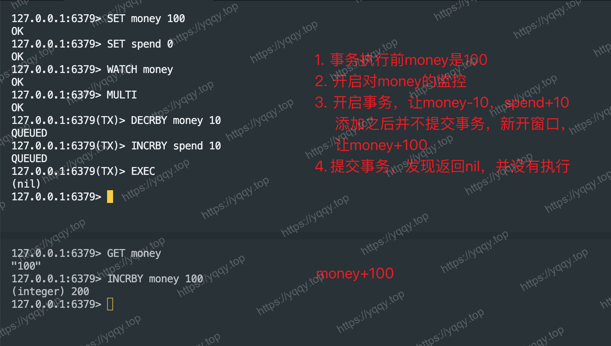
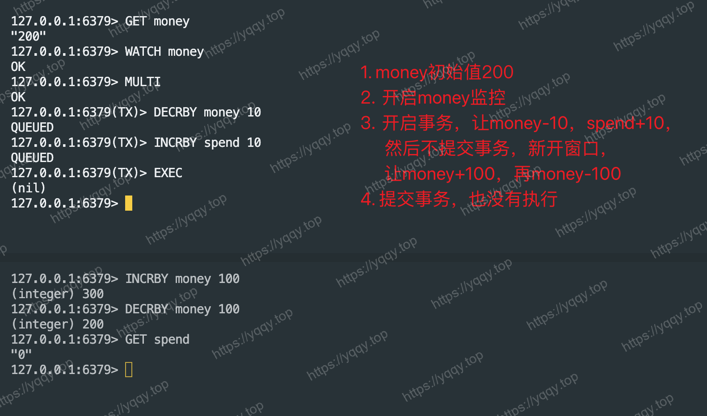

# Redis面试题-八股

:::tip 声明
本文中部分内容摘自网络(下方表示出处)，如有违规可联系我进行删除 🙏🏻
> * [https://github.com/chaseSpace/interview/blob/main/db_redis.md](https://github.com/chaseSpace/interview/blob/main/db_redis.md)
> * [https://pdai.tech/md/db/nosql-redis/db-redis-overview.html](https://pdai.tech/md/db/nosql-redis/db-redis-overview.html)
:::

::: details 目录索引
[[toc]]
:::
## 1. 说说你对Redis的理解

redis是基于key-value存储结构的NoSQL开源内存数据库，他提供了5种常用的数据结构（string，hash，set，zset，list），针对不同的结构，可以解决不同场景的问题。

其次redis本身是一个基于内存的存储，并且在数据结构上做了大量的一些优化，所以IO的性能笔记哦啊好，在实际开发中，通常把它作为应用和数据库之间的一个分布式缓存中间件，并且redis又是一个非关系型数据库的存储，他不存在表之间的关联查询的问题，所以它可以很好的去提升应用程序的IO数据效率

## 2. Redis为什么那么快

* 纯内存访问，不与磁盘交互
* 单线程避免上下文切换
* 丰富的数据结构
* 多路复用epoll网络模型
* 渐进式ReHash，缓存时间戳等设计
## 3. 为什么Redis使用单线程

* 简单高效：单线程模型使reids开发维护更简单，不需要处理多线程带来的枷锁，线程同步等复杂情况
* 瓶颈不在CPU：redis作为内存数据库，性能瓶颈主要内存和网络带宽
* 数据结构简单：redis的数据结构被专门设计的很简单高效，绝大部分操作的时间复杂度都是O(1)，因此单线程足以应对大部分读写场景
* IO多路复用：利用了操作系统提供的多路IO复用epoll模型，可以高效的监听和处理多个客户端连接。

## 4. Redis使用单线程的瓶颈

* 只能用一个cpu核（忽略后台线程和子线程）
* 如果value比较大，redis的qps会下降的很厉害，有时一个大key就可以拖垮
* qps难以更上一层楼

## 5. 为什么Redis后来引入多线程

### Redis4.x

redis 在 4.x 版本引入了多线程，用来异步执行[`UNLINK`](./interview-1#_6-redis中del和unlink区别) 、`FLUSHALL ASYNC` 、`FLUSHDB ASYNC` 命令。比如对于键的删除，我们一般不需要同步等待完成，而且删除大键是一个耗时操作，所以引入多线程是方便执行那些不需要同步返回的命令。
### Redis6.x中的多线程I/O

Redis官方在2020年5月正式推出6.0版本，此版本正式引入了多线程IO。

首先要解释Redis的单线程：Redis在处理客户端的请求时，包括获取（socket读）、解析、执行、内容返回（socket写）等都由一个顺序串行的主线程执行。

随着硬件性能的提升，Redis的单线程性能瓶颈可能出现网络IO的读写，也就是：单个线程处理网络读写的速度跟不上底层网络硬件的速度，读写网络的`read / write`系统调用占用了Redis执行期间大部分CPU时间，瓶颈主要在网络的IO消耗，此时的优化方向：
* 提高网络IO性能，典型的实现比如使用 [`DPDK`](https://zh.wikipedia.org/wiki/DPDK) 来代替内核网络栈的方向
* 使用多线程充分利用多核，提高网络请求读写的并行度，典型的实现比如 `Memcached`

🤔 Redis采用了第二种方式，即Redis采用多个IO线程来处理网络请求，提高网络请求处理的并行度，**需要注意的是**，Redis多IO线程模型只用来处理网络读写请求，对于Redis的读写命令，依然是单线程处理。

**开启多线程 - redis.conf**  
Redis的多线程默认是禁用的，只使用主线程，如需开启需要修改redis.conf配置：
```txt
io-threads-do-reads yes
io-threads 4 # 建议为CPU核心数-1
```

## 6. Redis中del和unlink区别
`del`和`unlink`都是用来删除的指令
### del命令

```shell
DEL key [KEY ...]
```
* `del`可以指定多个键名，删除多个键，如果指定的键不存在，则会被忽略
* `del`命令不会释放已经分配的内存，如需释放使用`unlink`
* `del`是一种同步命令，它会阻塞客户端，直到所有指定的键都被删除为止
### unlink命令

```shell
UNLINK key [KEY ...]
```
* `unlink`可以指定多个键名，删除多个键，如果指定的键不存在，则会被忽略
* `unlink`命令会释放已经分配的内存，有大量键需要删除时会减少内存使用量
* `unlink`命令会异步删除指定的键及与之相关联的值，结果立即返回，不会阻塞客户端

## 7. Redis的多路复用和HTTP/2有何不同

### 1. 应用层别不同

HTTP/2 的多路复用发生在应用层，即在一个TCP链接上复用多条流。而Redis的多路复用发生在更底层的网络IO层，即在一个线程中同时处理多个客户端socket连接的IO操作。

### 2. 目的不同

HTTP/2 多路复用的主要目的是减少TCP连接数，提高带宽利用率。Redis的多路复用主要目的是保持单线程以及不必要的上下文切换开销。

## 8. Redis的事务

Redis事务的本质是一组命令的集合，事务支持一次执行多个命令，一个事务中所有命令，一个事务中所有的命令都会被序列化。在事务执行过程中，会按照顺序串行化执行队列中的命令，其他客户端提交的命令请求不会插入到事务执行命令序列中。

总结说：redis事务就是一次性、顺序性、排他性的执行一个队列中的一系列命令。
### Redis事务相关命令
* `WATCH`: 在事务开始前，用于监视一个或多个键，如果键的值发生了变化，则EXEC无法执行，事务中断（在`MULTI`前执行）
	* 事务中断后，`WATCH`命令自动取消
	* 单个会话有效
* `UNWATCH`: 取消`WATCH`对所有key的监视（在`MULTI`前执行）
* `MULTI`: 标志着事务开始
* `EXEC`: 服务器以先进先出的顺序执行命令，如果命令执行失败，则继续执行下一条命令，也不会回滚已执行的命令
* `DISCARD`: 取消一个事务（在`EXEC`前执行）
* `输入其他命令`: 命令在服务器入列，命令语法错误会导致`EXEC`无法执行，即事务中断（所有命令都不执行）

🤔 Redis事务(ACID)提供一致性和隔离性，<span style="color:red; font-weight: bold;">但不提供原子性和持久性</span>
* 一致性(Consistency)：指可以保证命令失败的情况下得以回滚，数据能恢复到没有执行以前的样子
* 隔离性(Isolation)：指事务之间互不干扰，同时也不会在事务内插入其他命令
* 原子性(Atomicity)：指事务内的命令全部执行或都不执行，无法做到因为一条命令的运行错误导致其他命令中断
* 持久性(Durability)：因为Redis的持久化都是异步的，做不到实时落盘（为了保证性能）

### 事务使用案例

#### 正常使用  
```shell
# 连接到 Redis 服务器
$ redis-cli

# 开启 Redis 事务
127.0.0.1:6379> MULTI

# 执行递增操作
127.0.0.1:6379> INCR counter
QUEUED

# 记录递增值
127.0.0.1:6379> INCR log:counter
QUEUED

# 执行 Redis 事务
127.0.0.1:6379> EXEC
1) (integer) 1
2) (integer) 1

```
#### 验证原子性

```shell
127.0.0.1:6379> SET k1 v1
OK

127.0.0.1:6379> MULTI
OK

127.0.0.1:6379(TX)> SET k2 v2
QUEUED

127.0.0.1:6379(TX)> INCR k1
QUEUED

127.0.0.1:6379(TX)> GET k2
QUEUED

127.0.0.1:6379(TX)> EXEC
1) OK
2) (error) ERR value is not an integer or out of range
3) "v2"
```

#### watch命令  
watch命令用于监视一个或多个key，如果在事务执行前这个key被其他命令所改动，那么事务将被打断，可以实现乐观锁。




## 9. Redis会变慢的原因

* 当内存不足时，key可能会频繁被淘汰，响应时间上升
* 频繁的内存持久化，如果数据量大且写操作比较多必然会引起大量的磁盘IO操作，导致性能下降
* 阻塞操作，某些redis命令会导致阻塞，比如阻塞式列表操作，慢查询，当这些操作频繁调用或者执行时间长的时候，会导致整个系统的性能下降，可以使用redis的性能分析工具和命令来识别慢查询和阻塞的操作对并发行进行优化调整
* 网络问题，比如网络延迟和带宽受限

## 10. Redis内存淘汰机制

当 Redis 内存不够用的时候，它根据设置的淘汰策略来删除部分键，支持以下策略：
* `noeviction(默认策略)`: 当内存超过配置时就会返回错误，不会驱逐任何键
* `allkeys-lru`: 首先通过LRU算法驱逐最久没有使用的键
* `voliatile-lru`: 首先从设置过期时间的键集合中驱逐最久没有使用的键
* `allkey-random`: 从所有key中随机删除
* `voliatile-random`: 从设置了过期时间的键集合中随机删除
* `voliatile-ttl`: 从配置了过期时间的键中驱逐马上要过期的键
* `voliatile-lfu`: 从所有配置了过期时间的键中驱逐使用频率最少的键
* `voliatile-lfu`: 从所有键中驱逐使用频率最少的键

## 11. Redis存在线程安全问题吗

* `从redis服务端层面`：redis-server本身是一个线程安全的服务，在redis-server端去执行指令的时候不需要任何的同步机制，不会存在任何线程安全的问题。
*  `从redis客户端层面`：虽然redis中的指令操作是原子的，但是如果多个redis客户端同时执行多个指令的情况下，就无法保证原子性。假设两个redis client同时获取redis server的key，同时进行读取和写入，因为多线程下的原子性无法被保障，以及多进程情况下同享资源访问的一个竞争问题，使得数据的安全性无法保障

## 12. 什么是缓存雪崩

缓存在同一时间大面积的失效，后面的请求都直接落到了数据库上，造成数据库短时间内承担大量的请求。

**解决办法：**  
根据缓存雪崩的原因执行不同的方案：
* Redis宕机
	* 集群化或使用哨兵模式部署Redis
	* 开启持久化，保证重启后快速恢复缓存数据
* 大量缓存同时失效
	* 在批量往redis存数据的时候，把每个key的失效时间都加个随机值
	* 或者设置热点数据永远不过期，有更新操作就更新缓存
	* 在代码中实现本地缓存，避免请求全部落到数据库
	* 接口限流
## 13. 什么是缓存穿透

请求的数据根本不存在，所以缓存 `miss`，请求一直落到数据库，此时如果请求量较大就会击垮数据库。

**解决办法：**  
* 添加参数校验，在API入口处判断请求参数是否合理，是否有非法制
* 缓存空值key，还可设置一个较短的过期时间
* 使用布隆过滤器，过滤掉不存在的数据避免打到数据库上
## 14. 什么是缓存击穿

大量的请求同时查询一个热 key 时，假设此时，这个key正好失效了，就会导致大量的请求都打到数据库上面去，这种现象我们称为击穿。缓存击穿带来的问题就是会造成某一时刻数据库请求量过大，压力剧增。

**解决办法：**  
* 热点数据永不过期，由定时任务定期去刷新缓存
* 互斥锁。在缓存`miss`后，从数据库加载缓存前，对操作加一个互斥锁

## 15. 什么是布隆过滤器

它由一个很长的二进制向量和一系列随机映射函数组成。布隆过滤器可以用于检索出一个元素是否在一个集合中，它的优点是空间效率和查询时间远远超过一般的算法。

**原理：**  
当一个元素被加入集合时，通过K个散列函数将这个元素映射成一个位数组中的K个点（offset），把它们置为 `1`。  
检索时，我们只要看看这些点是不是就是 `1` 就（大概）知道集合中有没有它了：如果这些点有任何一个 `0`，则被检索元素一定不在；如果都是 `1`，则被检索元素很可能在，这就是布隆过滤器的基本思想。

**优点：**  
* 空间占用极小，因为本身不存储数据而是用比特位表示数据是否存在，某种程度具有保密的效果
* 插入与查询操作的时间复杂度均为O(k)，常数级别，k表示散列函数执行次数
* 散列函数之间可以相互独立，可以在硬件指令层加速计算

**缺点：**  
* 误差（假阳性率）
* 无法删除

**go-redis库中的使用：**  
[bloomFilter](https://github.com/redis/go-redis/blob/b64d9deef330a51cfbd3e0425b6c26b27c1ee370/example/redis-bloom/main.go#L32)

## 16. Redis和Memcached有什么区别

**共同点：**
* 都是基于内存的数据库
* 都有过期策略
* 性能都非常高

**不同点：**  
* Redis支持的数据结构丰富，Memcached只支持最简单的key-val数据结构
* Redis支持数据持久化，Memcached没有持久化功能，当服务挂掉后，容易丢数据
* Redis原生支持集群模式，Memcached没有原生的集群模式，需要依靠客户端来实现往集群中分片写入数据
* Redis支持发布订阅模式、Lua脚本、事务等功能，而Memcached不支持

## 17. Redis的key过期后是否立即被删除

**先了解Redis的过期策略：**  [[1]](https://redis.io/docs/latest/commands/expire/#how-redis-expires-keys) [[2]](https://redis.io/docs/latest/develop/use/keyspace-notifications/#timing-of-expired-events)  
Redis的过期策略是一种自动删除过期数据的机制，在使用Redis存储数据是，可以为每个key设置一个过期时间，一旦设置了过期时间，Redis将会在key的过期时间到达后自动将其删除，释放内存空间。**但需要注意的是**，Redis并不保证一定会在key过期时间到达时立即删除，实际上，Redis选择了 **惰性删除+定期删除** 两种策略配合使用，以求在合理使用CPU时间和避免内存浪费时间取得平衡。
### 惰性删除

惰性删除是指：不主动删除过期key，每次访问到这个key时，在检测是否过期，如果过期则删除
* **优点**：只有在每次访问时才会检查key是否过期，所以会使用较少的系统资源，对CPU时间友好
* **缺点**：如果一个key已经过期，如果不去访问这个key，就会一直保留在内存中，造成了一定的内存空间浪费，对内存不友好
### 定期删除

定期删除是指：每隔一段时间随机的取出一定数量的key进行检查，并删除其中的过期key
* **优点**：限制了删除操作执行时长和频率，减少了操作对CPU的影响，同时也能删除一部分过期key释放内存空间
* **缺点**：没有惰性删除使用的系统资源少；难以确定删除操作执行的市场和频率

