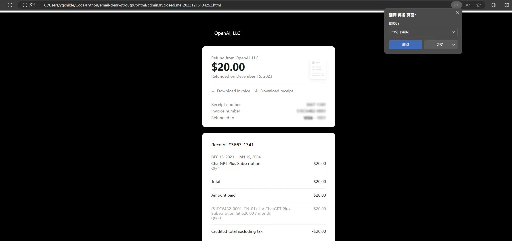

# 电子邮件查删助手（支持Mail、GMX、Outlook、Hotmail、自建）

::: tip 软件介绍
* 软件类型：**付费（需授权）**
* 软件作用：👨‍💻如果你想快速查看邮箱里是否有指定邮件（比如退款邮件），这款工具可以帮你快速查询以及快速删掉，如果是退款邮件，软件还会帮你把退款账单保存一份到本地，方便你核对。  
* **用前必看**：[📌 软件自述文件](./soft-used-readme)
:::

## 1. 使用视频

<ClientOnly><ArtPlayer url='https://alist.diyy.fun:433/p/Local/%E7%94%B5%E5%AD%90%E9%82%AE%E4%BB%B6%E6%9F%A5%E5%88%A0%E5%8A%A9%E6%89%8B.mov?sign=TzErNxjvnqkvnDyq8X91uWMalh6PW2TvWGlDQe_Onvs=:0'/></ClientOnly>

## 2. 版本日志

:::details 版本更新日志
v1.2.1 (2024-07-20)
1. 更新UI    
2. 常规维护更新解决一些问题
---
v1.2.0 (2023-12-17)
1. 退款邮件Html文件保存到output/html文件夹下
2. 文件命名格式：账号_卡尾号_退款金额_退款时间.html

---
v1.1.1
1. 修复代理问题
2. 修复邮件主题配置问题
---
v.1.0.0
1. 第一版
:::
