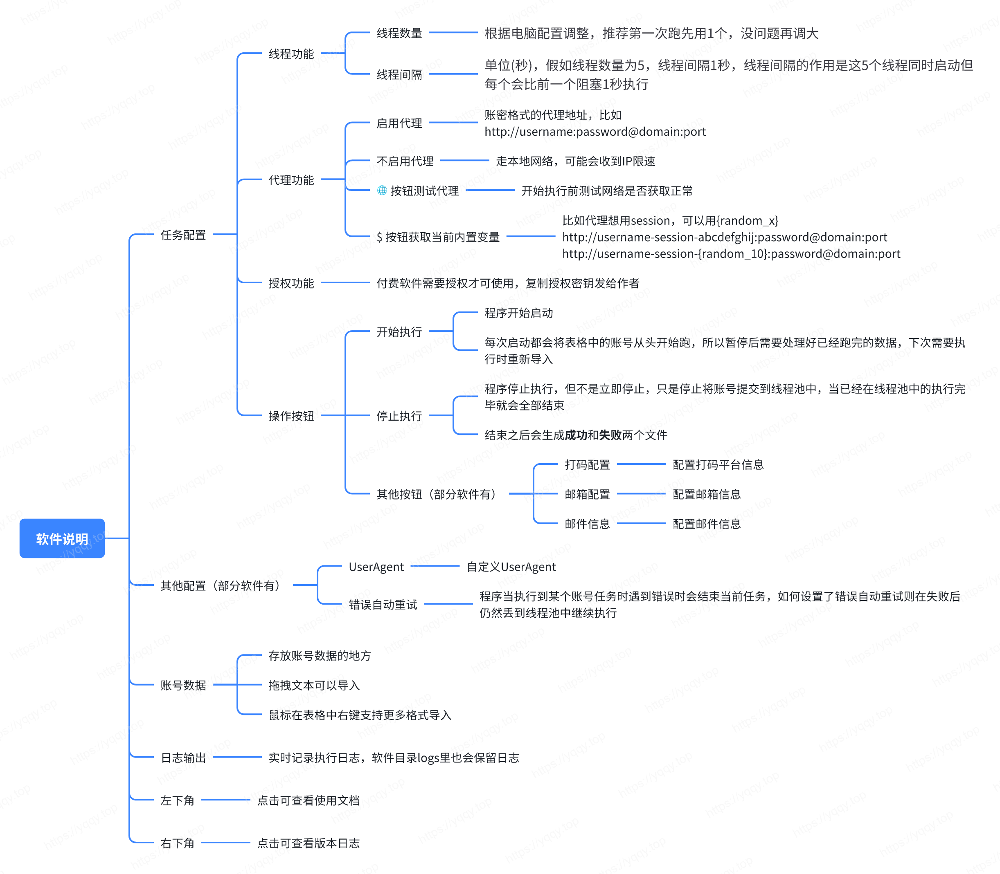

# 【必看】软件自述文件

::: tip
这篇文章主要是用来介绍我这几款软件的界面布局功能，因为我在多款软件中布局均差不多，所以都统一放在这里讲。
:::

## 1. 软件支持平台

MacOS / Windows，这两端均可运行

## 2. 使用流程(付费)

打开软件 -> 复制授权密钥 -> 发送给作者 -> 拿到授权证书 -> 将证书放入软件目录 -> 重启软件 -> 授权成功

## 3. 视频教程

1. 代理配置教程：
<ClientOnly><ArtPlayer url='https://alist.diyy.fun:433/p/Local/soft_proxies.mov?sign=-NNsaNuQ-oXyE0YraO093VQWyHv_RfUs_D-E6pAKVZk=:0'/></ClientOnly>

2. 其他教程：暂无

## 4. 常见问题

1. 代理测试失败：请将该代理的 https:// 替换为 http://；跟着提示操作就行

2. 代理测试失败：curl(28) Connection timed out ...
    * 这种情况如果本地已经开了TUN模式了，那可能是你本地的TUN代理不行，可以换一家试试，下图就是我用两家不同的代理测试结果，第一家不行，换成第二家就成功了
    * 

3. 如果还有其他问题，请反馈给作者
